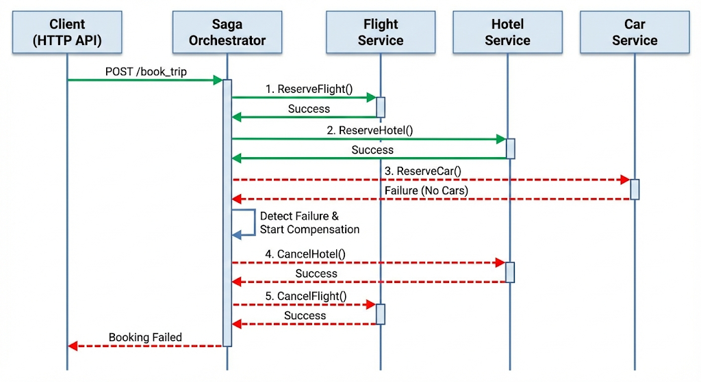

# Saga Pattern in Go: Building resilient distributed transactions with Orchestration

## Table of Contents
- [Introduction](#introduction)
- [What is the Saga pattern?](#what-is-the-saga-pattern)
- [Orchestration vs. Choreography](#orchestration-vs-choreography)
- [Prerequisites](#prerequisites)
- [Step 1: Understanding our domain - travel booking system](#step-1-understanding-our-domain---travel-booking-system)
- [Step 2: Building the Saga core framework](#step-2-building-the-saga-core-framework)
- [Step 3: Implementing service participants](#step-3-implementing-service-participants)
- [Step 4: Adding persistence and recovery](#step-4-adding-persistence-and-recovery)
- [Step 5: Building the Saga orchestrator](#step-5-building-the-saga-orchestrator)
- [Step 6: HTTP API and integration](#step-6-http-api-and-integration)
- [Step 7: Testing failure scenarios](#step-7-testing-failure-scenarios)
- [Step 8: Observability and monitoring](#step-8-observability-and-monitoring)
- [Conclusion](#conclusion)

---

#### Introduction

Picture this scenario: a customer on your travel booking platform clicks "Book Trip" to reserve a flight from New York to Los Angeles, a hotel in Santa Monica,
and a rental car for the week. Your system successfully reserves the flight and hotel, but when it attempts to book the car,
the rental service returns an error - no vehicles available for those dates.

What happens next? The customer cannot complete their trip without transportation, so the entire booking must be cancelled.
But here is the challenge: the flight and hotel reservations already exist in two separate databases, each owned by a different service.
You cannot simply issue a `ROLLBACK` command across service boundaries like you would with a traditional database transaction.

This is the distributed transaction problem, one of the most challenging aspects of microservice architecture.
Traditional database transactions with `ACID` properties work beautifully within a single database,
but they fall apart when your business operation spans multiple services, each with its own data store.

The `Saga` pattern elegantly solves this problem.
Instead of trying to make distributed transactions atomic (which is extremely difficult and often impractical),
we accept that failures can happen and plan for how to handle them through compensating actions.
When our car rental fails, the saga automatically cancels the hotel reservation, then cancels the flight reservation,
leaving the system in a consistent state.

In this deep dive, we will build a complete travel booking system that demonstrates the Saga Orchestration pattern in Go.
You will not only learn the theory but also gain hands-on experience implementing sagas that gracefully handle failure scenarios.

---

#### What is the Saga pattern?

The Saga pattern was originally described by Hector Garcia-Molina and Kenneth Salem in their 1987 paper "Sagas" as a way to handle long-lived transactions.
In the context of microservices, it has been adapted to manage distributed transactions across service boundaries.

A saga consists of a sequence of steps, where each step is a local transaction within a single service.
The key insight is that instead of trying to make the entire distributed operation atomic, we break it into smaller, 
independently manageable pieces and define what to do when any of them fails.

**The forward journey**: When a saga begins, it executes each step in sequence.
Each step performs its local transaction and, upon success, the saga moves to the next step. If all steps are completed successfully, the saga is considered complete.

**The backward journey (compensation)**: If any step fails, the saga must undo the work done by all previously successful steps.
This is accomplished through compensating transactions - a compensating transaction is the semantic inverse of the original.
If the original transaction was `"reserve flight"`, the compensating transaction would be `"cancel flight reservation"`.

Think of it like a chain of dominoes. When everything goes well, each domino falls forward in sequence.
But when one domino refuses to fall (a step fails), we need to pick up each fallen domino in reverse order (compensate each completed step).

The following state diagram shows the lifecycle of a saga as it moves through execution and, when necessary, compensation:



**Important characteristics of compensating transactions**

Compensating transactions are not simple "undo" operations. They must be carefully designed with several properties in mind.

First, they must be **idempotent** - they can be safely executed multiple times without causing additional side effects.
This is crucial because network failures might require retrying compensations.
If your compensation function cancels a hotel reservation, calling it twice should not cause an error or try to cancel a different reservation.

Second, they must handle the possibility that the **original transaction might not have fully completed**.
Network timeouts can leave you uncertain about whether a reservation was actually made. Your compensation must handle both cases gracefully.

Third, they should be designed to **always succeed** if possible, as a failed compensation leaves the system in an inconsistent state that requires manual intervention.
This often means implementing more robust error handling and retry logic in compensation functions than in forward actions.

**Saga execution guarantees**

A saga is a sequence of local ACID transactions that provides eventual atomicity/consistency via coordination and compensating actions, but it does not provide global isolation.
This means that intermediate states are visible to other transactions. For example, while a travel booking saga is in progress,
another user might see that a flight seat is reserved but the associated hotel booking does not exist yet.
Applications must be designed to handle these intermediate states appropriately, perhaps by showing reservations as "pending" until the entire saga completes.

---

#### Orchestration vs. Choreography

There are two main approaches to implementing the Saga pattern, each with distinct characteristics that make them suitable for different scenarios.

**Orchestration** uses a central coordinator (the orchestrator) that explicitly tells each participant what local transaction to execute.
The orchestrator maintains the saga's state and determines what step to execute next based on the outcome of the previous step.
Think of it like a conductor leading an orchestra - the conductor knows the entire score and directs each musician when to play.

**Choreography** distributes the decision-making across the participants themselves.
Each service produces and listens to events, and based on those events, decides what action to take.
There is no central coordinator; the saga emerges from the interaction of independent services.
Think of it like a jazz improvisation, where musicians respond to one another without a conductor.

**When to choose Orchestration**: Orchestration excels when you have complex workflows with many steps, when you need clear visibility into the saga's current state,
when the business logic for determining the next step is complex, or when you want to centralize the saga's definition for easier maintenance.
It is also preferable when you need timeout handling and complex retry logic.

**When to choose Choreography**: Choreography works well when you have simple workflows with few steps,
when services are developed by different teams and you want loose coupling, when you want to avoid a single point of failure,
or when the workflow might need to evolve organically as new services are added.

In this tutorial, we focus on `Orchestration` because it provides better control and visibility and is often easier to reason about for complex business workflows, such as our travel booking scenario.

---

#### Prerequisites

Before we begin building our saga implementation, ensure you have the following set up:

- Go 1.25 or later
- A basic understanding of Go concurrency patterns, including goroutines, channels, and the `context` package.
- Familiarity with HTTP servers in Go and JSON marshaling.
- Understanding of interface-based design patterns in Go.
- A code editor of your choice and command-line comfort.

---

#### Step 1: Understanding our domain - travel booking system

Before diving into code, let us thoroughly understand the domain we are modeling.
Our travel booking system allows users to book a complete trip that includes a flight, a hotel stay, and a car rental.
This is a perfect example for demonstrating the `Saga` pattern because each component is typically managed by a different service in a real-world scenario.

**The business process**

When a customer wants to book a trip, the system must coordinate three independent services.
The **Flight service** handles searching for available flights, reserving seats, confirming bookings, and canceling reservations.
The **Hotel service** manages room availability, reservations, confirmations, and cancellations.
The **Car rental service** deals with vehicle availability, reservations, confirmations, and cancellations.

**Why does this require a Saga?**

Each service maintains its own database and manages its own business rules.
When we book a trip, we need to ensure that either all three bookings succeed, or none of them persist.
If we book a flight and hotel, but the car rental falls through, we must cancel the hotel and flight to maintain consistency.

**The compensation challenge**

Consider what happens when we need to compensate.
If we cancel a flight reservation, the airline might have refund policies, the seat might have already been sold to someone else, or the cancellation might fail due to airline system issues.
Our compensation logic must handle all these scenarios gracefully, which is why idempotency is so important.

Let us create our project structure and initialize the module:

```bash
mkdir -p saga-orchestration/{cmd/{server,client},pkg/{saga,orchestrator,services,store},internal/{handlers,middleware}}
cd saga-orchestration
go mod init sagaorchestration
```

Your `go.mod` file should look like this:

```
module sagaorchestration

go 1.25.0
```

First, let us define the core domain models that represent our business entities.

Create `pkg/saga/types.go`:

```go
package saga

import (
	"encoding/json"
	"time"
)

// SagaID uniquely identifies a saga instance. We use a string type alias
// to provide type safety while maintaining easy serialization.
type SagaID string

// StepID uniquely identifies a step within a saga definition.
type StepID string

// SagaStatus represents the current state of a saga in its lifecycle.
// See the state diagram in the README for how these states connect.
type SagaStatus string

const (
	// StatusPending indicates the saga has been created but not started.
	StatusPending SagaStatus = "PENDING"

	// StatusRunning indicates the saga is currently executing forward steps.
	StatusRunning SagaStatus = "RUNNING"

	// StatusCompleted indicates all steps completed successfully.
	// This is a terminal state.
	StatusCompleted SagaStatus = "COMPLETED"

	// StatusCompensating indicates the saga is rolling back due to a failure.
	// Compensation runs in reverse order from the last completed step.
	StatusCompensating SagaStatus = "COMPENSATING"

	// StatusCompensated indicates compensation completed successfully.
	// All side effects from completed steps have been undone.
	StatusCompensated SagaStatus = "COMPENSATED"

	// StatusFailed indicates the saga failed and could not be fully compensated.
	// This requires manual intervention to resolve the inconsistent state.
	StatusFailed SagaStatus = "FAILED"
)

// StepStatus represents the current state of an individual step within a saga.
type StepStatus string

const (
	StepPending            StepStatus = "PENDING"
	StepRunning            StepStatus = "RUNNING"
	StepCompleted          StepStatus = "COMPLETED"
	StepFailed             StepStatus = "FAILED"
	StepCompensating       StepStatus = "COMPENSATING"
	StepCompensated        StepStatus = "COMPENSATED"
	StepCompensationFailed StepStatus = "COMPENSATION_FAILED"
	StepSkipped            StepStatus = "SKIPPED"
)

// SagaState holds the complete state of a saga instance, including all
// steps and their current statuses. This state can be persisted and
// recovered to support durable saga execution across system restarts.
type SagaState struct {
	ID          SagaID         `json:"id"`
	Name        string         `json:"name"`
	Status      SagaStatus     `json:"status"`
	CurrentStep int            `json:"current_step"`
	Steps       []StepState    `json:"steps"`
	Data        map[string]any `json:"data"`
	Error       string         `json:"error,omitempty"`
	CreatedAt   time.Time      `json:"created_at"`
	UpdatedAt   time.Time      `json:"updated_at"`
	CompletedAt *time.Time     `json:"completed_at,omitempty"`
}

// StepState holds the state of an individual step within a saga.
// Each step tracks its own execution history independently.
type StepState struct {
	ID            StepID         `json:"id"`
	Name          string         `json:"name"`
	Status        StepStatus     `json:"status"`
	Result        map[string]any `json:"result,omitempty"`
	Error         string         `json:"error,omitempty"`
	RetryCount    int            `json:"retry_count"`
	StartedAt     *time.Time     `json:"started_at,omitempty"`
	CompletedAt   *time.Time     `json:"completed_at,omitempty"`
	CompensatedAt *time.Time     `json:"compensated_at,omitempty"`
}

// NewSagaState creates a new saga state with the given ID and name.
// The saga starts in PENDING status with all steps also pending.
func NewSagaState(id SagaID, name string, steps []StepState) *SagaState {
	now := time.Now()
	return &SagaState{
		ID:          id,
		Name:        name,
		Status:      StatusPending,
		CurrentStep: 0,
		Steps:       steps,
		Data:        make(map[string]any),
		CreatedAt:   now,
		UpdatedAt:   now,
	}
}

// SetData stores a value in the saga's shared data store. This data is
// available to all steps and is persisted with the saga state. Steps
// use this to pass results to subsequent steps (e.g., a reservation ID
// created in step 1 that step 2 needs to reference).
func (s *SagaState) SetData(key string, value any) {
	s.Data[key] = value
	s.UpdatedAt = time.Now()
}

// GetData retrieves a value from the saga's shared data store.
// Returns the value and a boolean indicating whether the key exists.
func (s *SagaState) GetData(key string) (any, bool) {
	val, ok := s.Data[key]
	return val, ok
}

// GetDataAs retrieves and unmarshals data into the provided target.
// This is useful when step results need to be accessed by subsequent steps
// with proper type information. The method uses JSON as an intermediate
// format to handle type conversions safely (e.g., when data was stored
// as a map[string]any but needs to be read as a struct).
//
// Returns an error if the key exists but unmarshaling fails. If the key
// does not exist, target is left unchanged and nil is returned.
func (s *SagaState) GetDataAs(key string, target any) error {
	val, ok := s.Data[key]
	if !ok {
		return nil
	}

	bytes, err := json.Marshal(val)
	if err != nil {
		return err
	}
	return json.Unmarshal(bytes, target)
}

// IsTerminal returns true if the saga is in a terminal state
// (completed, compensated, or failed). Terminal states indicate
// that the saga will not undergo any further state changes.
func (s *SagaState) IsTerminal() bool {
	return s.Status == StatusCompleted ||
		s.Status == StatusCompensated ||
		s.Status == StatusFailed
}

// Clone creates a deep copy of the saga state. This is critical
// for thread-safety when storing state - modifications to the
// original must not affect the stored copy and vice versa.
func (s *SagaState) Clone() *SagaState {
	clone := &SagaState{
		ID:          s.ID,
		Name:        s.Name,
		Status:      s.Status,
		CurrentStep: s.CurrentStep,
		Steps:       make([]StepState, len(s.Steps)),
		Data:        make(map[string]any),
		Error:       s.Error,
		CreatedAt:   s.CreatedAt,
		UpdatedAt:   s.UpdatedAt,
		CompletedAt: s.CompletedAt,
	}

	// Deep copy each step, including its Result map
	for i, step := range s.Steps {
		clone.Steps[i] = StepState{
			ID:            step.ID,
			Name:          step.Name,
			Status:        step.Status,
			Error:         step.Error,
			RetryCount:    step.RetryCount,
			StartedAt:     step.StartedAt,
			CompletedAt:   step.CompletedAt,
			CompensatedAt: step.CompensatedAt,
		}
		if step.Result != nil {
			clone.Steps[i].Result = make(map[string]any, len(step.Result))
			for k, v := range step.Result {
				clone.Steps[i].Result[k] = v
			}
		}
	}

	// Deep copy saga data using JSON round-trip. This handles nested
	// maps and slices that a simple key-value copy would share by reference.
	if len(s.Data) > 0 {
		dataBytes, err := json.Marshal(s.Data)
		if err == nil {
			_ = json.Unmarshal(dataBytes, &clone.Data)
		}
	}

	return clone
}
```

Now, let us define the domain models for our travel booking. These represent the data structures that flow between services.

Create `pkg/services/models.go`:

```go
package services

import (
	"fmt"
	"time"
)

// TripBookingRequest represents a customer's request to book a complete trip.
// This is the input that initiates our saga, containing all the details
// needed for flight, hotel, and car reservations.
type TripBookingRequest struct {
	CustomerID    string `json:"customer_id"`
	CustomerEmail string `json:"customer_email"`

	// Flight details - these determine the travel dates that other
	// services need to align with
	FlightOrigin      string    `json:"flight_origin"`
	FlightDestination string    `json:"flight_destination"`
	FlightDate        time.Time `json:"flight_date"`
	FlightClass       string    `json:"flight_class"` // ECONOMY, BUSINESS, FIRST

	// Hotel details - typically aligned with the flight arrival date
	HotelCity     string    `json:"hotel_city"`
	HotelCheckIn  time.Time `json:"hotel_check_in"`
	HotelCheckOut time.Time `json:"hotel_check_out"`
	HotelRoomType string    `json:"hotel_room_type"` // STANDARD, DELUXE, SUITE

	// Car rental details - pickup typically at destination airport
	CarPickupCity string    `json:"car_pickup_city"`
	CarPickupDate time.Time `json:"car_pickup_date"`
	CarReturnDate time.Time `json:"car_return_date"`
	CarType       string    `json:"car_type"` // ECONOMY, COMPACT, SUV, LUXURY
}

// FlightReservation represents a reserved flight returned by the flight service.
// The Status field tracks the reservation lifecycle: RESERVED → CONFIRMED or CANCELLED.
type FlightReservation struct {
	ReservationID string    `json:"reservation_id"`
	FlightNumber  string    `json:"flight_number"`
	Origin        string    `json:"origin"`
	Destination   string    `json:"destination"`
	DepartureTime time.Time `json:"departure_time"`
	ArrivalTime   time.Time `json:"arrival_time"`
	SeatNumber    string    `json:"seat_number"`
	Class         string    `json:"class"`
	Price         float64   `json:"price"`
	Status        string    `json:"status"` // RESERVED, CONFIRMED, CANCELLED
	CustomerID    string    `json:"customer_id"`
}

// HotelReservation represents a reserved hotel room.
type HotelReservation struct {
	ReservationID string    `json:"reservation_id"`
	HotelName     string    `json:"hotel_name"`
	HotelAddress  string    `json:"hotel_address"`
	RoomNumber    string    `json:"room_number"`
	RoomType      string    `json:"room_type"`
	CheckInDate   time.Time `json:"check_in_date"`
	CheckOutDate  time.Time `json:"check_out_date"`
	PricePerNight float64   `json:"price_per_night"`
	TotalPrice    float64   `json:"total_price"`
	Status        string    `json:"status"` // RESERVED, CONFIRMED, CANCELLED
	CustomerID    string    `json:"customer_id"`
}

// CarReservation represents a reserved rental car.
type CarReservation struct {
	ReservationID  string    `json:"reservation_id"`
	CarModel       string    `json:"car_model"`
	CarType        string    `json:"car_type"`
	PickupLocation string    `json:"pickup_location"`
	ReturnLocation string    `json:"return_location"`
	PickupDate     time.Time `json:"pickup_date"`
	ReturnDate     time.Time `json:"return_date"`
	PricePerDay    float64   `json:"price_per_day"`
	TotalPrice     float64   `json:"total_price"`
	Status         string    `json:"status"` // RESERVED, CONFIRMED, CANCELLED
	CustomerID     string    `json:"customer_id"`
}

// TripBookingResult contains all reservations for a completed trip booking.
// This is returned when the saga completes successfully.
type TripBookingResult struct {
	BookingID         string             `json:"booking_id"`
	CustomerID        string             `json:"customer_id"`
	FlightReservation *FlightReservation `json:"flight_reservation,omitempty"`
	HotelReservation  *HotelReservation  `json:"hotel_reservation,omitempty"`
	CarReservation    *CarReservation    `json:"car_reservation,omitempty"`
	TotalPrice        float64            `json:"total_price"`
	Status            string             `json:"status"`
	CreatedAt         time.Time          `json:"created_at"`
}

// ServiceError represents an error from a service with additional context.
// The IsRetryable field is crucial for the saga to determine whether
// to retry the operation or immediately begin compensation.
type ServiceError struct {
	Service     string `json:"service"`
	Code        string `json:"code"`
	Message     string `json:"message"`
	IsRetryable bool   `json:"retryable"`
	Details     string `json:"details,omitempty"`
}

// Error implements the error interface.
func (e *ServiceError) Error() string {
	return fmt.Sprintf("%s service error [%s]: %s", e.Service, e.Code, e.Message)
}

// Retryable returns whether this error indicates a transient failure
// that might succeed if retried. The saga framework checks this to
// decide between retrying and compensating.
func (e *ServiceError) Retryable() bool {
	return e.IsRetryable
}

// NewServiceError creates a new service error with all fields populated.
func NewServiceError(service, code, message string, retryable bool) *ServiceError {
	return &ServiceError{
		Service:     service,
		Code:        code,
		Message:     message,
		IsRetryable: retryable,
	}
}
```

---

#### Step 2: Building the Saga core framework

Now we will build the core saga framework that provides the foundation for defining and executing sagas.
The framework needs to be flexible enough to support any type of saga while providing essential coordination and error handling capabilities.

Create `pkg/saga/step.go`:

```go
package saga

import (
	"context"
	"errors"
	"fmt"
	"time"
)

// StepFunc is the function signature for a saga step's forward action.
// It receives the saga context and state, and returns a result map and error.
// The result map can contain any data that subsequent steps might need.
type StepFunc func(ctx context.Context, state *SagaState) (map[string]any, error)

// CompensateFunc is the function signature for a step's compensation action.
// It receives the saga context and state, and should undo the work done by
// the corresponding forward action. Compensation functions must be
// idempotent - calling them multiple times has the same effect as calling once.
type CompensateFunc func(ctx context.Context, state *SagaState) error

// Step defines a single step in a saga. Each step has a forward action
// that performs the business logic and an optional compensation action
// that undoes the work if the saga needs to roll back.
type Step struct {
	// ID uniquely identifies this step within the saga
	ID StepID

	// Name is a human-readable name for the step, used in logging and UI
	Name string

	// Execute is the forward action that performs the step's work
	Execute StepFunc

	// Compensate is the action that undoes the step's work.
	// This is optional - some steps might not need compensation
	// (e.g., read-only steps or steps that are naturally idempotent)
	Compensate CompensateFunc

	// MaxRetries is the maximum number of times to retry this step
	// on transient failures before giving up
	MaxRetries int

	// RetryDelay is the initial delay between retry attempts.
	// The actual delay increases with each attempt (exponential backoff)
	RetryDelay time.Duration

	// Timeout is the maximum time allowed for this step to complete.
	// If zero, a default timeout will be used.
	Timeout time.Duration
}

// NewStep creates a new step with the given ID, name, and execute function.
// The step is created with sensible defaults: 3 retries, 100ms initial delay,
// and 30 second timeout. These can be customized using the builder methods.
func NewStep(id StepID, name string, execute StepFunc) *Step {
	return &Step{
		ID:         id,
		Name:       name,
		Execute:    execute,
		MaxRetries: 3,
		RetryDelay: 100 * time.Millisecond,
		Timeout:    30 * time.Second,
	}
}

// WithCompensation sets the compensation function for this step.
// Returns the step for method chaining.
func (s *Step) WithCompensation(compensate CompensateFunc) *Step {
	s.Compensate = compensate
	return s
}

// WithRetry configures retry behavior for this step.
// Returns the step for method chaining.
func (s *Step) WithRetry(maxRetries int, delay time.Duration) *Step {
	s.MaxRetries = maxRetries
	s.RetryDelay = delay
	return s
}

// WithTimeout sets the maximum execution time for this step.
// Returns the step for method chaining.
func (s *Step) WithTimeout(timeout time.Duration) *Step {
	s.Timeout = timeout
	return s
}

// ExecuteWithRetry executes the step with automatic retry on transient failures.
// It implements exponential backoff: each retry waits twice as long as the previous.
// Returns the result from a successful execution or the last error if all retries fail.
func (s *Step) ExecuteWithRetry(ctx context.Context, state *SagaState) (map[string]any, error) {
	var lastErr error

	for attempt := 0; attempt <= s.MaxRetries; attempt++ {
		// Check if context is cancelled before each attempt
		select {
		case <-ctx.Done():
			return nil, ctx.Err()
		default:
		}

		// Create a timeout context for this specific attempt
		timeoutCtx, cancel := context.WithTimeout(ctx, s.Timeout)

		result, err := s.Execute(timeoutCtx, state)
		cancel() // Always cancel to release resources

		if err == nil {
			return result, nil
		}

		lastErr = err

		// Check if error is retryable - if not, fail immediately
		// and let the orchestrator begin compensation
		if !isRetryable(err) {
			return nil, err
		}

		// Don't sleep after the last attempt
		if attempt < s.MaxRetries {
			// Calculate backoff delay with exponential increase:
			// attempt 0 → delay×1, attempt 1 → delay×2, attempt 2 → delay×4
			delay := s.RetryDelay * time.Duration(1<<uint(attempt))

			select {
			case <-ctx.Done():
				return nil, ctx.Err()
			case <-time.After(delay):
				// Continue to next attempt
			}
		}
	}

	return nil, fmt.Errorf("step %s failed after %d attempts: %w",
		s.Name, s.MaxRetries+1, lastErr)
}

// CompensateWithRetry executes the compensation with retry logic.
// Compensation uses more aggressive retrying than forward execution because
// leaving a step uncompensated creates an inconsistent state that may
// require manual intervention to resolve.
func (s *Step) CompensateWithRetry(ctx context.Context, state *SagaState) error {
	if s.Compensate == nil {
		return nil
	}

	var lastErr error

	// Ensure a minimum number of compensation attempts even if MaxRetries
	// is set low - compensation is too important to give up on quickly.
	maxAttempts := s.MaxRetries * 2
	if maxAttempts < 3 {
		maxAttempts = 3
	}

	for attempt := 0; attempt <= maxAttempts; attempt++ {
		select {
		case <-ctx.Done():
			return ctx.Err()
		default:
		}

		timeoutCtx, cancel := context.WithTimeout(ctx, s.Timeout)
		err := s.Compensate(timeoutCtx, state)
		cancel()

		if err == nil {
			return nil
		}

		lastErr = err

		if attempt < maxAttempts {
			delay := s.RetryDelay * time.Duration(1<<uint(attempt))
			// Cap delay at 10 seconds for compensation to avoid excessive waits
			if delay > 10*time.Second {
				delay = 10 * time.Second
			}
			select {
			case <-ctx.Done():
				return ctx.Err()
			case <-time.After(delay):
			}
		}
	}

	return fmt.Errorf("compensation for step %s failed after %d attempts: %w",
		s.Name, maxAttempts+1, lastErr)
}

// retryableChecker is the interface that errors can implement to signal
// whether they represent transient failures worth retrying.
type retryableChecker interface {
	Retryable() bool
}

// isRetryable determines if an error is transient and worth retrying.
// It uses errors.As to walk the error chain, which correctly handles
// wrapped errors (e.g., fmt.Errorf("...: %w", serviceErr)).
func isRetryable(err error) bool {
	var checker retryableChecker
	if errors.As(err, &checker) {
		return checker.Retryable()
	}
	// By default, don't retry unknown errors - it's safer to fail fast
	// and begin compensation than to retry indefinitely
	return false
}

// RetryableError wraps an error to explicitly mark it as retryable.
// Use this when you want to signal a transient failure from code
// that doesn't use ServiceError.
type RetryableError struct {
	Err error
}

func (e *RetryableError) Error() string   { return e.Err.Error() }
func (e *RetryableError) Unwrap() error   { return e.Err }
func (e *RetryableError) Retryable() bool { return true }

// NewRetryableError creates a retryable error wrapper.
func NewRetryableError(err error) *RetryableError {
	return &RetryableError{Err: err}
}
```

Now let us create the saga definition that combines steps into a complete workflow.

Create `pkg/saga/definition.go`:

```go
package saga

import (
	"fmt"
)

// Definition describes a saga as a sequence of steps. It serves as
// a blueprint for creating saga instances and is typically defined
// once at startup and reused for multiple saga executions.
//
// The Definition is immutable after creation - modifying it while
// sagas are executing would cause undefined behavior.
type Definition struct {
	// Name identifies this saga definition (must be unique within the orchestrator)
	Name string

	// Description provides human-readable context about what this saga does
	Description string

	// Steps are the ordered sequence of steps that make up this saga.
	// Steps execute in order during forward execution and in reverse
	// order during compensation.
	Steps []*Step

	// stepIndex provides O(1) lookup of steps by ID
	stepIndex map[StepID]int
}

// NewDefinition creates a new saga definition with the given name.
// Steps should be added using AddStep().
func NewDefinition(name string) *Definition {
	return &Definition{
		Name:      name,
		Steps:     make([]*Step, 0),
		stepIndex: make(map[StepID]int),
	}
}

// WithDescription adds a description to the saga definition.
func (d *Definition) WithDescription(desc string) *Definition {
	d.Description = desc
	return d
}

// AddStep adds a step to the saga definition. Steps are executed
// in the order they are added during forward execution.
// Panics if a step with the same ID already exists - this is
// always a programming error caught at startup, not at runtime.
func (d *Definition) AddStep(step *Step) *Definition {
	if _, exists := d.stepIndex[step.ID]; exists {
		panic(fmt.Sprintf("duplicate step ID: %s", step.ID))
	}

	d.stepIndex[step.ID] = len(d.Steps)
	d.Steps = append(d.Steps, step)
	return d
}

// GetStep retrieves a step by its ID.
func (d *Definition) GetStep(id StepID) (*Step, bool) {
	index, ok := d.stepIndex[id]
	if !ok {
		return nil, false
	}
	return d.Steps[index], true
}

// GetStepByIndex retrieves a step by its position in the sequence.
func (d *Definition) GetStepByIndex(index int) (*Step, bool) {
	if index < 0 || index >= len(d.Steps) {
		return nil, false
	}
	return d.Steps[index], true
}

// StepCount returns the number of steps in this saga.
func (d *Definition) StepCount() int {
	return len(d.Steps)
}

// CreateInitialState creates the initial state for a new saga instance.
// Each step is initialized to PENDING status.
func (d *Definition) CreateInitialState(sagaID SagaID) *SagaState {
	steps := make([]StepState, len(d.Steps))
	for i, step := range d.Steps {
		steps[i] = StepState{
			ID:     step.ID,
			Name:   step.Name,
			Status: StepPending,
		}
	}
	return NewSagaState(sagaID, d.Name, steps)
}

// Validate checks that the saga definition is valid and ready for use.
func (d *Definition) Validate() error {
	if d.Name == "" {
		return fmt.Errorf("saga definition must have a name")
	}

	if len(d.Steps) == 0 {
		return fmt.Errorf("saga definition must have at least one step")
	}

	for i, step := range d.Steps {
		if step.ID == "" {
			return fmt.Errorf("step %d must have an ID", i)
		}
		if step.Name == "" {
			return fmt.Errorf("step %s must have a name", step.ID)
		}
		if step.Execute == nil {
			return fmt.Errorf("step %s must have an execute function", step.ID)
		}
	}

	return nil
}
```

---

#### Step 3: Implementing service participants

Now we will implement the service participants that the saga coordinates.
In a real microservices architecture, these would be separate services with their own databases and APIs.
For this tutorial, we simulate them as packages with in-memory storage to keep the focus on the saga pattern itself.

All three services follow the same pattern: reserve, confirm, cancel - with configurable failure rates for testing compensation behavior.
We will show the Flight service in full detail since it establishes the pattern, then present the Hotel and Car services more concisely.

Create `pkg/services/flight_service.go`:

```go
package services

import (
	"context"
	"fmt"
	"math/rand"
	"sync"
	"time"
)

// FlightService simulates an airline reservation system. In production,
// this would be a separate microservice with its own database. We
// simulate network latency and configurable failure rates for testing.
type FlightService struct {
	mu           sync.RWMutex
	reservations map[string]*FlightReservation

	// Configuration for simulating failures - essential for testing compensation
	failureRate float64       // Probability of random failure (0.0 to 1.0)
	latency     time.Duration // Simulated network latency
}

// NewFlightService creates a new flight service instance with default settings.
func NewFlightService() *FlightService {
	return &FlightService{
		reservations: make(map[string]*FlightReservation),
		failureRate:  0.0,
		latency:      50 * time.Millisecond,
	}
}

// SetFailureRate configures the probability of simulated failures.
// A rate of 1.0 means every request will fail; 0.0 means no simulated failures.
func (s *FlightService) SetFailureRate(rate float64) {
	s.mu.Lock()
	defer s.mu.Unlock()
	s.failureRate = rate
}

// SetLatency configures simulated network latency for all operations.
func (s *FlightService) SetLatency(d time.Duration) {
	s.mu.Lock()
	defer s.mu.Unlock()
	s.latency = d
}

// ReserveFlight creates a new flight reservation. In a real system this
// is a two-phase operation: first reserve (hold the seat), then confirm
// (charge the customer). Reserved flights are held for a limited time
// before being automatically released.
func (s *FlightService) ReserveFlight(ctx context.Context, req *TripBookingRequest) (*FlightReservation, error) {
	// Read config under RLock, then release before sleeping
	s.mu.RLock()
	latency := s.latency
	failureRate := s.failureRate
	s.mu.RUnlock()

	// Simulate network latency, respecting context cancellation
	select {
	case <-ctx.Done():
		return nil, ctx.Err()
	case <-time.After(latency):
	}

	s.mu.Lock()
	defer s.mu.Unlock()

	// Simulate random failures for testing compensation
	if failureRate > 0 && rand.Float64() < failureRate {
		return nil, NewServiceError("flight", "RANDOM_FAILURE",
			"simulated flight service failure", true)
	}

	reservationID := fmt.Sprintf("FL-%d", time.Now().UnixNano())

	// Simulate finding an available flight
	flightNumber := fmt.Sprintf("AA%d", 100+rand.Intn(900))
	departureTime := req.FlightDate.Add(time.Hour * time.Duration(6+rand.Intn(12)))
	arrivalTime := departureTime.Add(time.Hour * time.Duration(2+rand.Intn(6)))

	// Calculate price based on class
	basePrice := 200.0 + rand.Float64()*300
	multiplier := 1.0
	switch req.FlightClass {
	case "BUSINESS":
		multiplier = 2.5
	case "FIRST":
		multiplier = 4.0
	}

	reservation := &FlightReservation{
		ReservationID: reservationID,
		FlightNumber:  flightNumber,
		Origin:        req.FlightOrigin,
		Destination:   req.FlightDestination,
		DepartureTime: departureTime,
		ArrivalTime:   arrivalTime,
		SeatNumber:    fmt.Sprintf("%d%c", rand.Intn(30)+1, 'A'+rune(rand.Intn(6))),
		Class:         req.FlightClass,
		Price:         basePrice * multiplier,
		Status:        "RESERVED",
		CustomerID:    req.CustomerID,
	}

	s.reservations[reservationID] = reservation
	return reservation, nil
}

// CancelFlight cancels a flight reservation. This is the compensation
// action for flight booking. It MUST be idempotent - calling it multiple
// times has the same effect as calling it once. If the reservation
// doesn't exist or is already cancelled, we consider it a success
// because the end state (no active reservation) is what we want.
func (s *FlightService) CancelFlight(ctx context.Context, reservationID string) error {
	s.mu.RLock()
	latency := s.latency
	s.mu.RUnlock()

	select {
	case <-ctx.Done():
		return ctx.Err()
	case <-time.After(latency):
	}

	s.mu.Lock()
	defer s.mu.Unlock()

	reservation, exists := s.reservations[reservationID]
	if !exists {
		// Idempotent: if reservation doesn't exist, the desired state
		// (no active reservation) is already achieved
		return nil
	}

	if reservation.Status == "CANCELLED" {
		// Idempotent: already cancelled
		return nil
	}

	reservation.Status = "CANCELLED"
	return nil
}

// GetReservation retrieves a reservation by ID for status checking.
func (s *FlightService) GetReservation(ctx context.Context, reservationID string) (*FlightReservation, error) {
	s.mu.RLock()
	latency := s.latency
	s.mu.RUnlock()

	select {
	case <-ctx.Done():
		return nil, ctx.Err()
	case <-time.After(latency / 2): // Reads are faster
	}

	s.mu.RLock()
	defer s.mu.RUnlock()

	reservation, exists := s.reservations[reservationID]
	if !exists {
		return nil, NewServiceError("flight", "NOT_FOUND",
			fmt.Sprintf("reservation %s not found", reservationID), false)
	}

	return reservation, nil
}
```

The Hotel and Car services follow the identical pattern - reserve, cancel, get - with the only differences being domain-specific fields (room types, car models, pricing).
The key design principle remains the same across all three: **compensation functions are idempotent and treat "already in desired state" as success**.

Create `pkg/services/hotel_service.go`:

```go
package services

import (
	"context"
	"fmt"
	"math/rand"
	"sync"
	"time"
)

// HotelService simulates a hotel reservation system.
type HotelService struct {
	mu           sync.RWMutex
	reservations map[string]*HotelReservation
	failureRate  float64
	latency      time.Duration
}

func NewHotelService() *HotelService {
	return &HotelService{
		reservations: make(map[string]*HotelReservation),
		failureRate:  0.0,
		latency:      50 * time.Millisecond,
	}
}

func (s *HotelService) SetFailureRate(rate float64) {
	s.mu.Lock()
	defer s.mu.Unlock()
	s.failureRate = rate
}

func (s *HotelService) SetLatency(d time.Duration) {
	s.mu.Lock()
	defer s.mu.Unlock()
	s.latency = d
}

var hotelNames = []string{
	"Grand Plaza Hotel",
	"Seaside Resort & Spa",
	"Metropolitan Inn",
	"Sunset Beach Hotel",
	"Mountain View Lodge",
}

func (s *HotelService) ReserveHotel(ctx context.Context, req *TripBookingRequest) (*HotelReservation, error) {
	s.mu.RLock()
	latency := s.latency
	failureRate := s.failureRate
	s.mu.RUnlock()

	select {
	case <-ctx.Done():
		return nil, ctx.Err()
	case <-time.After(latency):
	}

	s.mu.Lock()
	defer s.mu.Unlock()

	if failureRate > 0 && rand.Float64() < failureRate {
		return nil, NewServiceError("hotel", "RANDOM_FAILURE",
			"simulated hotel service failure", true)
	}

	reservationID := fmt.Sprintf("HT-%d", time.Now().UnixNano())
	hotelName := hotelNames[rand.Intn(len(hotelNames))]

	basePricePerNight := 100.0 + rand.Float64()*100
	multiplier := 1.0
	switch req.HotelRoomType {
	case "DELUXE":
		multiplier = 1.5
	case "SUITE":
		multiplier = 2.5
	}

	pricePerNight := basePricePerNight * multiplier
	nights := int(req.HotelCheckOut.Sub(req.HotelCheckIn).Hours() / 24)
	if nights < 1 {
		nights = 1
	}

	reservation := &HotelReservation{
		ReservationID: reservationID,
		HotelName:     hotelName,
		HotelAddress:  fmt.Sprintf("123 Main St, %s", req.HotelCity),
		RoomNumber:    fmt.Sprintf("%d", 100+rand.Intn(900)),
		RoomType:      req.HotelRoomType,
		CheckInDate:   req.HotelCheckIn,
		CheckOutDate:  req.HotelCheckOut,
		PricePerNight: pricePerNight,
		TotalPrice:    pricePerNight * float64(nights),
		Status:        "RESERVED",
		CustomerID:    req.CustomerID,
	}

	s.reservations[reservationID] = reservation
	return reservation, nil
}

// CancelHotel cancels a hotel reservation (compensation action).
// Idempotent - safe to call multiple times.
func (s *HotelService) CancelHotel(ctx context.Context, reservationID string) error {
	s.mu.RLock()
	latency := s.latency
	s.mu.RUnlock()

	select {
	case <-ctx.Done():
		return ctx.Err()
	case <-time.After(latency):
	}

	s.mu.Lock()
	defer s.mu.Unlock()

	reservation, exists := s.reservations[reservationID]
	if !exists {
		return nil // Idempotent: nothing to cancel
	}
	if reservation.Status == "CANCELLED" {
		return nil // Idempotent: already cancelled
	}

	reservation.Status = "CANCELLED"
	return nil
}

func (s *HotelService) GetReservation(ctx context.Context, reservationID string) (*HotelReservation, error) {
	s.mu.RLock()
	latency := s.latency
	s.mu.RUnlock()

	select {
	case <-ctx.Done():
		return nil, ctx.Err()
	case <-time.After(latency / 2):
	}

	s.mu.RLock()
	defer s.mu.RUnlock()

	reservation, exists := s.reservations[reservationID]
	if !exists {
		return nil, NewServiceError("hotel", "NOT_FOUND",
			fmt.Sprintf("reservation %s not found", reservationID), false)
	}
	return reservation, nil
}
```

Create `pkg/services/car_service.go`:

```go
package services

import (
	"context"
	"fmt"
	"math/rand"
	"sync"
	"time"
)

// CarService simulates a car rental reservation system.
type CarService struct {
	mu           sync.RWMutex
	reservations map[string]*CarReservation
	failureRate  float64
	latency      time.Duration
}

func NewCarService() *CarService {
	return &CarService{
		reservations: make(map[string]*CarReservation),
		failureRate:  0.0,
		latency:      50 * time.Millisecond,
	}
}

func (s *CarService) SetFailureRate(rate float64) {
	s.mu.Lock()
	defer s.mu.Unlock()
	s.failureRate = rate
}

func (s *CarService) SetLatency(d time.Duration) {
	s.mu.Lock()
	defer s.mu.Unlock()
	s.latency = d
}

var carModels = map[string][]string{
	"ECONOMY": {"Toyota Corolla", "Honda Civic", "Nissan Sentra"},
	"COMPACT": {"Mazda 3", "Volkswagen Golf", "Ford Focus"},
	"SUV":     {"Toyota RAV4", "Honda CR-V", "Ford Escape"},
	"LUXURY":  {"BMW 5 Series", "Mercedes E-Class", "Audi A6"},
}

func (s *CarService) ReserveCar(ctx context.Context, req *TripBookingRequest) (*CarReservation, error) {
	s.mu.RLock()
	latency := s.latency
	failureRate := s.failureRate
	s.mu.RUnlock()

	select {
	case <-ctx.Done():
		return nil, ctx.Err()
	case <-time.After(latency):
	}

	s.mu.Lock()
	defer s.mu.Unlock()

	if failureRate > 0 && rand.Float64() < failureRate {
		return nil, NewServiceError("car", "RANDOM_FAILURE",
			"simulated car service failure", true)
	}

	reservationID := fmt.Sprintf("CR-%d", time.Now().UnixNano())

	carType := req.CarType
	if carType == "" {
		carType = "ECONOMY"
	}

	models, ok := carModels[carType]
	if !ok {
		models = carModels["ECONOMY"]
	}
	carModel := models[rand.Intn(len(models))]

	basePricePerDay := 30.0 + rand.Float64()*20
	multiplier := 1.0
	switch carType {
	case "COMPACT":
		multiplier = 1.3
	case "SUV":
		multiplier = 1.8
	case "LUXURY":
		multiplier = 3.0
	}

	pricePerDay := basePricePerDay * multiplier
	days := int(req.CarReturnDate.Sub(req.CarPickupDate).Hours() / 24)
	if days < 1 {
		days = 1
	}

	reservation := &CarReservation{
		ReservationID:  reservationID,
		CarModel:       carModel,
		CarType:        carType,
		PickupLocation: fmt.Sprintf("%s Airport", req.CarPickupCity),
		ReturnLocation: fmt.Sprintf("%s Airport", req.CarPickupCity),
		PickupDate:     req.CarPickupDate,
		ReturnDate:     req.CarReturnDate,
		PricePerDay:    pricePerDay,
		TotalPrice:     pricePerDay * float64(days),
		Status:         "RESERVED",
		CustomerID:     req.CustomerID,
	}

	s.reservations[reservationID] = reservation
	return reservation, nil
}

// CancelCar cancels a car rental reservation (compensation action).
// Idempotent - safe to call multiple times.
func (s *CarService) CancelCar(ctx context.Context, reservationID string) error {
	s.mu.RLock()
	latency := s.latency
	s.mu.RUnlock()

	select {
	case <-ctx.Done():
		return ctx.Err()
	case <-time.After(latency):
	}

	s.mu.Lock()
	defer s.mu.Unlock()

	reservation, exists := s.reservations[reservationID]
	if !exists {
		return nil
	}
	if reservation.Status == "CANCELLED" {
		return nil
	}

	reservation.Status = "CANCELLED"
	return nil
}

func (s *CarService) GetReservation(ctx context.Context, reservationID string) (*CarReservation, error) {
	s.mu.RLock()
	latency := s.latency
	s.mu.RUnlock()

	select {
	case <-ctx.Done():
		return nil, ctx.Err()
	case <-time.After(latency / 2):
	}

	s.mu.RLock()
	defer s.mu.RUnlock()

	reservation, exists := s.reservations[reservationID]
	if !exists {
		return nil, NewServiceError("car", "NOT_FOUND",
			fmt.Sprintf("reservation %s not found", reservationID), false)
	}
	return reservation, nil
}
```

---

#### Step 4: Adding persistence and recovery

For a production-ready saga implementation, we need to persist saga state so that sagas can be recovered after system failures.
Let us create a storage layer with a clean interface that can be backed by different implementations.

Create `pkg/store/store.go`:

```go
package store

import (
	"context"

	"sagaorchestration/pkg/saga"
)

// SagaStore defines the interface for saga state persistence.
// Implementations can use various backends: in-memory for development,
// PostgreSQL for production, Redis for distributed systems, etc.
type SagaStore interface {
	// Save persists the saga state (upsert: create if not exists, update if exists)
	Save(ctx context.Context, state *saga.SagaState) error

	// Get retrieves a saga state by ID
	Get(ctx context.Context, id saga.SagaID) (*saga.SagaState, error)

	// List retrieves sagas matching the given filter criteria
	List(ctx context.Context, filter SagaFilter) ([]*saga.SagaState, error)

	// Delete removes a saga state (used for cleanup of old completed sagas)
	Delete(ctx context.Context, id saga.SagaID) error
}

// SagaFilter defines criteria for listing sagas. All fields are optional;
// empty/zero fields mean "no filter on this field".
type SagaFilter struct {
	Name     string
	Status   saga.SagaStatus
	Statuses []saga.SagaStatus
	Limit    int
	Offset   int
}
```

Create `pkg/store/memory_store.go`:

```go
package store

import (
	"context"
	"fmt"
	"sort"
	"sync"

	"sagaorchestration/pkg/saga"
)

// MemoryStore is an in-memory implementation of SagaStore.
// Suitable for development and testing; replace with a persistent
// store (PostgreSQL, Redis, etc.) for production use.
type MemoryStore struct {
	mu    sync.RWMutex
	sagas map[saga.SagaID]*saga.SagaState
}

func NewMemoryStore() *MemoryStore {
	return &MemoryStore{
		sagas: make(map[saga.SagaID]*saga.SagaState),
	}
}

func (s *MemoryStore) Save(ctx context.Context, state *saga.SagaState) error {
	select {
	case <-ctx.Done():
		return ctx.Err()
	default:
	}

	s.mu.Lock()
	defer s.mu.Unlock()

	// Store a clone to prevent external modifications from affecting stored state
	s.sagas[state.ID] = state.Clone()
	return nil
}

func (s *MemoryStore) Get(ctx context.Context, id saga.SagaID) (*saga.SagaState, error) {
	select {
	case <-ctx.Done():
		return nil, ctx.Err()
	default:
	}

	s.mu.RLock()
	defer s.mu.RUnlock()

	state, exists := s.sagas[id]
	if !exists {
		return nil, fmt.Errorf("saga %s not found", id)
	}

	return state.Clone(), nil
}

func (s *MemoryStore) List(ctx context.Context, filter SagaFilter) ([]*saga.SagaState, error) {
	select {
	case <-ctx.Done():
		return nil, ctx.Err()
	default:
	}

	s.mu.RLock()
	defer s.mu.RUnlock()

	var results []*saga.SagaState

	for _, state := range s.sagas {
		if filter.Name != "" && state.Name != filter.Name {
			continue
		}
		if filter.Status != "" && state.Status != filter.Status {
			continue
		}
		if len(filter.Statuses) > 0 {
			found := false
			for _, status := range filter.Statuses {
				if state.Status == status {
					found = true
					break
				}
			}
			if !found {
				continue
			}
		}
		results = append(results, state.Clone())
	}

	// Sort by creation time (newest first)
	sort.Slice(results, func(i, j int) bool {
		return results[i].CreatedAt.After(results[j].CreatedAt)
	})

	// Apply pagination
	if filter.Offset > 0 {
		if filter.Offset >= len(results) {
			return []*saga.SagaState{}, nil
		}
		results = results[filter.Offset:]
	}

	if filter.Limit > 0 && len(results) > filter.Limit {
		results = results[:filter.Limit]
	}

	return results, nil
}

func (s *MemoryStore) Delete(ctx context.Context, id saga.SagaID) error {
	select {
	case <-ctx.Done():
		return ctx.Err()
	default:
	}

	s.mu.Lock()
	defer s.mu.Unlock()

	delete(s.sagas, id)
	return nil
}

// GetStats returns statistics about the store contents (useful for monitoring).
func (s *MemoryStore) GetStats() map[string]int {
	s.mu.RLock()
	defer s.mu.RUnlock()

	stats := map[string]int{"total": len(s.sagas)}
	for _, state := range s.sagas {
		stats[string(state.Status)]++
	}
	return stats
}
```

Now let us create the travel booking saga definition that ties the framework to our domain services.

Create `pkg/orchestrator/trip_booking_saga.go`:

```go
package orchestrator

import (
	"context"
	"encoding/json"
	"fmt"
	"time"

	"sagaorchestration/pkg/saga"
	"sagaorchestration/pkg/services"
)

// TripBookingSagaBuilder creates a saga definition for the trip booking workflow.
type TripBookingSagaBuilder struct {
	flightService *services.FlightService
	hotelService  *services.HotelService
	carService    *services.CarService
}

func NewTripBookingSagaBuilder(
	flightSvc *services.FlightService,
	hotelSvc *services.HotelService,
	carSvc *services.CarService,
) *TripBookingSagaBuilder {
	return &TripBookingSagaBuilder{
		flightService: flightSvc,
		hotelService:  hotelSvc,
		carService:    carSvc,
	}
}

// Build creates the saga definition. Steps are ordered by resource
// scarcity and dependency: flights first (most constrained and set
// travel dates), then hotels (depend on flight dates), then cars
// (most flexible).
func (b *TripBookingSagaBuilder) Build() *saga.Definition {
	def := saga.NewDefinition("TripBooking").
		WithDescription("Books a complete trip including flight, hotel, and car rental")

	// Step 1: Reserve Flight
	flightStep := saga.NewStep("reserve-flight", "Reserve Flight", b.reserveFlight).
		WithCompensation(b.cancelFlight).
		WithRetry(3, 200*time.Millisecond).
		WithTimeout(30 * time.Second)
	def.AddStep(flightStep)

	// Step 2: Reserve Hotel
	hotelStep := saga.NewStep("reserve-hotel", "Reserve Hotel", b.reserveHotel).
		WithCompensation(b.cancelHotel).
		WithRetry(3, 200*time.Millisecond).
		WithTimeout(30 * time.Second)
	def.AddStep(hotelStep)

	// Step 3: Reserve Car - if this fails, both hotel and flight are compensated
	carStep := saga.NewStep("reserve-car", "Reserve Car", b.reserveCar).
		WithCompensation(b.cancelCar).
		WithRetry(3, 200*time.Millisecond).
		WithTimeout(30 * time.Second)
	def.AddStep(carStep)

	return def
}

// reserveFlight extracts the booking request from saga state and calls
// the flight service. Results are stored back into saga data so that
// the compensation function (and subsequent steps) can access them.
func (b *TripBookingSagaBuilder) reserveFlight(ctx context.Context, state *saga.SagaState) (map[string]any, error) {
	var req services.TripBookingRequest
	if err := state.GetDataAs("booking_request", &req); err != nil {
		return nil, fmt.Errorf("failed to get booking request: %w", err)
	}

	reservation, err := b.flightService.ReserveFlight(ctx, &req)
	if err != nil {
		return nil, err
	}

	// Convert to map for saga data storage via JSON round-trip
	reservationJSON, err := json.Marshal(reservation)
	if err != nil {
		return nil, fmt.Errorf("failed to marshal flight reservation: %w", err)
	}
	var result map[string]any
	if err = json.Unmarshal(reservationJSON, &result); err != nil {
		return nil, fmt.Errorf("failed to unmarshal flight reservation: %w", err)
	}

	return map[string]any{
		"flight_reservation":    result,
		"flight_reservation_id": reservation.ReservationID,
	}, nil
}

// cancelFlight compensates a flight reservation. It retrieves the
// reservation ID from saga data and cancels it. Safe to call even
// if no reservation was created (returns nil).
func (b *TripBookingSagaBuilder) cancelFlight(ctx context.Context, state *saga.SagaState) error {
	reservationID, ok := state.GetData("flight_reservation_id")
	if !ok {
		return nil // No reservation to cancel
	}

	idStr, ok := reservationID.(string)
	if !ok {
		return fmt.Errorf("invalid flight_reservation_id type: %T", reservationID)
	}

	return b.flightService.CancelFlight(ctx, idStr)
}

func (b *TripBookingSagaBuilder) reserveHotel(ctx context.Context, state *saga.SagaState) (map[string]any, error) {
	var req services.TripBookingRequest
	if err := state.GetDataAs("booking_request", &req); err != nil {
		return nil, fmt.Errorf("failed to get booking request: %w", err)
	}

	reservation, err := b.hotelService.ReserveHotel(ctx, &req)
	if err != nil {
		return nil, err
	}

	reservationJSON, err := json.Marshal(reservation)
	if err != nil {
		return nil, fmt.Errorf("failed to marshal hotel reservation: %w", err)
	}
	var result map[string]any
	if err = json.Unmarshal(reservationJSON, &result); err != nil {
		return nil, fmt.Errorf("failed to unmarshal hotel reservation: %w", err)
	}

	return map[string]any{
		"hotel_reservation":    result,
		"hotel_reservation_id": reservation.ReservationID,
	}, nil
}

func (b *TripBookingSagaBuilder) cancelHotel(ctx context.Context, state *saga.SagaState) error {
	reservationID, ok := state.GetData("hotel_reservation_id")
	if !ok {
		return nil
	}

	idStr, ok := reservationID.(string)
	if !ok {
		return fmt.Errorf("invalid hotel_reservation_id type: %T", reservationID)
	}

	return b.hotelService.CancelHotel(ctx, idStr)
}

func (b *TripBookingSagaBuilder) reserveCar(ctx context.Context, state *saga.SagaState) (map[string]any, error) {
	var req services.TripBookingRequest
	if err := state.GetDataAs("booking_request", &req); err != nil {
		return nil, fmt.Errorf("failed to get booking request: %w", err)
	}

	reservation, err := b.carService.ReserveCar(ctx, &req)
	if err != nil {
		return nil, err
	}

	reservationJSON, err := json.Marshal(reservation)
	if err != nil {
		return nil, fmt.Errorf("failed to marshal car reservation: %w", err)
	}
	var result map[string]any
	if err = json.Unmarshal(reservationJSON, &result); err != nil {
		return nil, fmt.Errorf("failed to unmarshal car reservation: %w", err)
	}

	return map[string]any{
		"car_reservation":    result,
		"car_reservation_id": reservation.ReservationID,
	}, nil
}

func (b *TripBookingSagaBuilder) cancelCar(ctx context.Context, state *saga.SagaState) error {
	reservationID, ok := state.GetData("car_reservation_id")
	if !ok {
		return nil
	}

	idStr, ok := reservationID.(string)
	if !ok {
		return fmt.Errorf("invalid car_reservation_id type: %T", reservationID)
	}

	return b.carService.CancelCar(ctx, idStr)
}
```

---

#### Step 5: Building the Saga orchestrator

The orchestrator is the heart of the saga pattern.
It coordinates the execution of steps, handles failures, and manages compensation when things go wrong.
Let us build it with careful attention to the state machine transitions.

Create `pkg/orchestrator/orchestrator.go`:

```go
package orchestrator

import (
	"context"
	"fmt"
	"log"
	"sync"
	"time"

	"sagaorchestration/pkg/saga"
	"sagaorchestration/pkg/store"
)

// Orchestrator coordinates the execution of sagas. It manages the state
// machine transitions, handles step execution and compensation, and
// ensures durability through persistence.
type Orchestrator struct {
	definitions map[string]*saga.Definition
	store       store.SagaStore
	mu          sync.RWMutex

	// EventHandler is called when significant saga events occur.
	// Must be set before starting any sagas (not concurrency-safe
	// for writes after startup).
	EventHandler EventHandler

	// DefaultTimeout is the maximum time allowed for a complete saga
	DefaultTimeout time.Duration
}

// EventHandler is called for saga lifecycle events. Implementations
// can use this for logging, metrics collection, or alerting.
type EventHandler func(event SagaEvent)

// SagaEvent represents a significant event in saga execution.
type SagaEvent struct {
	Type      string
	SagaID    saga.SagaID
	SagaName  string
	StepID    saga.StepID
	StepName  string
	Status    string
	Error     string
	Timestamp time.Time
}

// NewOrchestrator creates a new orchestrator instance.
func NewOrchestrator(sagaStore store.SagaStore) *Orchestrator {
	return &Orchestrator{
		definitions:    make(map[string]*saga.Definition),
		store:          sagaStore,
		DefaultTimeout: 5 * time.Minute,
	}
}

// RegisterDefinition registers a saga definition with the orchestrator.
// Must be called before starting sagas of that type.
func (o *Orchestrator) RegisterDefinition(def *saga.Definition) error {
	if err := def.Validate(); err != nil {
		return fmt.Errorf("invalid saga definition: %w", err)
	}

	o.mu.Lock()
	defer o.mu.Unlock()

	if _, exists := o.definitions[def.Name]; exists {
		return fmt.Errorf("saga definition %s already registered", def.Name)
	}

	o.definitions[def.Name] = def
	log.Printf("Registered saga definition: %s with %d steps", def.Name, len(def.Steps))
	return nil
}

// GetDefinition retrieves a registered saga definition by name.
func (o *Orchestrator) GetDefinition(name string) (*saga.Definition, bool) {
	o.mu.RLock()
	defer o.mu.RUnlock()
	def, ok := o.definitions[name]
	return def, ok
}

// StartSaga begins execution of a new saga instance. It creates the initial
// state, persists it, and begins executing asynchronously.
// Returns the saga ID which can be used to track progress.
func (o *Orchestrator) StartSaga(ctx context.Context, definitionName string,
	initialData map[string]any) (saga.SagaID, error) {

	def, ok := o.GetDefinition(definitionName)
	if !ok {
		return "", fmt.Errorf("saga definition %s not found", definitionName)
	}

	sagaID := saga.SagaID(fmt.Sprintf("%s-%d", definitionName, time.Now().UnixNano()))
	state := def.CreateInitialState(sagaID)

	// Populate initial data - typically the request that triggered the saga
	for k, v := range initialData {
		state.SetData(k, v)
	}

	// Persist initial state before starting execution
	if err := o.store.Save(ctx, state); err != nil {
		return "", fmt.Errorf("failed to save initial saga state: %w", err)
	}

	o.emitEvent(SagaEvent{
		Type:      "SAGA_STARTED",
		SagaID:    sagaID,
		SagaName:  def.Name,
		Status:    string(saga.StatusPending),
		Timestamp: time.Now(),
	})

	// Execute in a goroutine - the caller polls for status via GetSagaState.
	// We use context.Background() so the saga outlives the HTTP request.
	go o.executeSaga(context.Background(), def, state)

	return sagaID, nil
}

// executeSaga is the main orchestration loop. It handles forward execution,
// failure detection, and compensation.
func (o *Orchestrator) executeSaga(ctx context.Context, def *saga.Definition, state *saga.SagaState) {
	ctx, cancel := context.WithTimeout(ctx, o.DefaultTimeout)
	defer cancel()

	// Transition to running
	state.Status = saga.StatusRunning
	state.UpdatedAt = time.Now()
	if err := o.store.Save(ctx, state); err != nil {
		log.Printf("Failed to save saga state: %v", err)
	}

	o.emitEvent(SagaEvent{
		Type: "SAGA_RUNNING", SagaID: state.ID, SagaName: state.Name,
		Status: string(saga.StatusRunning), Timestamp: time.Now(),
	})

	// === Forward execution ===
	var failedStep int = -1
	var executionError error

	for i := state.CurrentStep; i < len(def.Steps); i++ {
		step := def.Steps[i]
		stepState := &state.Steps[i]

		now := time.Now()
		stepState.StartedAt = &now
		stepState.Status = saga.StepRunning

		result, err := step.ExecuteWithRetry(ctx, state)

		if err != nil {
			failedStep = i
			executionError = err
			stepState.Status = saga.StepFailed
			stepState.Error = err.Error()

			o.emitEvent(SagaEvent{
				Type: "STEP_FAILED", SagaID: state.ID, SagaName: state.Name,
				StepID: step.ID, StepName: step.Name,
				Status: string(saga.StepFailed), Error: err.Error(),
				Timestamp: time.Now(),
			})
			break
		}

		// Step succeeded
		stepState.Status = saga.StepCompleted
		stepState.Result = result
		completedAt := time.Now()
		stepState.CompletedAt = &completedAt
		state.CurrentStep = i + 1

		// Store step results in saga data for subsequent steps
		if result != nil {
			for k, v := range result {
				state.SetData(k, v)
			}
		}

		o.emitEvent(SagaEvent{
			Type: "STEP_COMPLETED", SagaID: state.ID, SagaName: state.Name,
			StepID: step.ID, StepName: step.Name,
			Status: string(saga.StepCompleted), Timestamp: time.Now(),
		})

		// Persist after each step for durability
		if err = o.store.Save(ctx, state); err != nil {
			log.Printf("Failed to save saga state: %v", err)
		}
	}

	// === Check for success ===
	if failedStep == -1 {
		state.Status = saga.StatusCompleted
		now := time.Now()
		state.CompletedAt = &now
		state.UpdatedAt = now

		o.emitEvent(SagaEvent{
			Type: "SAGA_COMPLETED", SagaID: state.ID, SagaName: state.Name,
			Status: string(saga.StatusCompleted), Timestamp: time.Now(),
		})

		if err := o.store.Save(ctx, state); err != nil {
			log.Printf("Failed to save saga state: %v", err)
		}
		return
	}

	// === Compensation ===
	state.Status = saga.StatusCompensating
	state.Error = executionError.Error()
	state.UpdatedAt = time.Now()

	o.emitEvent(SagaEvent{
		Type: "SAGA_COMPENSATING", SagaID: state.ID, SagaName: state.Name,
		Status: string(saga.StatusCompensating), Error: executionError.Error(),
		Timestamp: time.Now(),
	})

	if err := o.store.Save(ctx, state); err != nil {
		log.Printf("Failed to save saga state: %v", err)
	}

	// Compensate in reverse order, starting from the step BEFORE the failed one.
	// The failed step never completed its work, so it doesn't need compensation.
	compensationFailed := false
	for i := failedStep - 1; i >= 0; i-- {
		step := def.Steps[i]
		stepState := &state.Steps[i]

		// Only compensate steps that actually completed
		if stepState.Status != saga.StepCompleted {
			stepState.Status = saga.StepSkipped
			continue
		}

		if step.Compensate == nil {
			// No compensation defined - consider it handled
			continue
		}

		stepState.Status = saga.StepCompensating
		err := step.CompensateWithRetry(ctx, state)

		if err != nil {
			stepState.Status = saga.StepCompensationFailed
			stepState.Error = err.Error()
			compensationFailed = true

			o.emitEvent(SagaEvent{
				Type: "STEP_COMPENSATION_FAILED", SagaID: state.ID,
				SagaName: state.Name, StepID: step.ID, StepName: step.Name,
				Status: string(saga.StepCompensationFailed), Error: err.Error(),
				Timestamp: time.Now(),
			})

			// Important: continue compensating remaining steps even if one fails.
			// We want to undo as much as possible rather than leaving everything
			// in an inconsistent state.
		} else {
			stepState.Status = saga.StepCompensated
			compensatedAt := time.Now()
			stepState.CompensatedAt = &compensatedAt

			o.emitEvent(SagaEvent{
				Type: "STEP_COMPENSATED", SagaID: state.ID, SagaName: state.Name,
				StepID: step.ID, StepName: step.Name,
				Status: string(saga.StepCompensated), Timestamp: time.Now(),
			})
		}

		if err = o.store.Save(ctx, state); err != nil {
			log.Printf("Failed to save saga state: %v", err)
		}
	}

	// Set final status
	if compensationFailed {
		state.Status = saga.StatusFailed
		o.emitEvent(SagaEvent{
			Type: "SAGA_FAILED", SagaID: state.ID, SagaName: state.Name,
			Status: string(saga.StatusFailed), Timestamp: time.Now(),
		})
	} else {
		state.Status = saga.StatusCompensated
		o.emitEvent(SagaEvent{
			Type: "SAGA_COMPENSATED", SagaID: state.ID, SagaName: state.Name,
			Status: string(saga.StatusCompensated), Timestamp: time.Now(),
		})
	}

	now := time.Now()
	state.CompletedAt = &now
	state.UpdatedAt = now

	if err := o.store.Save(ctx, state); err != nil {
		log.Printf("Failed to save saga state: %v", err)
	}
}

// GetSagaState retrieves the current state of a saga by ID.
func (o *Orchestrator) GetSagaState(ctx context.Context, sagaID saga.SagaID) (*saga.SagaState, error) {
	return o.store.Get(ctx, sagaID)
}

// ListSagas retrieves sagas matching the given criteria.
func (o *Orchestrator) ListSagas(ctx context.Context, filter store.SagaFilter) ([]*saga.SagaState, error) {
	return o.store.List(ctx, filter)
}

func (o *Orchestrator) emitEvent(event SagaEvent) {
	if o.EventHandler != nil {
		o.EventHandler(event)
	}
}
```

---

#### Step 6: HTTP API and integration

Let us create an HTTP server that exposes our saga orchestrator through a REST API, allowing clients to start trip bookings and check their status.

Create `internal/handlers/handlers.go`:

```go
package handlers

import (
	"encoding/json"
	"log"
	"net/http"
	"strings"
	"time"

	"sagaorchestration/pkg/orchestrator"
	"sagaorchestration/pkg/saga"
	"sagaorchestration/pkg/services"
	"sagaorchestration/pkg/store"
)

// Handler handles HTTP requests for the saga API.
type Handler struct {
	orchestrator *orchestrator.Orchestrator
}

func NewHandler(orch *orchestrator.Orchestrator) *Handler {
	return &Handler{orchestrator: orch}
}

// BookTripRequest is the API request for booking a trip.
type BookTripRequest struct {
	CustomerID    string `json:"customer_id"`
	CustomerEmail string `json:"customer_email"`

	FlightOrigin      string `json:"flight_origin"`
	FlightDestination string `json:"flight_destination"`
	FlightDate        string `json:"flight_date"` // RFC3339 format
	FlightClass       string `json:"flight_class"`

	HotelCity     string `json:"hotel_city"`
	HotelCheckIn  string `json:"hotel_check_in"`  // RFC3339 format
	HotelCheckOut string `json:"hotel_check_out"` // RFC3339 format
	HotelRoomType string `json:"hotel_room_type"`

	CarPickupCity string `json:"car_pickup_city"`
	CarPickupDate string `json:"car_pickup_date"` // RFC3339 format
	CarReturnDate string `json:"car_return_date"` // RFC3339 format
	CarType       string `json:"car_type"`
}

type BookTripResponse struct {
	BookingID string `json:"booking_id"`
	Status    string `json:"status"`
	Message   string `json:"message"`
}

type SagaStatusResponse struct {
	ID          string               `json:"id"`
	Name        string               `json:"name"`
	Status      string               `json:"status"`
	CurrentStep int                  `json:"current_step"`
	TotalSteps  int                  `json:"total_steps"`
	Steps       []StepStatusResponse `json:"steps"`
	Data        map[string]any       `json:"data,omitempty"`
	Error       string               `json:"error,omitempty"`
	CreatedAt   string               `json:"created_at"`
	UpdatedAt   string               `json:"updated_at"`
	CompletedAt string               `json:"completed_at,omitempty"`
}

type StepStatusResponse struct {
	ID         string `json:"id"`
	Name       string `json:"name"`
	Status     string `json:"status"`
	Error      string `json:"error,omitempty"`
	RetryCount int    `json:"retry_count"`
}

// BookTrip handles POST /api/bookings - creates a new trip booking.
func (h *Handler) BookTrip(w http.ResponseWriter, r *http.Request) {
	if r.Method != http.MethodPost {
		http.Error(w, "Method not allowed", http.StatusMethodNotAllowed)
		return
	}

	var req BookTripRequest
	if err := json.NewDecoder(r.Body).Decode(&req); err != nil {
		respondError(w, http.StatusBadRequest, "Invalid request body: "+err.Error())
		return
	}

	if req.CustomerID == "" {
		respondError(w, http.StatusBadRequest, "customer_id is required")
		return
	}

	// Parse all dates - they must be valid RFC3339 format
	flightDate, err := time.Parse(time.RFC3339, req.FlightDate)
	if err != nil {
		respondError(w, http.StatusBadRequest, "Invalid flight_date format, expected RFC3339")
		return
	}

	hotelCheckIn, err := time.Parse(time.RFC3339, req.HotelCheckIn)
	if err != nil {
		respondError(w, http.StatusBadRequest, "Invalid hotel_check_in format, expected RFC3339")
		return
	}

	hotelCheckOut, err := time.Parse(time.RFC3339, req.HotelCheckOut)
	if err != nil {
		respondError(w, http.StatusBadRequest, "Invalid hotel_check_out format, expected RFC3339")
		return
	}

	carPickupDate, err := time.Parse(time.RFC3339, req.CarPickupDate)
	if err != nil {
		respondError(w, http.StatusBadRequest, "Invalid car_pickup_date format, expected RFC3339")
		return
	}

	carReturnDate, err := time.Parse(time.RFC3339, req.CarReturnDate)
	if err != nil {
		respondError(w, http.StatusBadRequest, "Invalid car_return_date format, expected RFC3339")
		return
	}

	bookingReq := services.TripBookingRequest{
		CustomerID:        req.CustomerID,
		CustomerEmail:     req.CustomerEmail,
		FlightOrigin:      req.FlightOrigin,
		FlightDestination: req.FlightDestination,
		FlightDate:        flightDate,
		FlightClass:       req.FlightClass,
		HotelCity:         req.HotelCity,
		HotelCheckIn:      hotelCheckIn,
		HotelCheckOut:     hotelCheckOut,
		HotelRoomType:     req.HotelRoomType,
		CarPickupCity:     req.CarPickupCity,
		CarPickupDate:     carPickupDate,
		CarReturnDate:     carReturnDate,
		CarType:           req.CarType,
	}

	// Start the saga - returns immediately while execution runs async
	sagaID, err := h.orchestrator.StartSaga(r.Context(), "TripBooking", map[string]any{
		"booking_request": bookingReq,
	})
	if err != nil {
		respondError(w, http.StatusInternalServerError, "Failed to start booking: "+err.Error())
		return
	}

	respondJSON(w, http.StatusAccepted, BookTripResponse{
		BookingID: string(sagaID),
		Status:    "PROCESSING",
		Message:   "Trip booking initiated. Poll the status endpoint for updates.",
	})
}

// GetBookingStatus handles GET /api/bookings/{id}.
func (h *Handler) GetBookingStatus(w http.ResponseWriter, r *http.Request) {
	if r.Method != http.MethodGet {
		http.Error(w, "Method not allowed", http.StatusMethodNotAllowed)
		return
	}

	path := r.URL.Path
	bookingID := strings.TrimPrefix(path, "/api/bookings/")
	if bookingID == "" || bookingID == path {
		respondError(w, http.StatusBadRequest, "Booking ID is required")
		return
	}

	state, err := h.orchestrator.GetSagaState(r.Context(), saga.SagaID(bookingID))
	if err != nil {
		respondError(w, http.StatusNotFound, "Booking not found")
		return
	}

	respondJSON(w, http.StatusOK, sagaStateToResponse(state))
}

// ListBookings handles GET /api/bookings.
func (h *Handler) ListBookings(w http.ResponseWriter, r *http.Request) {
	if r.Method != http.MethodGet {
		http.Error(w, "Method not allowed", http.StatusMethodNotAllowed)
		return
	}

	filter := store.SagaFilter{Name: "TripBooking", Limit: 50}
	if status := r.URL.Query().Get("status"); status != "" {
		filter.Status = saga.SagaStatus(status)
	}

	sagas, err := h.orchestrator.ListSagas(r.Context(), filter)
	if err != nil {
		respondError(w, http.StatusInternalServerError, "Failed to list bookings")
		return
	}

	responses := make([]SagaStatusResponse, len(sagas))
	for i, s := range sagas {
		responses[i] = sagaStateToResponse(s)
	}

	respondJSON(w, http.StatusOK, map[string]any{
		"bookings": responses,
		"total":    len(responses),
	})
}

// HealthCheck handles GET /health.
func (h *Handler) HealthCheck(w http.ResponseWriter, r *http.Request) {
	respondJSON(w, http.StatusOK, map[string]string{
		"status": "healthy",
		"time":   time.Now().Format(time.RFC3339),
	})
}

func sagaStateToResponse(state *saga.SagaState) SagaStatusResponse {
	steps := make([]StepStatusResponse, len(state.Steps))
	for i, step := range state.Steps {
		steps[i] = StepStatusResponse{
			ID:         string(step.ID),
			Name:       step.Name,
			Status:     string(step.Status),
			Error:      step.Error,
			RetryCount: step.RetryCount,
		}
	}

	completedAt := ""
	if state.CompletedAt != nil {
		completedAt = state.CompletedAt.Format(time.RFC3339)
	}

	return SagaStatusResponse{
		ID:          string(state.ID),
		Name:        state.Name,
		Status:      string(state.Status),
		CurrentStep: state.CurrentStep,
		TotalSteps:  len(state.Steps),
		Steps:       steps,
		Data:        state.Data,
		Error:       state.Error,
		CreatedAt:   state.CreatedAt.Format(time.RFC3339),
		UpdatedAt:   state.UpdatedAt.Format(time.RFC3339),
		CompletedAt: completedAt,
	}
}

func respondJSON(w http.ResponseWriter, status int, data any) {
	w.Header().Set("Content-Type", "application/json")
	w.WriteHeader(status)
	if err := json.NewEncoder(w).Encode(data); err != nil {
		log.Printf("Failed to encode response: %v", err)
	}
}

func respondError(w http.ResponseWriter, status int, message string) {
	respondJSON(w, status, map[string]string{"error": message})
}
```

Now let us create the main server that brings everything together.

Create `cmd/server/main.go`:

```go
package main

import (
	"context"
	"errors"
	"log"
	"net/http"
	"os"
	"os/signal"
	"syscall"
	"time"

	"sagaorchestration/internal/handlers"
	"sagaorchestration/pkg/orchestrator"
	"sagaorchestration/pkg/services"
	"sagaorchestration/pkg/store"
)

func main() {
	log.Println("Starting Trip Booking Saga Server...")

	// Initialize the three services that participate in our saga.
	// In production, these would be separate microservices.
	flightService := services.NewFlightService()
	hotelService := services.NewHotelService()
	carService := services.NewCarService()

	// Initialize saga store - using in-memory for this demo.
	// Production would use PostgreSQL, Redis, etc.
	sagaStore := store.NewMemoryStore()

	// Initialize the orchestrator
	orch := orchestrator.NewOrchestrator(sagaStore)

	// Configure event handler for observability
	orch.EventHandler = func(event orchestrator.SagaEvent) {
		log.Printf("[SAGA EVENT] Type=%s SagaID=%s Step=%s Status=%s Error=%s",
			event.Type, event.SagaID, event.StepName, event.Status, event.Error)
	}

	// Build and register the trip booking saga definition
	sagaBuilder := orchestrator.NewTripBookingSagaBuilder(flightService, hotelService, carService)
	if err := orch.RegisterDefinition(sagaBuilder.Build()); err != nil {
		log.Fatalf("Failed to register saga definition: %v", err)
	}

	// Initialize HTTP handlers and routes
	handler := handlers.NewHandler(orch)
	mux := http.NewServeMux()
	mux.HandleFunc("/health", handler.HealthCheck)
	mux.HandleFunc("/api/bookings", func(w http.ResponseWriter, r *http.Request) {
		switch r.Method {
		case http.MethodGet:
			handler.ListBookings(w, r)
		case http.MethodPost:
			handler.BookTrip(w, r)
		default:
			http.Error(w, "Method not allowed", http.StatusMethodNotAllowed)
		}
	})
	mux.HandleFunc("/api/bookings/", handler.GetBookingStatus)

	server := &http.Server{
		Addr:         ":8080",
		Handler:      mux,
		ReadTimeout:  15 * time.Second,
		WriteTimeout: 15 * time.Second,
		IdleTimeout:  60 * time.Second,
	}

	// Start server in goroutine
	go func() {
		log.Printf("Server listening on %s", server.Addr)
		log.Println("Endpoints:")
		log.Println("  GET  /health              - Health check")
		log.Println("  POST /api/bookings        - Create a trip booking")
		log.Println("  GET  /api/bookings        - List all bookings")
		log.Println("  GET  /api/bookings/{id}   - Get booking status")

		if err := server.ListenAndServe(); !errors.Is(err, http.ErrServerClosed) {
			log.Fatalf("Server error: %v", err)
		}
	}()

	// Graceful shutdown on interrupt signal
	sigChan := make(chan os.Signal, 1)
	signal.Notify(sigChan, os.Interrupt, syscall.SIGTERM)
	<-sigChan

	log.Println("Shutting down server...")
	ctx, cancel := context.WithTimeout(context.Background(), 30*time.Second)
	defer cancel()

	if err := server.Shutdown(ctx); err != nil {
		log.Printf("Server shutdown error: %v", err)
	}
	log.Println("Server stopped")
}
```

Build and run the server:

```bash
go build -o server ./cmd/server
./server
```

---

#### Step 7: Testing failure scenarios

Testing compensation behavior is essential - it is how we verify that our saga actually delivers on its promise of consistency.
Let us create a test suite that exercises the happy path and each failure scenario.

Create `pkg/orchestrator/orchestrator_test.go`:

```go
package orchestrator

import (
	"context"
	"fmt"
	"testing"
	"time"

	"sagaorchestration/pkg/saga"
	"sagaorchestration/pkg/services"
	"sagaorchestration/pkg/store"
)

// createTestOrchestrator sets up a complete orchestrator for testing.
func createTestOrchestrator(t *testing.T) (*Orchestrator, *services.FlightService, *services.HotelService, *services.CarService) {
	t.Helper()

	flightSvc := services.NewFlightService()
	hotelSvc := services.NewHotelService()
	carSvc := services.NewCarService()
	sagaStore := store.NewMemoryStore()
	orch := NewOrchestrator(sagaStore)

	builder := NewTripBookingSagaBuilder(flightSvc, hotelSvc, carSvc)
	if err := orch.RegisterDefinition(builder.Build()); err != nil {
		t.Fatalf("Failed to register saga: %v", err)
	}

	return orch, flightSvc, hotelSvc, carSvc
}

// createTestBookingRequest creates a realistic test booking request.
func createTestBookingRequest() services.TripBookingRequest {
	now := time.Now()
	return services.TripBookingRequest{
		CustomerID:        "test-customer-123",
		CustomerEmail:     "test@example.com",
		FlightOrigin:      "NYC",
		FlightDestination: "LAX",
		FlightDate:        now.Add(24 * time.Hour),
		FlightClass:       "ECONOMY",
		HotelCity:         "Los Angeles",
		HotelCheckIn:      now.Add(24 * time.Hour),
		HotelCheckOut:     now.Add(72 * time.Hour),
		HotelRoomType:     "STANDARD",
		CarPickupCity:     "Los Angeles",
		CarPickupDate:     now.Add(24 * time.Hour),
		CarReturnDate:     now.Add(72 * time.Hour),
		CarType:           "ECONOMY",
	}
}

// waitForSagaCompletion polls until a saga reaches a terminal state.
func waitForSagaCompletion(t *testing.T, ctx context.Context, orch *Orchestrator, sagaID saga.SagaID) *saga.SagaState {
	t.Helper()

	ticker := time.NewTicker(50 * time.Millisecond)
	defer ticker.Stop()

	for {
		select {
		case <-ctx.Done():
			t.Fatalf("Timed out waiting for saga %s to complete", sagaID)
			return nil
		case <-ticker.C:
			state, err := orch.GetSagaState(ctx, sagaID)
			if err != nil {
				t.Fatalf("Failed to get saga state: %v", err)
			}
			if state.IsTerminal() {
				return state
			}
		}
	}
}

// TestSuccessfulTripBooking tests the happy path where all services succeed.
func TestSuccessfulTripBooking(t *testing.T) {
	orch, _, _, _ := createTestOrchestrator(t)
	bookingReq := createTestBookingRequest()

	ctx, cancel := context.WithTimeout(context.Background(), 30*time.Second)
	defer cancel()

	sagaID, err := orch.StartSaga(ctx, "TripBooking", map[string]any{
		"booking_request": bookingReq,
	})
	if err != nil {
		t.Fatalf("Failed to start saga: %v", err)
	}

	state := waitForSagaCompletion(t, ctx, orch, sagaID)

	if state.Status != saga.StatusCompleted {
		t.Errorf("Expected status COMPLETED, got %s. Error: %s", state.Status, state.Error)
	}

	// Verify all steps completed
	for i, step := range state.Steps {
		if step.Status != saga.StepCompleted {
			t.Errorf("Step %d (%s) status: %s, expected COMPLETED", i, step.Name, step.Status)
		}
	}

	// Verify all reservation IDs were created
	for _, key := range []string{"flight_reservation_id", "hotel_reservation_id", "car_reservation_id"} {
		if _, ok := state.GetData(key); !ok {
			t.Errorf("%s not found in saga data", key)
		}
	}

	t.Logf("Saga completed successfully with ID: %s", sagaID)
}

// TestFlightServiceFailure tests compensation when the flight service fails.
// Since flight is the first step, no compensation is needed - there's
// nothing to undo.
func TestFlightServiceFailure(t *testing.T) {
	orch, flightSvc, _, _ := createTestOrchestrator(t)
	flightSvc.SetFailureRate(1.0) // 100% failure rate

	ctx, cancel := context.WithTimeout(context.Background(), 30*time.Second)
	defer cancel()

	sagaID, err := orch.StartSaga(ctx, "TripBooking", map[string]any{
		"booking_request": createTestBookingRequest(),
	})
	if err != nil {
		t.Fatalf("Failed to start saga: %v", err)
	}

	state := waitForSagaCompletion(t, ctx, orch, sagaID)

	if state.Status != saga.StatusCompensated {
		t.Errorf("Expected status COMPENSATED, got %s. Error: %s", state.Status, state.Error)
	}
	if state.Steps[0].Status != saga.StepFailed {
		t.Errorf("Expected first step FAILED, got %s", state.Steps[0].Status)
	}

	t.Log("Flight failure handled correctly - saga compensated (nothing to undo)")
}

// TestHotelServiceFailure tests compensation when hotel fails after flight succeeds.
// The flight reservation should be cancelled.
func TestHotelServiceFailure(t *testing.T) {
	orch, _, hotelSvc, _ := createTestOrchestrator(t)
	hotelSvc.SetFailureRate(1.0)

	ctx, cancel := context.WithTimeout(context.Background(), 30*time.Second)
	defer cancel()

	sagaID, err := orch.StartSaga(ctx, "TripBooking", map[string]any{
		"booking_request": createTestBookingRequest(),
	})
	if err != nil {
		t.Fatalf("Failed to start saga: %v", err)
	}

	state := waitForSagaCompletion(t, ctx, orch, sagaID)

	if state.Status != saga.StatusCompensated {
		t.Errorf("Expected status COMPENSATED, got %s. Error: %s", state.Status, state.Error)
	}
	if state.Steps[0].Status != saga.StepCompensated {
		t.Errorf("Expected flight step COMPENSATED, got %s", state.Steps[0].Status)
	}
	if state.Steps[1].Status != saga.StepFailed {
		t.Errorf("Expected hotel step FAILED, got %s", state.Steps[1].Status)
	}

	t.Log("Hotel failure handled - flight reservation compensated")
}

// TestCarServiceFailure tests compensation when car fails after flight and hotel succeed.
// Both hotel and flight reservations should be cancelled in reverse order.
func TestCarServiceFailure(t *testing.T) {
	orch, _, _, carSvc := createTestOrchestrator(t)
	carSvc.SetFailureRate(1.0)

	ctx, cancel := context.WithTimeout(context.Background(), 30*time.Second)
	defer cancel()

	sagaID, err := orch.StartSaga(ctx, "TripBooking", map[string]any{
		"booking_request": createTestBookingRequest(),
	})
	if err != nil {
		t.Fatalf("Failed to start saga: %v", err)
	}

	state := waitForSagaCompletion(t, ctx, orch, sagaID)

	if state.Status != saga.StatusCompensated {
		t.Errorf("Expected status COMPENSATED, got %s. Error: %s", state.Status, state.Error)
	}
	if state.Steps[0].Status != saga.StepCompensated {
		t.Errorf("Expected flight step COMPENSATED, got %s", state.Steps[0].Status)
	}
	if state.Steps[1].Status != saga.StepCompensated {
		t.Errorf("Expected hotel step COMPENSATED, got %s", state.Steps[1].Status)
	}
	if state.Steps[2].Status != saga.StepFailed {
		t.Errorf("Expected car step FAILED, got %s", state.Steps[2].Status)
	}

	t.Log("Car failure handled - all prior reservations compensated")
}

// TestConcurrentSagas verifies thread-safety by running multiple sagas at once.
func TestConcurrentSagas(t *testing.T) {
	orch, _, _, _ := createTestOrchestrator(t)

	ctx, cancel := context.WithTimeout(context.Background(), 60*time.Second)
	defer cancel()

	numSagas := 10
	sagaIDs := make([]saga.SagaID, numSagas)

	for i := 0; i < numSagas; i++ {
		req := createTestBookingRequest()
		req.CustomerID = fmt.Sprintf("customer-%d", i)

		sagaID, err := orch.StartSaga(ctx, "TripBooking", map[string]any{
			"booking_request": req,
		})
		if err != nil {
			t.Fatalf("Failed to start saga %d: %v", i, err)
		}
		sagaIDs[i] = sagaID
	}

	completed := 0
	for _, sagaID := range sagaIDs {
		state := waitForSagaCompletion(t, ctx, orch, sagaID)
		if state.Status == saga.StatusCompleted {
			completed++
		}
	}

	if completed != numSagas {
		t.Errorf("Expected %d completed sagas, got %d", numSagas, completed)
	}

	t.Logf("Successfully ran %d concurrent sagas", completed)
}
```

Run the tests:

```bash
go test -v ./pkg/orchestrator/...
```

You should see output showing successful tests for both the happy path and each failure scenario.
The tests demonstrate the saga's most important property: when any step fails, all previously completed steps are compensated in reverse order.

---

#### Step 8: Observability and monitoring

For production systems, observability is critical. Without visibility into what your sagas are doing, diagnosing failures becomes guesswork.
In this step, we will build two pieces of HTTP middleware - a structured request logger and a metrics collector - and then wire them into the server
so that every request is automatically instrumented.

The middleware follows a common Go pattern: each middleware is a function that takes an `http.Handler` and returns a new `http.Handler`,
wrapping the original with additional behavior.
This lets us compose multiple middleware layers by nesting them, where each layer calls the next via `next.ServeHTTP`.
The request flows inward through each wrapper, and the response flows back out, giving every layer a chance to observe both the request and the response.

Let us start by building a shared helper. Both middleware layers need to capture the HTTP status code written by downstream handlers.

Create `internal/middleware/logging.go`:

```go
package middleware

import (
	"log"
	"net/http"
	"time"
)

type responseWriter struct {
	http.ResponseWriter
	statusCode int
}

func (rw *responseWriter) WriteHeader(code int) {
	rw.statusCode = code
	rw.ResponseWriter.WriteHeader(code)
}

// Logger is middleware that logs HTTP requests with timing information.
func Logger(next http.Handler) http.Handler {
	return http.HandlerFunc(func(w http.ResponseWriter, r *http.Request) {
		start := time.Now()

		wrapped := &responseWriter{
			ResponseWriter: w,
			statusCode:     http.StatusOK,
		}

		next.ServeHTTP(wrapped, r)

		log.Printf("[HTTP] %s %s %d %v",
			r.Method, r.URL.Path, wrapped.statusCode, time.Since(start))
	})
}
```

Now let us build the metrics collector. This uses Go's `sync/atomic` package for lock-free counters that are safe to increment
from many goroutines simultaneously - important since every concurrent HTTP request will update these counters.

Create `internal/middleware/metrics.go`:

```go
package middleware

import (
	"encoding/json"
	"net/http"
	"sync"
	"sync/atomic"
	"time"
)

// Metrics collects request metrics for monitoring.
type Metrics struct {
	RequestCount   atomic.Int64
	ErrorCount     atomic.Int64
	TotalLatencyMs atomic.Int64

	mu             sync.RWMutex
	endpointCounts map[string]int64
}

func NewMetrics() *Metrics {
	return &Metrics{
		endpointCounts: make(map[string]int64),
	}
}

// Middleware returns HTTP middleware that collects request metrics.
func (m *Metrics) Middleware(next http.Handler) http.Handler {
	return http.HandlerFunc(func(w http.ResponseWriter, r *http.Request) {
		start := time.Now()

		wrapped := &responseWriter{
			ResponseWriter: w,
			statusCode:     http.StatusOK,
		}

		next.ServeHTTP(wrapped, r)

		m.RequestCount.Add(1)
		m.TotalLatencyMs.Add(time.Since(start).Milliseconds())

		if wrapped.statusCode >= 400 {
			m.ErrorCount.Add(1)
		}

		m.mu.Lock()
		m.endpointCounts[r.URL.Path]++
		m.mu.Unlock()
	})
}

// Handler exposes collected metrics as JSON via GET /metrics.
func (m *Metrics) Handler() http.Handler {
	return http.HandlerFunc(func(w http.ResponseWriter, r *http.Request) {
		m.mu.RLock()
		endpoints := make(map[string]int64)
		for k, v := range m.endpointCounts {
			endpoints[k] = v
		}
		m.mu.RUnlock()

		requestCount := m.RequestCount.Load()
		avgLatency := float64(0)
		if requestCount > 0 {
			avgLatency = float64(m.TotalLatencyMs.Load()) / float64(requestCount)
		}

		w.Header().Set("Content-Type", "application/json")
		_ = json.NewEncoder(w).Encode(map[string]any{
			"request_count":   requestCount,
			"error_count":     m.ErrorCount.Load(),
			"avg_latency_ms":  avgLatency,
			"endpoint_counts": endpoints,
			"collection_time": time.Now().Format(time.RFC3339),
		})
	})
}
```

`Integrating middleware into the server`

With both middleware components built, we now need to wire them into the HTTP server we created in `Step 6`.
This requires three changes to `cmd/server/main.go`: importing the middleware package, creating a metrics instance and registering its endpoint,
and wrapping the mux through the middleware chain so every request is instrumented automatically.

Update `cmd/server/main.go` with the following changes. First, add the middleware import to the import block:

```go
import (
	// ...
    "sagaorchestration/internal/middleware" // Add this import
	//...
)
```

Next, locate the section in `main()` where routes are registered on the mux and the `http.Server` is created.
Add the metrics collector, register the `/metrics` endpoint, build the middleware chain, and pass the wrapped handler to the server.

```go
// ...

// Initialize metrics collector
metrics := middleware.NewMetrics()

// Register the metrics endpoint on the mux alongside existing routes
mux.Handle("/metrics", metrics.Handler())

// Build the middleware chain: Metrics → Logger → Mux
//
// When a request arrives, it first passes through the Metrics middleware
// (which starts a timer and increments counters), then through the
// Logger middleware (which logs the request details), and finally
// reaches the actual route handler on the mux.
//
// On the way back out, the Logger records the response time and status,
// and the Metrics middleware captures the final latency and error counts.
//
// This composition works because each middleware satisfies the
// http.Handler interface: it receives the request, does its work,
// calls next.ServeHTTP to pass control inward, and then does any
// post-processing after the inner handler returns.
wrappedHandler := metrics.Middleware(middleware.Logger(mux))

server := &http.Server{
	Addr:         ":8080",
	Handler:      wrappedHandler, // Use the wrapped handler instead of bare mux
	ReadTimeout:  15 * time.Second,
	WriteTimeout: 15 * time.Second,
	IdleTimeout:  60 * time.Second,
} 

// ...
```

Finally, add the metrics endpoint to the startup log so operators know it is available:

```go
//...
    go func() {
        log.Printf("Server listening on %s", server.Addr)
        log.Println("Endpoints:")
        log.Println("  GET  /health              - Health check")
        log.Println("  POST /api/bookings        - Create a trip booking")
        log.Println("  GET  /api/bookings        - List all bookings")
        log.Println("  GET  /api/bookings/{id}   - Get booking status")
        log.Println("  GET  /metrics             - Request metrics")
        
        if err := server.ListenAndServe(); !errors.Is(err, http.ErrServerClosed) {
            log.Fatalf("Server error: %v", err)
        }
    }()
//..
```

Now let us create a command-line client for testing the API interactively.

Create `cmd/client/main.go`:

```go
package main

import (
	"bytes"
	"encoding/json"
	"fmt"
	"io"
	"log"
	"net/http"
	"os"
	"time"
)

const baseURL = "http://localhost:8080"

func main() {
	if len(os.Args) < 2 {
		printUsage()
		os.Exit(1)
	}

	switch os.Args[1] {
	case "book":
		bookTrip()
	case "status":
		if len(os.Args) < 3 {
			log.Fatal("Usage: client status <booking-id>")
		}
		getStatus(os.Args[2])
	case "list":
		listBookings()
	case "health":
		checkHealth()
	default:
		printUsage()
		os.Exit(1)
	}
}

func printUsage() {
	fmt.Println("Usage: client <command> [args]")
	fmt.Println()
	fmt.Println("Commands:")
	fmt.Println("  book              Create a new trip booking")
	fmt.Println("  status <id>       Get booking status")
	fmt.Println("  list              List all bookings")
	fmt.Println("  health            Check server health")
}

func bookTrip() {
	now := time.Now()

	booking := map[string]any{
		"customer_id":        "CLI-USER-001",
		"customer_email":     "user@example.com",
		"flight_origin":      "SFO",
		"flight_destination": "JFK",
		"flight_date":        now.Add(24 * time.Hour).Format(time.RFC3339),
		"flight_class":       "BUSINESS",
		"hotel_city":         "New York",
		"hotel_check_in":     now.Add(24 * time.Hour).Format(time.RFC3339),
		"hotel_check_out":    now.Add(96 * time.Hour).Format(time.RFC3339),
		"hotel_room_type":    "DELUXE",
		"car_pickup_city":    "New York",
		"car_pickup_date":    now.Add(24 * time.Hour).Format(time.RFC3339),
		"car_return_date":    now.Add(96 * time.Hour).Format(time.RFC3339),
		"car_type":           "SUV",
	}

	body, _ := json.Marshal(booking)

	resp, err := http.Post(baseURL+"/api/bookings", "application/json", bytes.NewBuffer(body))
	if err != nil {
		log.Fatalf("Request failed: %v", err)
	}
	defer func() { _ = resp.Body.Close() }()

	respBody, _ := io.ReadAll(resp.Body)

	fmt.Printf("Status: %d\n", resp.StatusCode)
	prettyPrintJSON(respBody)

	// If accepted, poll for completion
	if resp.StatusCode == http.StatusAccepted {
		var result map[string]any
		_ = json.Unmarshal(respBody, &result)

		if bookingID, ok := result["booking_id"].(string); ok {
			fmt.Println("\nPolling for completion...")
			pollStatus(bookingID)
		}
	}
}

func pollStatus(bookingID string) {
	for i := 0; i < 30; i++ {
		time.Sleep(500 * time.Millisecond)

		resp, err := http.Get(baseURL + "/api/bookings/" + bookingID)
		if err != nil {
			continue
		}

		body, _ := io.ReadAll(resp.Body)
		_ = resp.Body.Close()

		var status map[string]any
		_ = json.Unmarshal(body, &status)

		statusStr, _ := status["status"].(string)
		fmt.Printf("  Status: %s\n", statusStr)

		if statusStr == "COMPLETED" || statusStr == "COMPENSATED" || statusStr == "FAILED" {
			fmt.Println("\nFinal result:")
			prettyPrintJSON(body)
			return
		}
	}
	fmt.Println("Timeout waiting for completion")
}

func getStatus(bookingID string) {
	resp, err := http.Get(baseURL + "/api/bookings/" + bookingID)
	if err != nil {
		log.Fatalf("Request failed: %v", err)
	}
	defer func() { _ = resp.Body.Close() }()

	body, _ := io.ReadAll(resp.Body)
	fmt.Printf("Status: %d\n", resp.StatusCode)
	prettyPrintJSON(body)
}

func listBookings() {
	resp, err := http.Get(baseURL + "/api/bookings")
	if err != nil {
		log.Fatalf("Request failed: %v", err)
	}
	defer func() { _ = resp.Body.Close() }()

	body, _ := io.ReadAll(resp.Body)
	fmt.Printf("Status: %d\n", resp.StatusCode)
	prettyPrintJSON(body)
}

func checkHealth() {
	resp, err := http.Get(baseURL + "/health")
	if err != nil {
		log.Fatalf("Request failed: %v", err)
	}
	defer func() { _ = resp.Body.Close() }()

	body, _ := io.ReadAll(resp.Body)
	fmt.Printf("Status: %d\n", resp.StatusCode)
	prettyPrintJSON(body)
}

func prettyPrintJSON(data []byte) {
	var parsed any
	if err := json.Unmarshal(data, &parsed); err == nil {
		output, _ := json.MarshalIndent(parsed, "", "  ")
		fmt.Println(string(output))
	} else {
		fmt.Println(string(data))
	}
}
```

Build and test the complete system. Now every request to the server is automatically logged with timing information in the terminal,
and you can view aggregated metrics by visiting the `/metrics` endpoint.

```bash
# Build everything
go build -o server ./cmd/server
go build -o client ./cmd/client

# In terminal 1: Start the server
./server

# In terminal 2: Test with the client
./client health
./client book
./client list

# Check the collected metrics
curl -s http://localhost:8080/metrics | jq .
```

You should see output similar to:

```json
{
  "avg_latency_ms": 8,
  "collection_time": "2026-02-08T13:50:05+02:00",
  "endpoint_counts": {
    "/api/bookings": 2,
    "/api/bookings/TripBooking-1770551100161562801": 1,
    "/health": 1
  },
  "error_count": 0,
  "request_count": 4
}

```

Meanwhile, the server terminal shows structured logs for each request:

```
[HTTP] GET /api/bookings/TripBooking-1770551100161562801 200 165.542µs
[HTTP] GET /api/bookings 200 161.527µs
[HTTP] GET /metrics 200 51.927µs
```

This observability foundation, combined with the saga event handler we configured in `Step 6`, gives you visibility into both
the HTTP layer and the saga execution layer.

In a production system, you would extend this by replacing the log-based approach with OpenTelemetry for distributed tracing,
exporting metrics to VictoriaMetrics, Prometheus, or Datadog, and adding alerting rules for sagas stuck in the `FAILED` state that require manual intervention.

---

#### Conclusion

Throughout this deep dive, we built a complete implementation of the Saga Orchestration pattern in Go - from the core framework
through service participants, orchestrator, persistence, and testing.

The most important lessons from this implementation are worth revisiting.

**Compensation is not undo.** Designing effective compensation requires thinking about partial failures, network timeouts, and idempotency.
A compensation function must work correctly whether called once, twice, or ten times, and whether or not the original transaction is fully completed.

**Error classification drives retry decisions.** The `Retryable()` interface lets each service communicate whether a failure is transient (retry it)
or permanent (compensate immediately).

**Eventual consistency requires visible intermediate states.** Since sagas lack isolation, other parts of your system will see partial bookings.
Design your UIs and APIs to handle this - show reservations as "pending" until the saga completes.

**Persistence enables recovery.** By saving state after each step, the saga can survive orchestrator crashes.
In a production system, you would replace the in-memory store with PostgreSQL or Redis and add a recovery process that resumes incomplete sagas on startup.

**Testing failure scenarios is essential.** Our test suite exercises the happy path and each failure point.
In production, you should additionally test network partitions, timeouts, and combinations of failures across multiple services.

For production use, consider extending this foundation with circuit breakers to protect against cascading failures, dead letter queues for sagas stuck in FAILED state that need manual intervention,
saga versioning for handling definition changes while sagas are in flight, distributed tracing integration (OpenTelemetry) for end-to-end visibility,
and persistent storage backends like PostgreSQL with proper indexing for saga state queries.
