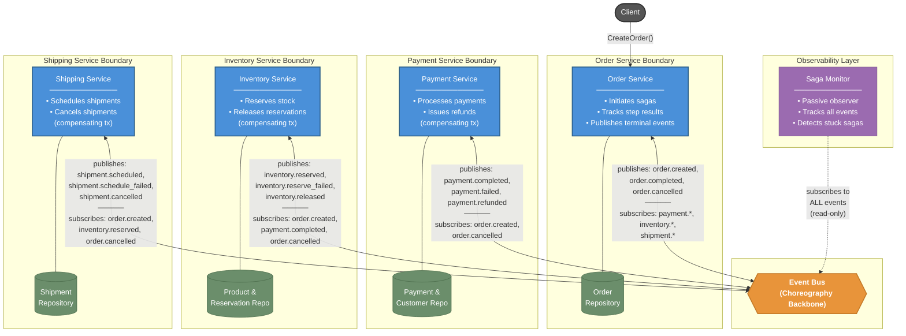
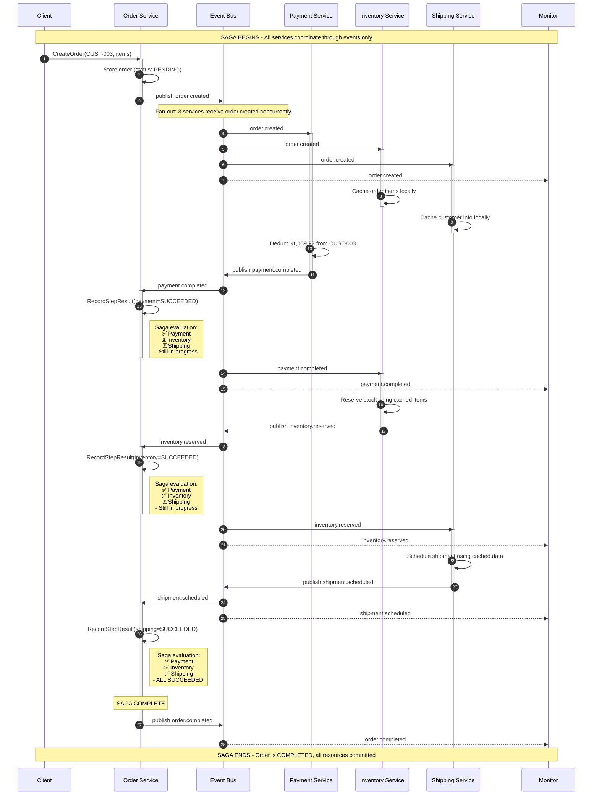
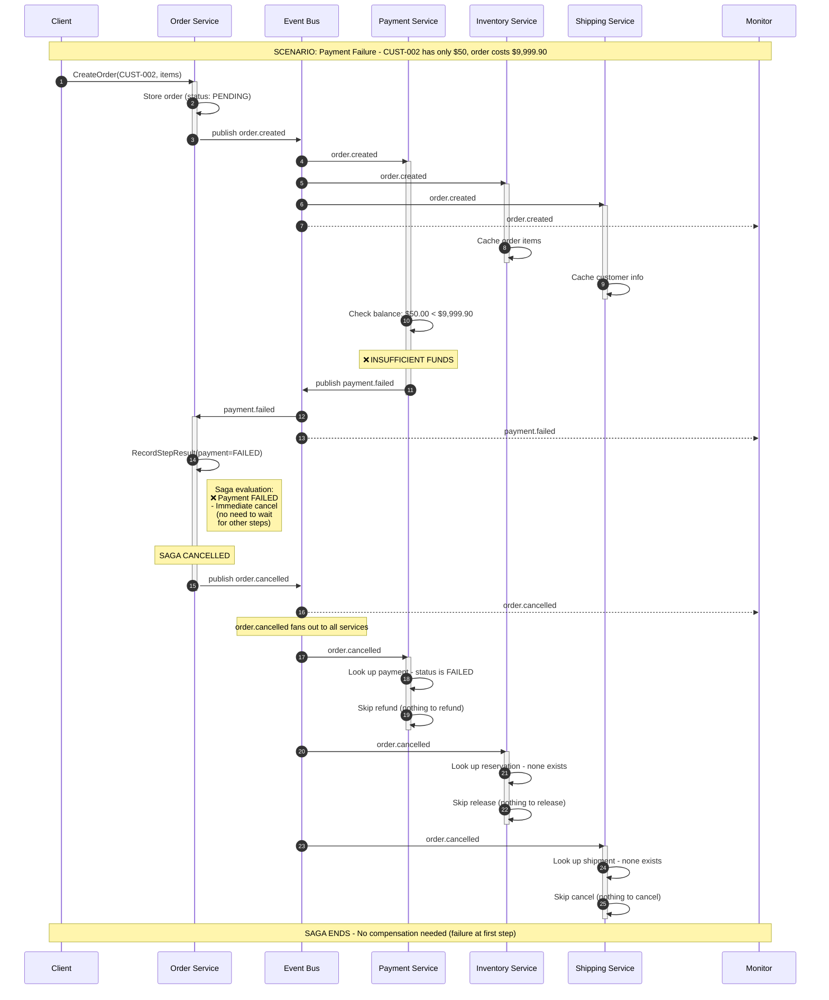
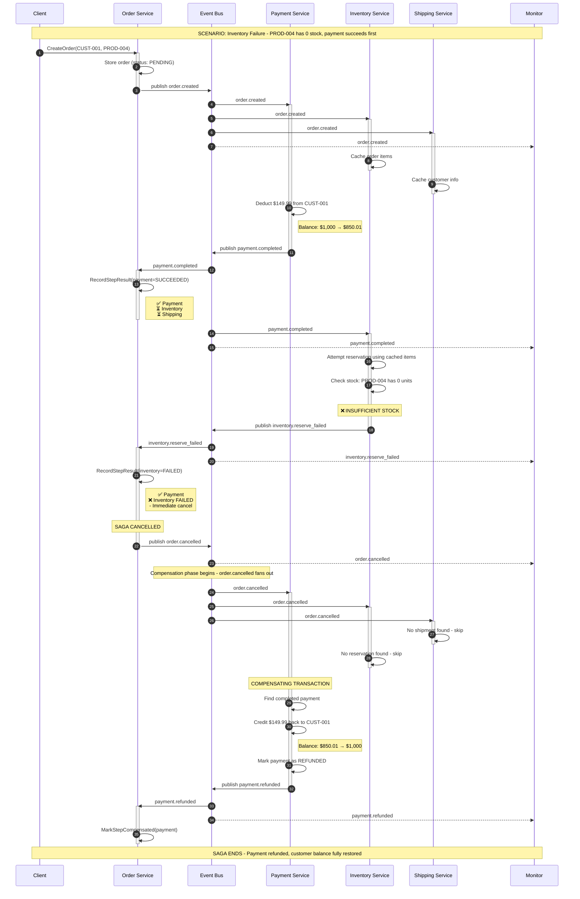
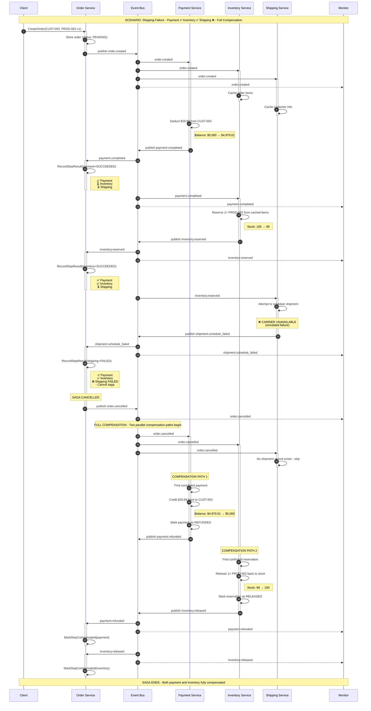
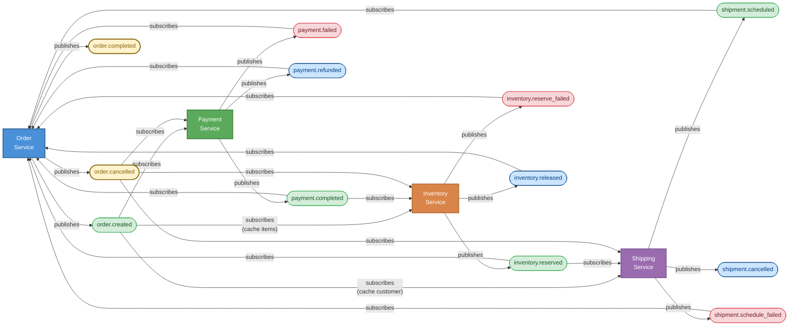

# Saga Pattern in Go: Building resilient distributed transactions with Choreography

## Table of Contents
- [Introduction](#introduction)
- [What is the Saga pattern?](#what-is-the-saga-pattern)
- [Choreography vs. Orchestration](#choreography-vs-orchestration)
- [The complete event flow](#the-complete-event-flow)
- [Prerequisites](#prerequisites)
- [Step 1: Setting up our choreography environment](#step-1-setting-up-our-choreography-environment)
- [Step 2: Building the event infrastructure](#step-2-building-the-event-infrastructure)
- [Step 3: Implementing the Order service](#step-3-implementing-the-order-service)
- [Step 4: Implementing the Payment service](#step-4-implementing-the-payment-service)
- [Step 5: Implementing the Inventory service](#step-5-implementing-the-inventory-service)
- [Step 6: Implementing the Shipping service](#step-6-implementing-the-shipping-service)
- [Step 7: Handling failures and compensating transactions](#step-7-handling-failures-and-compensating-transactions)
- [Step 8: Monitoring and observability](#step-8-monitoring-and-observability)
- [Step 9: Validating Saga correctness with tests](#step-9-validating-saga-correctness-with-tests)
- [Step 10: Testing the complete Saga flow](#step-10-testing-the-complete-saga-flow)
- [Conclusion](#conclusion)

---

#### Introduction

In the world of microservices, one of the most challenging problems to solve is maintaining data consistency across multiple services.
Traditional database transactions, which rely on ACID properties (Atomicity, Consistency, Isolation, Durability), simply don't work when your data is distributed across different databases owned by different services.

Consider a typical e-commerce order flow: create the order, process payment, reserve inventory, schedule shipping.
In a monolith with a single database, you'd wrap all four in one transaction. If any step fails, everything rolls back.
But in a microservices architecture, each operation lives in a different service with its own database.
Traditional distributed transactions (like two-phase commit) create tight coupling, introduce single points of failure, and don't scale.

This is where the Saga pattern comes in. A Saga is a sequence of local transactions, where each transaction updates data within a single service.
If one transaction fails, the Saga executes compensating transactions to undo the changes made by preceding transactions, thereby maintaining data consistency across all services.

In this deep dive, we'll build a complete e-commerce order processing system using the choreography-based Saga pattern.
You'll learn how to design services that communicate through events, implement compensating transactions for failure recovery, and build a system that maintains consistency even when things go wrong.

> **What we'll build:** A complete e-commerce order processing system with four independent microservices (Order, Payment, Inventory, Shipping) that coordinate through events. We'll handle three failure scenarios - payment failure, out-of-stock inventory, and shipping failure - each triggering automatic compensating transactions to maintain consistency.
> By the end, you'll have a running Go program that demonstrates every aspect of choreography-based sagas.

---

#### What is the Saga pattern?

The Saga pattern, originally described by Hector Garcia-Molina and Kenneth Salem in 1987, breaks a long-lived transaction into a sequence of smaller, local transactions.
Each local transaction updates data within a single service and publishes events or messages to trigger the next transaction in the sequence.

The key insight of the Saga pattern is that instead of rolling back a failed transaction (which is impossible across service boundaries),
we execute compensating transactions that semantically undo the effects of completed transactions.
For example, if a payment was successfully processed but inventory reservation fails, instead of rolling back the payment, we execute a refund operation.

There are two primary ways to coordinate a Saga: choreography and orchestration.

In **choreography**, there is no central coordinator.
Each service produces and listens to events from other services and decides what actions to take based on those events.
Services are loosely coupled and autonomous, each responsible for its own part of the workflow.

In **orchestration**, a central coordinator (the orchestrator) tells participants what to do and when.
The orchestrator is responsible for the overall workflow logic and handles failures by invoking compensating transactions.

This scenario focuses on the choreography approach. We explored orchestration in the previous scenario (Scenario 4), allowing you to compare both approaches and understand when each is most appropriate.

Choreography-based sagas are characterized by decentralization: no single service knows the entire workflow, so there's no single point of failure for coordination.
Services communicate only through events and don't need to know about each other's existence - a service can be replaced, scaled, or modified without affecting others, as long as it continues producing and consuming the expected events.
This loose coupling enables natural scalability, since each service (and the event bus itself) can be scaled independently.

The tradeoff is complexity in understanding the flow. Because the workflow is distributed across multiple services, it can be harder to understand and debug the overall process.
We'll address this challenge with proper monitoring and observability in Step 8.

---

#### Choreography vs. Orchestration

Before diving into implementation, let's understand when to choose choreography over orchestration.

| Aspect | Choreography                            | Orchestration                                      |
|--------|-----------------------------------------|----------------------------------------------------|
| Coordination | Decentralized (event-driven)            | Centralized (orchestrator)                         |
| Coupling | Loose - services only know about events | Tighter - orchestrator knows all participants      |
| Single Point of Failure | None for coordination                   | Orchestrator is a SPOF                             |
| Flow Visibility | Distributed (harder to trace)           | Centralized (easy to inspect)                      |
| Best For | Simple, linear workflows (<5 steps)     | Complex workflows with branching logic             |
| Team Autonomy | High - services evolve independently    | Lower - changes often require orchestrator updates |
| Debugging | Requires distributed tracing            | Inspect orchestrator state                         |

**Choose choreography when** you have simple workflows with few steps (typically less than five services), services are developed and maintained by different teams who need autonomy,
you want to avoid creating a single point of failure, and the workflow logic is unlikely to change frequently.

**Choose orchestration when** the workflow is complex with many conditional branches, you need clear visibility into the overall workflow state,
compensating transactions are complex and require careful coordination, or you expect the workflow logic to change frequently.

For our e-commerce example, choreography is a good fit because the order workflow is relatively straightforward: create order → process payment → reserve inventory → schedule shipping.
The flow is linear, and each service has clear responsibilities.

---

#### The complete event flow

Let's visualize the complete system we'll build.
The diagram below shows all four services, their data stores, the central event bus, and every event that flows between them.
This is the "big picture" - refer back to it as we implement each service in the steps that follow.



Each service reacts only to events it cares about and publishes events describing what happened.
No service knows the complete workflow - the overall behavior emerges from each service fulfilling its local responsibilities.

---

#### Prerequisites

Before we begin, you'll need:

- Go installed (version 1.26+)
- Basic understanding of Go concurrency (goroutines, channels)
- Familiarity with event-driven architecture concepts
- Understanding of microservices patterns

We'll start with an in-memory event bus to keep things simple.

---

#### Step 1: Setting up our choreography environment

Let's create our project structure. We'll build four microservices that communicate through events to process orders.

```bash
mkdir -p saga-choreography/{cmd,pkg,internal}
cd saga-choreography
go mod init saga-choreography
```

First, let's define our domain models that will be shared across services.

Create `pkg/models/models.go`:

```go
package models

import (
	"time"
)

// OrderStatus represents the current state of an order in the saga.
// These statuses form a state machine that tracks how far the saga has progressed
// and whether it completed successfully or was rolled back.
type OrderStatus string

const (
	OrderStatusPending           OrderStatus = "PENDING"
	OrderStatusPaymentCompleted  OrderStatus = "PAYMENT_COMPLETED"
	OrderStatusPaymentFailed     OrderStatus = "PAYMENT_FAILED"
	OrderStatusInventoryReserved OrderStatus = "INVENTORY_RESERVED"
	OrderStatusInventoryFailed   OrderStatus = "INVENTORY_FAILED"
	OrderStatusShippingFailed    OrderStatus = "SHIPPING_FAILED"
	OrderStatusCompleted         OrderStatus = "COMPLETED"
	OrderStatusCancelled         OrderStatus = "CANCELLED"
)

// StepResult tracks the outcome of an individual saga step.
// Each step in the saga (payment, inventory, shipping) progresses independently
// through these states. This decoupling is what allows the Order service to
// handle events arriving in any order.
type StepResult string

const (
	// StepPending means the step has not yet reported a result.
	StepPending StepResult = "PENDING"

	// StepSucceeded means the step completed its work successfully.
	StepSucceeded StepResult = "SUCCEEDED"

	// StepFailed means the step could not complete its work.
	StepFailed StepResult = "FAILED"

	// StepCompensated means the step's work was successfully undone.
	// This is set when a compensation confirmation event arrives (e.g.,
	// payment.refunded or inventory.released). It's purely informational
	// and doesn't affect saga evaluation.
	StepCompensated StepResult = "COMPENSATED"
)

// SagaAction tells the Order service what to do after recording a step result.
// The repository's RecordStepResult method evaluates all three step results
// atomically (under a mutex) and returns one of these actions. This ensures
// that even if two events race to update different steps, exactly one of them
// will trigger the terminal action.
type SagaAction int

const (
	// SagaActionNone means the saga is still in progress - more step results
	// are needed before a terminal decision can be made.
	SagaActionNone SagaAction = iota

	// SagaActionComplete means all three steps succeeded. The service should
	// publish order.completed.
	SagaActionComplete

	// SagaActionCancel means at least one step failed. The service should
	// publish order.cancelled to trigger compensating transactions.
	SagaActionCancel
)

// Order represents a customer order.
type Order struct {
	ID          string      `json:"id"`
	CustomerID  string      `json:"customer_id"`
	Items       []OrderItem `json:"items"`
	TotalAmount float64     `json:"total_amount"`
	Status      OrderStatus `json:"status"`
	CreatedAt   time.Time   `json:"created_at"`
	UpdatedAt   time.Time   `json:"updated_at"`

	// Step-level tracking for out-of-order event handling.
	// Each field records the outcome of one saga step independently.
	// The overall OrderStatus is derived from these three fields by the
	// repository's evaluateSaga method, rather than being set directly
	// by individual event handlers.
	PaymentStep   StepResult `json:"payment_step"`
	InventoryStep StepResult `json:"inventory_step"`
	ShippingStep  StepResult `json:"shipping_step"`

	// Saga-related fields for tracking compensation.
	// These IDs let the Order service know which resources were created
	// downstream, which is essential for understanding what needs to be
	// undone if the saga fails.
	PaymentID      string `json:"payment_id,omitempty"`
	ReservationID  string `json:"reservation_id,omitempty"`
	ShipmentID     string `json:"shipment_id,omitempty"`
	TrackingNumber string `json:"tracking_number,omitempty"`
}

// OrderItem represents a single item in an order.
type OrderItem struct {
	ProductID string  `json:"product_id"`
	Quantity  int     `json:"quantity"`
	Price     float64 `json:"price"`
}

// Payment represents a payment transaction.
type Payment struct {
	ID         string        `json:"id"`
	OrderID    string        `json:"order_id"`
	CustomerID string        `json:"customer_id"`
	Amount     float64       `json:"amount"`
	Status     PaymentStatus `json:"status"`
	CreatedAt  time.Time     `json:"created_at"`
}

// PaymentStatus represents the state of a payment.
type PaymentStatus string

const (
	PaymentStatusPending   PaymentStatus = "PENDING"
	PaymentStatusCompleted PaymentStatus = "COMPLETED"
	PaymentStatusFailed    PaymentStatus = "FAILED"
	PaymentStatusRefunded  PaymentStatus = "REFUNDED"
)

// InventoryReservation represents a reservation of inventory items.
type InventoryReservation struct {
	ID        string                     `json:"id"`
	OrderID   string                     `json:"order_id"`
	Items     []InventoryReservationItem `json:"items"`
	Status    ReservationStatus          `json:"status"`
	CreatedAt time.Time                  `json:"created_at"`
}

// InventoryReservationItem represents a single item in a reservation.
type InventoryReservationItem struct {
	ProductID string `json:"product_id"`
	Quantity  int    `json:"quantity"`
}

// ReservationStatus represents the state of an inventory reservation.
type ReservationStatus string

const (
	ReservationStatusPending   ReservationStatus = "PENDING"
	ReservationStatusConfirmed ReservationStatus = "CONFIRMED"
	ReservationStatusReleased  ReservationStatus = "RELEASED"
	ReservationStatusFailed    ReservationStatus = "FAILED"
)

// Shipment represents a shipping request.
type Shipment struct {
	ID              string         `json:"id"`
	OrderID         string         `json:"order_id"`
	CustomerID      string         `json:"customer_id"`
	ShippingAddress string         `json:"shipping_address"`
	Status          ShipmentStatus `json:"status"`
	TrackingNumber  string         `json:"tracking_number,omitempty"`
	CreatedAt       time.Time      `json:"created_at"`
}

// ShipmentStatus represents the state of a shipment.
type ShipmentStatus string

const (
	ShipmentStatusPending   ShipmentStatus = "PENDING"
	ShipmentStatusScheduled ShipmentStatus = "SCHEDULED"
	ShipmentStatusCancelled ShipmentStatus = "CANCELLED"
)

// Product represents an item in the inventory.
type Product struct {
	ID       string  `json:"id"`
	Name     string  `json:"name"`
	Price    float64 `json:"price"`
	Quantity int     `json:"quantity"` // Available quantity
}

// Customer represents a customer with payment information.
type Customer struct {
	ID              string  `json:"id"`
	Name            string  `json:"name"`
	Email           string  `json:"email"`
	Balance         float64 `json:"balance"` // Available balance for payments
	ShippingAddress string  `json:"shipping_address"`
}
```

The models we've defined capture the essential entities in our e-commerce domain.
Notice how each entity has a status field that allows us to track its state throughout the saga.
This is crucial for implementing compensating transactions, because we need to know the current state before we can undo it.

---

#### Step 2: Building the event infrastructure

The heart of a choreography-based saga is the event bus. In production, you'd use a message broker like Apache Kafka, NATS, or RabbitMQ.
For learning purposes, we'll build an in-memory event bus that demonstrates the core concepts.

Create `pkg/events/event.go`:

```go
package events

import (
	"encoding/json"
	"fmt"
	"sync/atomic"
	"time"

	"saga-choreography/pkg/models"
)

// EventType identifies the type of event being published.
type EventType string

// Domain events for the order saga.
//
// The naming convention follows: {Entity}{Action}
// Events use past tense because they represent something that has already happened.
// This is a deliberate design choice: events are facts about the world, not commands.
const (
	// Order events
	OrderCreated   EventType = "order.created"
	OrderCompleted EventType = "order.completed"
	OrderCancelled EventType = "order.cancelled"

	// Payment events
	PaymentCompleted EventType = "payment.completed"
	PaymentFailed    EventType = "payment.failed"
	PaymentRefunded  EventType = "payment.refunded"

	// Inventory events
	InventoryReserved      EventType = "inventory.reserved"
	InventoryReserveFailed EventType = "inventory.reserve_failed"
	InventoryReleased      EventType = "inventory.released"

	// Shipping events
	ShipmentScheduled      EventType = "shipment.scheduled"
	ShipmentScheduleFailed EventType = "shipment.schedule_failed"
	ShipmentCancelled      EventType = "shipment.cancelled"
)

// idCounter provides monotonically increasing IDs that are safe for concurrent use.
// Using time-based IDs (like time.Now().Format(...)) leads to collisions when multiple
// events are created within the same nanosecond, which is common in event-driven systems
// where a single incoming event can trigger several outgoing events in rapid succession.
var idCounter atomic.Uint64

// GenerateID creates a unique identifier by combining a monotonic counter with a timestamp.
// The counter guarantees uniqueness even under high concurrency, while the timestamp
// provides human-readable ordering for debugging. In production, use a proper UUID library.
func GenerateID(prefix string) string {
	id := idCounter.Add(1)
	return fmt.Sprintf("%s-%d-%04d", prefix, time.Now().UnixMilli(), id)
}

// Event represents a domain event in our saga.
// Every event carries two tracing IDs that together let you reconstruct the full
// causal history of any saga instance.
type Event struct {
	ID            string          `json:"id"`
	Type          EventType       `json:"type"`
	AggregateID   string          `json:"aggregate_id"`   // The ID of the entity this event relates to
	AggregateType string          `json:"aggregate_type"` // The type of entity (order, payment, etc.)
	Timestamp     time.Time       `json:"timestamp"`
	Data          json.RawMessage `json:"data"`

	// CorrelationID groups all events in a single saga instance.
	// Typically set to the order ID so that every event produced during
	// order processing, across all services, shares the same correlation ID.
	CorrelationID string `json:"correlation_id"`

	// CausationID records the ID of the event that directly caused this event.
	// While CorrelationID gives you the "which saga" answer, CausationID gives
	// you the "why did this happen" answer, forming a chain of cause and effect.
	CausationID string `json:"causation_id"`
}

// NewEvent creates a new event with the given type and data.
func NewEvent(eventType EventType, aggregateID, aggregateType string, data any) (*Event, error) {
	dataBytes, err := json.Marshal(data)
	if err != nil {
		return nil, fmt.Errorf("failed to marshal event data: %w", err)
	}

	return &Event{
		ID:            GenerateID("evt"),
		Type:          eventType,
		AggregateID:   aggregateID,
		AggregateType: aggregateType,
		Timestamp:     time.Now(),
		Data:          dataBytes,
	}, nil
}

// WithCorrelation sets the correlation ID for event tracing.
func (e *Event) WithCorrelation(correlationID string) *Event {
	e.CorrelationID = correlationID
	return e
}

// WithCausation sets the causation ID to track event chains.
func (e *Event) WithCausation(causationID string) *Event {
	e.CausationID = causationID
	return e
}

// ParseData unmarshals the event data into the provided struct.
func (e *Event) ParseData(v any) error {
	return json.Unmarshal(e.Data, v)
}

// --- Event payload structures ---
// These define the data carried by each event type.
// A critical design decision in choreography is what data to include in each event.
// Including too little forces services to query each other (introducing coupling).
// Including too much creates large events and potential data consistency issues.
// The guideline: include everything a downstream consumer needs to act autonomously.

// OrderCreatedData contains the data for an order.created event.
// We include the full order with all items because multiple downstream services
// (Payment and Inventory) need this information to do their work.
type OrderCreatedData struct {
	Order models.Order `json:"order"`
}

// PaymentCompletedData contains the data for a payment.completed event.
type PaymentCompletedData struct {
	PaymentID  string  `json:"payment_id"`
	OrderID    string  `json:"order_id"`
	CustomerID string  `json:"customer_id"`
	Amount     float64 `json:"amount"`
}

// PaymentFailedData contains the data for a payment.failed event.
type PaymentFailedData struct {
	OrderID    string `json:"order_id"`
	CustomerID string `json:"customer_id"`
	Reason     string `json:"reason"`
}

// PaymentRefundedData contains the data for a payment.refunded event.
type PaymentRefundedData struct {
	PaymentID  string  `json:"payment_id"`
	OrderID    string  `json:"order_id"`
	CustomerID string  `json:"customer_id"`
	Amount     float64 `json:"amount"`
	Reason     string  `json:"reason"`
}

// InventoryReservedData contains the data for an inventory.reserved event.
type InventoryReservedData struct {
	ReservationID string                            `json:"reservation_id"`
	OrderID       string                            `json:"order_id"`
	Items         []models.InventoryReservationItem `json:"items"`
}

// InventoryReserveFailedData contains the data for an inventory.reserve_failed event.
type InventoryReserveFailedData struct {
	OrderID string `json:"order_id"`
	Reason  string `json:"reason"`
}

// InventoryReleasedData contains the data for an inventory.released event.
type InventoryReleasedData struct {
	ReservationID string `json:"reservation_id"`
	OrderID       string `json:"order_id"`
	Reason        string `json:"reason"`
}

// ShipmentScheduledData contains the data for a shipment.scheduled event.
type ShipmentScheduledData struct {
	ShipmentID     string `json:"shipment_id"`
	OrderID        string `json:"order_id"`
	TrackingNumber string `json:"tracking_number"`
}

// ShipmentScheduleFailedData contains the data for a shipment.schedule_failed event.
type ShipmentScheduleFailedData struct {
	OrderID string `json:"order_id"`
	Reason  string `json:"reason"`
}

// ShipmentCancelledData contains the data for a shipment.cancelled event.
type ShipmentCancelledData struct {
	ShipmentID string `json:"shipment_id"`
	OrderID    string `json:"order_id"`
	Reason     string `json:"reason"`
}

// OrderCompletedData contains the data for an order.completed event.
type OrderCompletedData struct {
	OrderID        string `json:"order_id"`
	PaymentID      string `json:"payment_id"`
	ReservationID  string `json:"reservation_id"`
	ShipmentID     string `json:"shipment_id"`
	TrackingNumber string `json:"tracking_number"`
}

// OrderCancelledData contains the data for an order.cancelled event.
type OrderCancelledData struct {
	OrderID string `json:"order_id"`
	Reason  string `json:"reason"`
}
```

Now let's build the event bus itself. This is the communication backbone of our choreography-based system.
Notice that we use `log/slog` for structured logging throughout this project.
In a distributed system, structured logs with fields like `correlation_id` and `event_type` are essential for querying and filtering logs across services.

Create `pkg/events/bus.go`:

```go
package events

import (
	"context"
	"fmt"
	"log/slog"
	"sync"
	"time"
)

// EventHandler is a function that processes events.
type EventHandler func(ctx context.Context, event *Event) error

// Subscription represents a subscription to specific event types.
type Subscription struct {
	ID          string
	ServiceName string
	EventTypes  []EventType
	Handler     EventHandler
}

// EventBus manages event publishing and subscription.
// This is an in-memory implementation for demonstration purposes.
// In production, replace this with Kafka, NATS, or RabbitMQ.
type EventBus struct {
	mu            sync.RWMutex
	subscriptions map[EventType][]*Subscription
	allEvents     []*Event // Store all events for debugging/replay

	// done is closed when a terminal event (OrderCompleted or OrderCancelled) is published.
	done chan struct{}

	// Configuration
	asyncDelivery bool
	logger        *slog.Logger
}

// NewEventBus creates a new event bus.
func NewEventBus(logger *slog.Logger) *EventBus {
	return &EventBus{
		subscriptions: make(map[EventType][]*Subscription),
		allEvents:     make([]*Event, 0),
		done:          make(chan struct{}, 100), // buffered so multiple sagas can signal
		asyncDelivery: true,                     // default to async for realistic behavior
		logger:        logger,
	}
}

// SetAsyncDelivery controls whether events are delivered asynchronously.
// Synchronous delivery is useful for testing because it makes event processing
// deterministic and eliminates the need for sleeps or polling.
func (eb *EventBus) SetAsyncDelivery(async bool) {
	eb.asyncDelivery = async
}

// WaitForSaga blocks until a terminal event is published or the context is cancelled.
func (eb *EventBus) WaitForSaga(ctx context.Context, timeout time.Duration) error {
	ctx, cancel := context.WithTimeout(ctx, timeout)
	defer cancel()

	select {
	case <-eb.done:
		// Give async handlers a moment to finish processing the terminal event.
		time.Sleep(50 * time.Millisecond)
		return nil
	case <-ctx.Done():
		return fmt.Errorf("saga did not complete within %v", timeout)
	}
}

// Subscribe registers a handler for specific event types.
func (eb *EventBus) Subscribe(serviceName string, eventTypes []EventType, handler EventHandler) *Subscription {
	eb.mu.Lock()
	defer eb.mu.Unlock()

	sub := &Subscription{
		ID:          GenerateID("sub"),
		ServiceName: serviceName,
		EventTypes:  eventTypes,
		Handler:     handler,
	}

	for _, eventType := range eventTypes {
		eb.subscriptions[eventType] = append(eb.subscriptions[eventType], sub)
		eb.logger.Info("[EventBus] Subscribed to event",
			"service", serviceName,
			"event_type", string(eventType),
		)
	}

	return sub
}

// Publish sends an event to all interested subscribers.
func (eb *EventBus) Publish(ctx context.Context, event *Event) error {
	eb.mu.Lock()
	eb.allEvents = append(eb.allEvents, event)

	// Copy the subscriber slice so we can release the lock before delivering.
	// Without this copy, we'd hold the lock during handler execution, which would
	// deadlock if a handler tries to publish another event (which they all do).
	subscribers := make([]*Subscription, len(eb.subscriptions[event.Type]))
	copy(subscribers, eb.subscriptions[event.Type])
	eb.mu.Unlock()

	eb.logger.Info("[EventBus] Publishing event",
		"event_type", string(event.Type),
		"event_id", event.ID,
		"correlation_id", event.CorrelationID,
	)

	// Signal completion for terminal events so WaitForSaga can unblock
	if event.Type == OrderCompleted || event.Type == OrderCancelled {
		select {
		case eb.done <- struct{}{}:
		default:
		}
	}

	if len(subscribers) == 0 {
		eb.logger.Warn("[EventBus] No subscribers for event",
			"event_type", string(event.Type),
		)
		return nil
	}

	// Deliver to all subscribers
	for _, sub := range subscribers {
		if eb.asyncDelivery {
			// Async delivery: more realistic for distributed systems.
			// Each subscriber processes events independently and concurrently.
			go eb.deliverEvent(ctx, sub, event)
		} else {
			// Sync delivery: useful for testing where you need deterministic ordering.
			if err := eb.deliverEvent(ctx, sub, event); err != nil {
				return err
			}
		}
	}

	return nil
}

// deliverEvent delivers an event to a single subscriber.
func (eb *EventBus) deliverEvent(ctx context.Context, sub *Subscription, event *Event) error {
	eb.logger.Info("[EventBus] Delivering event",
		"event_type", string(event.Type),
		"target_service", sub.ServiceName,
	)

	if err := sub.Handler(ctx, event); err != nil {
		eb.logger.Error("[EventBus] Event delivery failed",
			"event_type", string(event.Type),
			"target_service", sub.ServiceName,
			"error", err,
		)
		return fmt.Errorf("handler error in %s: %w", sub.ServiceName, err)
	}

	return nil
}

// GetEvents returns all published events (for debugging).
func (eb *EventBus) GetEvents() []*Event {
	eb.mu.RLock()
	defer eb.mu.RUnlock()

	events := make([]*Event, len(eb.allEvents))
	copy(events, eb.allEvents)
	return events
}

// GetEventsByCorrelation returns all events for a specific saga instance.
func (eb *EventBus) GetEventsByCorrelation(correlationID string) []*Event {
	eb.mu.RLock()
	defer eb.mu.RUnlock()

	var events []*Event
	for _, event := range eb.allEvents {
		if event.CorrelationID == correlationID {
			events = append(events, event)
		}
	}
	return events
}

// Reset clears all events and creates a fresh completion channel.
// Call this between test scenarios to get a clean slate.
func (eb *EventBus) Reset() {
	eb.mu.Lock()
	defer eb.mu.Unlock()
	eb.allEvents = make([]*Event, 0)
	eb.done = make(chan struct{}, 100)
}
```

The event bus implementation includes several important features for saga coordination.

The **correlation ID** groups all events belonging to the same saga instance together.
When an order is created, we assign it a correlation ID (typically the order ID itself), and all subsequent events in that saga carry the same correlation ID.
This makes it easy to trace the entire flow of a saga instance.

The **causation ID** tracks which event caused another event.
For example, when the Payment service completes a payment in response to an `order.created` event, the resulting `payment.completed` event includes the ID of the `order.created` event as its causation ID.
This creates a chain of events that helps in debugging and understanding the flow.

**Structured logging with `slog`** is a deliberate choice for this project.
In a choreography-based system where events flow across multiple services, you need to be able to search your logs by correlation ID to reconstruct what happened during a particular saga.
With `slog`, every log entry is a structured record with queryable fields like `correlation_id`, `event_type`, and `target_service`.
In production, you'd configure a JSON handler (`slog.NewJSONHandler`) so that log aggregation systems like VictoriaLogs, Datadog, Elasticsearch, or CloudWatch can index these fields automatically.

---

#### Step 3: Implementing the Order service

The Order service is the entry point for our saga.
It creates orders and listens for events from other services to update order status. It's also responsible for determining when the saga is complete or when it has failed.

Create `internal/order/repository.go`:

```go
package order

import (
	"context"
	"fmt"
	"iter"
	"sync"
	"time"

	"saga-choreography/pkg/models"
)

// StepName identifies which saga step is reporting a result.
type StepName string

const (
	StepPayment   StepName = "payment"
	StepInventory StepName = "inventory"
	StepShipping  StepName = "shipping"
)

// StepRefs carries optional resource references to store alongside a step result.
// When a downstream service completes work (e.g., creates a payment or reservation),
// it includes the resource ID in its success event. The Order service passes these
// through StepRefs so they're stored atomically with the step result update.
type StepRefs struct {
	PaymentID      string
	ReservationID  string
	ShipmentID     string
	TrackingNumber string
}

// Repository provides storage for orders.
// In production, this would be backed by a database.
//
// All methods accept a context.Context as their first parameter. While our
// in-memory implementation doesn't use the context, this signature matches
// what a production database-backed repository would require (for query
// timeouts, cancellation, and tracing). Teaching the correct habit from
// the start prevents a painful refactor later.
type Repository struct {
	mu     sync.RWMutex
	orders map[string]*models.Order
}

// NewRepository creates a new order repository.
func NewRepository() *Repository {
	return &Repository{
		orders: make(map[string]*models.Order),
	}
}

// Create stores a new order. All step results are initialized to StepPending.
func (r *Repository) Create(ctx context.Context, order *models.Order) error {
	r.mu.Lock()
	defer r.mu.Unlock()

	if _, exists := r.orders[order.ID]; exists {
		return fmt.Errorf("order %s already exists", order.ID)
	}

	order.CreatedAt = time.Now()
	order.UpdatedAt = time.Now()
	order.PaymentStep = models.StepPending
	order.InventoryStep = models.StepPending
	order.ShippingStep = models.StepPending
	r.orders[order.ID] = order
	return nil
}

// Get retrieves an order by ID.
func (r *Repository) Get(ctx context.Context, id string) (*models.Order, error) {
	r.mu.RLock()
	defer r.mu.RUnlock()

	order, exists := r.orders[id]
	if !exists {
		return nil, fmt.Errorf("order %s not found", id)
	}

	// Return a copy to avoid race conditions.
	// Without this, a caller could modify the order through the returned pointer
	// while another goroutine is reading it, causing data races.
	//
	// Go 1.26's new(expr) syntax lets us write new(*order) instead of the old
	// pattern of declaring a variable and taking its address. The expression
	// *order dereferences the pointer to produce a value, and new(...) allocates
	// a fresh variable initialized to that value, returning a pointer to it.
	orderCopy := new(*order)
	orderCopy.Items = make([]models.OrderItem, len(order.Items))
	copy(orderCopy.Items, order.Items)
	return orderCopy, nil
}

// RecordStepResult atomically records a step's outcome, stores any resource
// references, and evaluates whether the saga has reached a terminal state.
//
// This is the central method that makes out-of-order event handling safe.
// The entire read-modify-evaluate cycle happens under a single mutex lock,
// which guarantees that even if two goroutines deliver events simultaneously
// (e.g., payment.completed and inventory.reserve_failed racing), exactly one
// of them will observe the transition to a terminal state and receive a
// non-None SagaAction. The other will find the order already in a terminal
// status and receive SagaActionNone.
func (r *Repository) RecordStepResult(ctx context.Context, orderID string, step StepName, result models.StepResult, refs StepRefs) (models.SagaAction, error) {
	r.mu.Lock()
	defer r.mu.Unlock()

	order, exists := r.orders[orderID]
	if !exists {
		return models.SagaActionNone, fmt.Errorf("order %s not found", orderID)
	}

	// Terminal orders accept no further updates.
	// This is the guard that prevents double-publishing of order.completed
	// or order.cancelled when two events race to complete/cancel the saga.
	if order.Status == models.OrderStatusCompleted || order.Status == models.OrderStatusCancelled {
		return models.SagaActionNone, nil
	}

	// 1. Record the step result
	switch step {
	case StepPayment:
		order.PaymentStep = result
	case StepInventory:
		order.InventoryStep = result
	case StepShipping:
		order.ShippingStep = result
	}

	// 2. Store any resource references
	if refs.PaymentID != "" {
		order.PaymentID = refs.PaymentID
	}
	if refs.ReservationID != "" {
		order.ReservationID = refs.ReservationID
	}
	if refs.ShipmentID != "" {
		order.ShipmentID = refs.ShipmentID
	}
	if refs.TrackingNumber != "" {
		order.TrackingNumber = refs.TrackingNumber
	}

	order.UpdatedAt = time.Now()

	// 3. Evaluate the saga state based on all step results
	return r.evaluateSaga(order), nil
}

// evaluateSaga examines the three step results and determines whether the saga
// has reached a terminal state. It also updates the order's Status field for
// observability.
//
// The evaluation logic is simple and deliberate:
//   - Any failure - cancel immediately. We don't wait for other steps to report
//     because a failure is definitive: the saga cannot succeed. The order.cancelled
//     event will reach all services, and each one independently checks its local
//     state to decide whether compensation is needed.
//   - All three succeeded - complete. This is the only path to success.
//   - Otherwise - still in progress. Update the status to reflect the most
//     advanced successful step for observability, but take no terminal action.
func (r *Repository) evaluateSaga(order *models.Order) models.SagaAction {
	// Check for any failure - this takes priority over everything else.
	// A single failed step is enough to doom the saga, regardless of what
	// other steps have reported (or haven't reported yet).
	if order.PaymentStep == models.StepFailed {
		order.Status = models.OrderStatusCancelled
		return models.SagaActionCancel
	}
	if order.InventoryStep == models.StepFailed {
		order.Status = models.OrderStatusCancelled
		return models.SagaActionCancel
	}
	if order.ShippingStep == models.StepFailed {
		order.Status = models.OrderStatusCancelled
		return models.SagaActionCancel
	}

	// Check for full success - all three steps must have reported success.
	if order.PaymentStep == models.StepSucceeded &&
		order.InventoryStep == models.StepSucceeded &&
		order.ShippingStep == models.StepSucceeded {
		order.Status = models.OrderStatusCompleted
		return models.SagaActionComplete
	}

	// Still in progress. Derive the most descriptive intermediate status
	// from the step results so that queries and dashboards can show how
	// far the saga has progressed.
	switch {
	case order.PaymentStep == models.StepSucceeded && order.InventoryStep == models.StepSucceeded:
		order.Status = models.OrderStatusInventoryReserved
	case order.PaymentStep == models.StepSucceeded:
		order.Status = models.OrderStatusPaymentCompleted
	default:
		order.Status = models.OrderStatusPending
	}

	return models.SagaActionNone
}

// MarkStepCompensated records that a step's work has been undone.
// This is called when compensation confirmation events arrive (payment.refunded,
// inventory.released). It's purely informational and doesn't change the saga
// outcome - the order is already CANCELLED by this point.
func (r *Repository) MarkStepCompensated(ctx context.Context, orderID string, step StepName) {
	r.mu.Lock()
	defer r.mu.Unlock()

	order, exists := r.orders[orderID]
	if !exists {
		return
	}

	switch step {
	case StepPayment:
		order.PaymentStep = models.StepCompensated
	case StepInventory:
		order.InventoryStep = models.StepCompensated
	}

	order.UpdatedAt = time.Now()
}

// All returns an iterator over all orders.
func (r *Repository) All() iter.Seq[*models.Order] {
	return func(yield func(*models.Order) bool) {
		r.mu.RLock()
		defer r.mu.RUnlock()

		for _, order := range r.orders {
			// new(*order) creates a safe copy using Go 1.26's new(expr) syntax.
			if !yield(new(*order)) {
				return
			}
		}
	}
}
```

Now let's implement the Order service itself.

Create `internal/order/service.go`:

```go
package order

import (
	"context"
	"fmt"
	"iter"
	"log/slog"
	"sync"

	"saga-choreography/pkg/events"
	"saga-choreography/pkg/models"
)

// Service handles order related business logic and saga coordination.
// In a choreography, the Order service plays a dual role: it initiates the saga
// by creating orders and publishing the first event, and it tracks saga progress
// by listening to success/failure events from all other services.
type Service struct {
	repo     *Repository
	eventBus *events.EventBus
	logger   *slog.Logger

	// processedEvents provides idempotency protection. In a distributed system,
	// the same event might be delivered more than once (at-least-once delivery).
	// Without this guard, a duplicate "payment.completed" event could corrupt
	// the order state or trigger duplicate downstream actions.
	//
	// WARNING: In a long-running production service, this map grows without bound
	// and will eventually cause an OOM crash. For production use, replace this with:
	//   - An LRU cache (e.g., hashicorp/golang-lru) with a size limit
	//   - A Redis key with a TTL (e.g., SET event_id 1 EX 3600 NX)
	//   - The Transactional Inbox Pattern: store processed event IDs in the
	//     service's primary database with a unique constraint, gaining both
	//     idempotency and atomicity with the business operation
	processedEvents sync.Map
}

// NewService creates a new Order service.
func NewService(repo *Repository, eventBus *events.EventBus, logger *slog.Logger) *Service {
	s := &Service{
		repo:     repo,
		eventBus: eventBus,
		logger:   logger,
	}

	// Subscribe to events that affect order status
	s.subscribeToEvents()

	return s
}

// subscribeToEvents sets up event handlers for the Order service.
func (s *Service) subscribeToEvents() {
	// The Order service listens to events from other services to track saga progress.
	// Notice that it subscribes to both success and failure events from every service,
	// because it needs to know the outcome of each step.
	eventTypes := []events.EventType{
		events.PaymentCompleted,
		events.PaymentFailed,
		events.InventoryReserved,
		events.InventoryReserveFailed,
		events.ShipmentScheduled,
		events.ShipmentScheduleFailed,
		// Compensation events are tracked for observability
		events.PaymentRefunded,
		events.InventoryReleased,
	}

	s.eventBus.Subscribe("order-service", eventTypes, s.handleEvent)
}

// isProcessed checks if an event has already been processed and marks it if not.
// This provides exactly once processing semantics on top of at-least-once delivery.
func (s *Service) isProcessed(eventID string) bool {
	_, loaded := s.processedEvents.LoadOrStore(eventID, true)
	return loaded
}

// handleEvent processes incoming events.
func (s *Service) handleEvent(ctx context.Context, event *events.Event) error {
	// Idempotency check: skip events we've already processed
	if s.isProcessed(event.ID) {
		s.logger.Info("[OrderService] Skipping duplicate event",
			"service", "order",
			"event_id", event.ID,
		)
		return nil
	}

	s.logger.Info("[OrderService] Received event",
		"service", "order",
		"event_type", string(event.Type),
		"correlation_id", event.CorrelationID,
	)

	switch event.Type {
	case events.PaymentCompleted:
		return s.handlePaymentCompleted(ctx, event)
	case events.PaymentFailed:
		return s.handlePaymentFailed(ctx, event)
	case events.InventoryReserved:
		return s.handleInventoryReserved(ctx, event)
	case events.InventoryReserveFailed:
		return s.handleInventoryReserveFailed(ctx, event)
	case events.ShipmentScheduled:
		return s.handleShipmentScheduled(ctx, event)
	case events.ShipmentScheduleFailed:
		return s.handleShipmentScheduleFailed(ctx, event)
	case events.PaymentRefunded:
		return s.handlePaymentRefunded(ctx, event)
	case events.InventoryReleased:
		return s.handleInventoryReleased(ctx, event)
	default:
		s.logger.Warn("[OrderService] Unknown event type",
			"service", "order",
			"event_type", string(event.Type),
		)
		return nil
	}
}

// CreateOrder initiates the order saga.
func (s *Service) CreateOrder(ctx context.Context, customerID string, items []models.OrderItem) (*models.Order, error) {
	// Calculate total amount
	var totalAmount float64
	for _, item := range items {
		totalAmount += item.Price * float64(item.Quantity)
	}

	// Create the order
	order := &models.Order{
		ID:          generateOrderID(),
		CustomerID:  customerID,
		Items:       items,
		TotalAmount: totalAmount,
		Status:      models.OrderStatusPending,
	}

	if err := s.repo.Create(ctx, order); err != nil {
		return nil, fmt.Errorf("failed to create order: %w", err)
	}

	s.logger.Info("[OrderService] Created order",
		"service", "order",
		"order_id", order.ID,
		"customer_id", customerID,
		"total_amount", totalAmount,
	)

	// Publish the OrderCreated event to start the saga.
	// The order ID serves as the correlation ID for the entire saga, linking
	// every event across all services back to this originating order.
	event, err := events.NewEvent(
		events.OrderCreated,
		order.ID,
		"order",
		events.OrderCreatedData{Order: *order},
	)
	if err != nil {
		return nil, fmt.Errorf("failed to create event: %w", err)
	}

	event.WithCorrelation(order.ID)

	if err = s.eventBus.Publish(ctx, event); err != nil {
		return nil, fmt.Errorf("failed to publish event: %w", err)
	}

	return order, nil
}

// Each handler follows the same pattern:
//   1. Parse the event data.
//   2. Call RecordStepResult with the step name, result, and any resource refs.
//   3. Log the outcome.
//   4. Call actOnSaga to publish the appropriate terminal event if the saga
//      has reached a terminal state.
//
// Notice that no handler checks or cares about the current order status.
// The repository's RecordStepResult method handles all concurrency concerns
// atomically. If the order is already in a terminal state (because a racing
// event got there first), RecordStepResult returns SagaActionNone and the
// handler simply does nothing.

// handlePaymentCompleted records that payment succeeded.
func (s *Service) handlePaymentCompleted(ctx context.Context, event *events.Event) error {
	var data events.PaymentCompletedData
	if err := event.ParseData(&data); err != nil {
		return fmt.Errorf("failed to parse payment completed data: %w", err)
	}

	action, err := s.repo.RecordStepResult(ctx, data.OrderID,
		StepPayment, models.StepSucceeded,
		StepRefs{PaymentID: data.PaymentID},
	)
	if err != nil {
		return err
	}

	s.logger.Info("[OrderService] Payment completed",
		"service", "order",
		"order_id", data.OrderID,
		"payment_id", data.PaymentID,
	)

	return s.actOnSaga(ctx, event, data.OrderID, action, "")
}

// handlePaymentFailed handles payment failure. The saga should be rolled back.
func (s *Service) handlePaymentFailed(ctx context.Context, event *events.Event) error {
	var data events.PaymentFailedData
	if err := event.ParseData(&data); err != nil {
		return fmt.Errorf("failed to parse payment failed data: %w", err)
	}

	action, err := s.repo.RecordStepResult(ctx, data.OrderID,
		StepPayment, models.StepFailed,
		StepRefs{},
	)
	if err != nil {
		return err
	}

	s.logger.Warn("[OrderService] Payment failed",
		"service", "order",
		"order_id", data.OrderID,
		"reason", data.Reason,
	)

	return s.actOnSaga(ctx, event, data.OrderID, action, "Payment failed: "+data.Reason)
}

// handleInventoryReserved records that inventory was reserved.
func (s *Service) handleInventoryReserved(ctx context.Context, event *events.Event) error {
	var data events.InventoryReservedData
	if err := event.ParseData(&data); err != nil {
		return fmt.Errorf("failed to parse inventory reserved data: %w", err)
	}

	action, err := s.repo.RecordStepResult(ctx, data.OrderID,
		StepInventory, models.StepSucceeded,
		StepRefs{ReservationID: data.ReservationID},
	)
	if err != nil {
		return err
	}

	s.logger.Info("[OrderService] Inventory reserved",
		"service", "order",
		"order_id", data.OrderID,
		"reservation_id", data.ReservationID,
	)

	return s.actOnSaga(ctx, event, data.OrderID, action, "")
}

// handleInventoryReserveFailed records that inventory reservation failed.
func (s *Service) handleInventoryReserveFailed(ctx context.Context, event *events.Event) error {
	var data events.InventoryReserveFailedData
	if err := event.ParseData(&data); err != nil {
		return fmt.Errorf("failed to parse inventory reserve failed data: %w", err)
	}

	action, err := s.repo.RecordStepResult(ctx, data.OrderID,
		StepInventory, models.StepFailed,
		StepRefs{},
	)
	if err != nil {
		return err
	}

	s.logger.Warn("[OrderService] Inventory reservation failed",
		"service", "order",
		"order_id", data.OrderID,
		"reason", data.Reason,
	)

	return s.actOnSaga(ctx, event, data.OrderID, action, "Inventory reservation failed: "+data.Reason)
}

// handleShipmentScheduled records that shipping was scheduled.
func (s *Service) handleShipmentScheduled(ctx context.Context, event *events.Event) error {
	var data events.ShipmentScheduledData
	if err := event.ParseData(&data); err != nil {
		return fmt.Errorf("failed to parse shipment scheduled data: %w", err)
	}

	action, err := s.repo.RecordStepResult(ctx, data.OrderID,
		StepShipping, models.StepSucceeded,
		StepRefs{
			ShipmentID:     data.ShipmentID,
			TrackingNumber: data.TrackingNumber,
		},
	)
	if err != nil {
		return err
	}

	s.logger.Info("[OrderService] Shipment scheduled",
		"service", "order",
		"order_id", data.OrderID,
		"shipment_id", data.ShipmentID,
		"tracking_number", data.TrackingNumber,
	)

	return s.actOnSaga(ctx, event, data.OrderID, action, "")
}

// handleShipmentScheduleFailed records that shipping scheduling failed.
func (s *Service) handleShipmentScheduleFailed(ctx context.Context, event *events.Event) error {
	var data events.ShipmentScheduleFailedData
	if err := event.ParseData(&data); err != nil {
		return fmt.Errorf("failed to parse shipment schedule failed data: %w", err)
	}

	action, err := s.repo.RecordStepResult(ctx, data.OrderID,
		StepShipping, models.StepFailed,
		StepRefs{},
	)
	if err != nil {
		return err
	}

	s.logger.Warn("[OrderService] Shipment scheduling failed",
		"service", "order",
		"order_id", data.OrderID,
		"reason", data.Reason,
	)

	return s.actOnSaga(ctx, event, data.OrderID, action, "Shipping failed: "+data.Reason)
}

// handlePaymentRefunded logs the refund completion.
func (s *Service) handlePaymentRefunded(ctx context.Context, event *events.Event) error {
	var data events.PaymentRefundedData
	if err := event.ParseData(&data); err != nil {
		return fmt.Errorf("failed to parse payment refunded data: %w", err)
	}

	s.repo.MarkStepCompensated(ctx, data.OrderID, StepPayment)

	s.logger.Info("[OrderService] Payment refunded",
		"service", "order",
		"order_id", data.OrderID,
		"amount", data.Amount,
	)

	return nil
}

// handleInventoryReleased logs the inventory release.
func (s *Service) handleInventoryReleased(ctx context.Context, event *events.Event) error {
	var data events.InventoryReleasedData
	if err := event.ParseData(&data); err != nil {
		return fmt.Errorf("failed to parse inventory released data: %w", err)
	}

	s.repo.MarkStepCompensated(ctx, data.OrderID, StepInventory)

	s.logger.Info("[OrderService] Inventory released",
		"service", "order",
		"order_id", data.OrderID,
	)

	return nil
}

// actOnSaga publishes the appropriate terminal event based on the action
// returned by RecordStepResult.
//
// This method is the single point where terminal events are published.
// Because RecordStepResult returns a non-None action at most once per saga
// (the terminal check in the repository prevents subsequent calls from
// returning an action), exactly one terminal event is published per saga,
// even under concurrent event delivery.
func (s *Service) actOnSaga(ctx context.Context, causingEvent *events.Event, orderID string, action models.SagaAction, reason string) error {
	switch action {
	case models.SagaActionComplete:
		return s.completeOrder(ctx, causingEvent, orderID)
	case models.SagaActionCancel:
		return s.cancelOrder(ctx, causingEvent, orderID, reason)
	default:
		return nil
	}
}

// completeOrder publishes an order.completed event.
func (s *Service) completeOrder(ctx context.Context, causingEvent *events.Event, orderID string) error {
	// Fetch the order to get all the resource references for the completion event.
	order, err := s.repo.Get(ctx, orderID)
	if err != nil {
		return fmt.Errorf("failed to get order for completion: %w", err)
	}

	s.logger.Info("[OrderService] SAGA COMPLETED",
		"service", "order",
		"order_id", orderID,
		"tracking_number", order.TrackingNumber,
	)

	completedEvent, err := events.NewEvent(
		events.OrderCompleted,
		orderID,
		"order",
		events.OrderCompletedData{
			OrderID:        orderID,
			PaymentID:      order.PaymentID,
			ReservationID:  order.ReservationID,
			ShipmentID:     order.ShipmentID,
			TrackingNumber: order.TrackingNumber,
		},
	)
	if err != nil {
		return fmt.Errorf("failed to create completed event: %w", err)
	}

	completedEvent.WithCorrelation(causingEvent.CorrelationID).WithCausation(causingEvent.ID)
	return s.eventBus.Publish(ctx, completedEvent)
}

// cancelOrder publishes an order.cancelled event.
// This is the trigger for compensating transactions across all services.
// Each service that receives this event checks its own state and undoes
// whatever work it completed for this order.
func (s *Service) cancelOrder(ctx context.Context, causingEvent *events.Event, orderID, reason string) error {
	s.logger.Warn("[OrderService] SAGA CANCELLED",
		"service", "order",
		"order_id", orderID,
		"reason", reason,
	)

	cancelledEvent, err := events.NewEvent(
		events.OrderCancelled,
		orderID,
		"order",
		events.OrderCancelledData{
			OrderID: orderID,
			Reason:  reason,
		},
	)
	if err != nil {
		return fmt.Errorf("failed to create cancelled event: %w", err)
	}

	cancelledEvent.WithCorrelation(causingEvent.CorrelationID).WithCausation(causingEvent.ID)
	return s.eventBus.Publish(ctx, cancelledEvent)
}

// GetOrder retrieves an order by ID.
func (s *Service) GetOrder(id string) (*models.Order, error) {
	return s.repo.Get(context.Background(), id)
}

// GetAllOrders returns an iterator over all orders.
func (s *Service) GetAllOrders() iter.Seq[*models.Order] {
	return s.repo.All()
}

// generateOrderID creates a unique order ID.
func generateOrderID() string {
	return events.GenerateID("ORD")
}
```

The Order service has several important responsibilities in our choreography:
- It acts as the **saga initiator** by creating the order and publishing the `order.created` event that kicks off the saga.
- It handles **completion detection** by determining when the saga is complete (successful shipment) or has failed.
- And it manages **cancellation** by publishing the `order.cancelled` event when the saga needs to be rolled back, which triggers compensating transactions in other services.

---

#### Step 4: Implementing the Payment service

The Payment service processes payments and handles refunds as compensating transactions.

Create `internal/payment/repository.go`:

```go
package payment

import (
	"context"
	"fmt"
	"iter"
	"sync"
	"time"

	"saga-choreography/pkg/models"
)

// Repository provides storage for payments and customers.
type Repository struct {
	mu        sync.RWMutex
	payments  map[string]*models.Payment
	customers map[string]*models.Customer
}

// NewRepository creates a new payment repository.
func NewRepository() *Repository {
	repo := &Repository{
		payments:  make(map[string]*models.Payment),
		customers: make(map[string]*models.Customer),
	}

	// Seed with test customers that exercise different scenarios
	repo.seedCustomers()

	return repo
}

// seedCustomers adds test customer data.
func (r *Repository) seedCustomers() {
	r.customers["CUST-001"] = &models.Customer{
		ID:              "CUST-001",
		Name:            "John Doe",
		Email:           "john@example.com",
		Balance:         1000.00,
		ShippingAddress: "123 Main St, New York, NY 10001",
	}

	r.customers["CUST-002"] = &models.Customer{
		ID:              "CUST-002",
		Name:            "Jane Smith",
		Email:           "jane@example.com",
		Balance:         50.00, // Low balance to test payment failure scenarios
		ShippingAddress: "456 Oak Ave, Los Angeles, CA 90001",
	}

	r.customers["CUST-003"] = &models.Customer{
		ID:              "CUST-003",
		Name:            "Bob Wilson",
		Email:           "bob@example.com",
		Balance:         5000.00,
		ShippingAddress: "789 Pine Rd, Chicago, IL 60601",
	}
}

// CreatePayment stores a new payment.
func (r *Repository) CreatePayment(ctx context.Context, payment *models.Payment) error {
	r.mu.Lock()
	defer r.mu.Unlock()

	payment.CreatedAt = time.Now()
	r.payments[payment.ID] = payment
	return nil
}

// GetPayment retrieves a payment by ID.
func (r *Repository) GetPayment(ctx context.Context, id string) (*models.Payment, error) {
	r.mu.RLock()
	defer r.mu.RUnlock()

	payment, exists := r.payments[id]
	if !exists {
		return nil, fmt.Errorf("payment %s not found", id)
	}

	return new(*payment), nil
}

// GetPaymentByOrderID retrieves a payment by order ID.
func (r *Repository) GetPaymentByOrderID(orderID string) (*models.Payment, error) {
	r.mu.RLock()
	defer r.mu.RUnlock()

	for _, payment := range r.payments {
		if payment.OrderID == orderID {
			return new(*payment), nil
		}
	}

	return nil, fmt.Errorf("payment for order %s not found", orderID)
}

// UpdatePaymentStatus updates a payment's status.
func (r *Repository) UpdatePaymentStatus(ctx context.Context, id string, status models.PaymentStatus) error {
	r.mu.Lock()
	defer r.mu.Unlock()

	payment, exists := r.payments[id]
	if !exists {
		return fmt.Errorf("payment %s not found", id)
	}

	payment.Status = status
	return nil
}

// GetCustomer retrieves a customer by ID.
func (r *Repository) GetCustomer(id string) (*models.Customer, error) {
	r.mu.RLock()
	defer r.mu.RUnlock()

	customer, exists := r.customers[id]
	if !exists {
		return nil, fmt.Errorf("customer %s not found", id)
	}

	return new(*customer), nil
}

// DeductBalance deducts an amount from a customer's balance.
func (r *Repository) DeductBalance(ctx context.Context, customerID string, amount float64) error {
	r.mu.Lock()
	defer r.mu.Unlock()

	customer, exists := r.customers[customerID]
	if !exists {
		return fmt.Errorf("customer %s not found", customerID)
	}

	if customer.Balance < amount {
		return fmt.Errorf("insufficient balance: available $%.2f, required $%.2f",
			customer.Balance, amount)
	}

	customer.Balance -= amount
	return nil
}

// CreditBalance adds an amount to a customer's balance (for refunds).
// NOTE: This method is not idempotent - calling it twice doubles the credit.
// Idempotency is enforced at the service layer via processedEvents. In production,
// you'd also want a database-level idempotency check (e.g., a unique refund
// transaction ID) to guard against duplicate refunds after service restarts.
func (r *Repository) CreditBalance(ctx context.Context, customerID string, amount float64) error {
	r.mu.Lock()
	defer r.mu.Unlock()

	customer, exists := r.customers[customerID]
	if !exists {
		return fmt.Errorf("customer %s not found", customerID)
	}

	customer.Balance += amount
	return nil
}

// AllPayments returns an iterator over all payments.
func (r *Repository) AllPayments() iter.Seq[*models.Payment] {
	return func(yield func(*models.Payment) bool) {
		r.mu.RLock()
		defer r.mu.RUnlock()

		for _, payment := range r.payments {
			if !yield(new(*payment)) {
				return
			}
		}
	}
}
```

Create `internal/payment/service.go`:

```go
package payment

import (
	"context"
	"fmt"
	"log/slog"
	"sync"

	"saga-choreography/pkg/events"
	"saga-choreography/pkg/models"
)

// Service handles payment processing and refunds.
type Service struct {
	repo            *Repository
	eventBus        *events.EventBus
	logger          *slog.Logger
	processedEvents sync.Map // See the memory leak warning in order/service.go
}

// NewService creates a new Payment service.
func NewService(repo *Repository, eventBus *events.EventBus, logger *slog.Logger) *Service {
	s := &Service{
		repo:     repo,
		eventBus: eventBus,
		logger:   logger,
	}

	s.subscribeToEvents()
	return s
}

// subscribeToEvents sets up event handlers.
func (s *Service) subscribeToEvents() {
	// Listen for order created to process payment.
	// Listen for order cancelled to issue refund (compensating transaction).
	eventTypes := []events.EventType{
		events.OrderCreated,
		events.OrderCancelled,
	}

	s.eventBus.Subscribe("payment-service", eventTypes, s.handleEvent)
}

// isProcessed provides idempotency.
func (s *Service) isProcessed(eventID string) bool {
	_, loaded := s.processedEvents.LoadOrStore(eventID, true)
	return loaded
}

// handleEvent processes incoming events.
func (s *Service) handleEvent(ctx context.Context, event *events.Event) error {
	if s.isProcessed(event.ID) {
		s.logger.Info("[PaymentService] Skipping duplicate event",
			"service", "payment",
			"event_id", event.ID,
		)
		return nil
	}

	s.logger.Info("[PaymentService] Received event",
		"service", "payment",
		"event_type", string(event.Type),
		"correlation_id", event.CorrelationID,
	)

	switch event.Type {
	case events.OrderCreated:
		return s.handleOrderCreated(ctx, event)
	case events.OrderCancelled:
		return s.handleOrderCancelled(ctx, event)
	default:
		return nil
	}
}

// handleOrderCreated processes payment when an order is created.
func (s *Service) handleOrderCreated(ctx context.Context, event *events.Event) error {
	var data events.OrderCreatedData
	if err := event.ParseData(&data); err != nil {
		return fmt.Errorf("failed to parse order created data: %w", err)
	}

	order := data.Order
	s.logger.Info("[PaymentService] Processing payment",
		"service", "payment",
		"order_id", order.ID,
		"customer_id", order.CustomerID,
		"amount", order.TotalAmount,
	)

	// Create payment record
	payment := &models.Payment{
		ID:         events.GenerateID("PAY"),
		OrderID:    order.ID,
		CustomerID: order.CustomerID,
		Amount:     order.TotalAmount,
		Status:     models.PaymentStatusPending,
	}

	if err := s.repo.CreatePayment(ctx, payment); err != nil {
		return fmt.Errorf("failed to create payment: %w", err)
	}

	// Attempt to deduct from customer balance.
	// We capture the error in a distinct variable (deductErr) to avoid confusion
	// with the err returned by NewEvent below.
	if deductErr := s.repo.DeductBalance(ctx, order.CustomerID, order.TotalAmount); deductErr != nil {
		// Payment failed: publish failure event so the Order service can cancel the saga
		payment.Status = models.PaymentStatusFailed
		_ = s.repo.UpdatePaymentStatus(ctx, payment.ID, models.PaymentStatusFailed)

		s.logger.Warn("[PaymentService] Payment failed",
			"service", "payment",
			"order_id", order.ID,
			"error", deductErr,
		)

		failedEvent, err := events.NewEvent(
			events.PaymentFailed,
			order.ID,
			"payment",
			events.PaymentFailedData{
				OrderID:    order.ID,
				CustomerID: order.CustomerID,
				Reason:     deductErr.Error(),
			},
		)
		if err != nil {
			return fmt.Errorf("failed to create payment failed event: %w", err)
		}

		failedEvent.WithCorrelation(event.CorrelationID).WithCausation(event.ID)
		return s.eventBus.Publish(ctx, failedEvent)
	}

	// Payment successful
	payment.Status = models.PaymentStatusCompleted
	if err := s.repo.UpdatePaymentStatus(ctx, payment.ID, models.PaymentStatusCompleted); err != nil {
		return fmt.Errorf("failed to update payment status: %w", err)
	}

	s.logger.Info("[PaymentService] Payment completed",
		"service", "payment",
		"order_id", order.ID,
		"payment_id", payment.ID,
	)

	// Publish payment completed event to trigger inventory reservation
	completedEvent, err := events.NewEvent(
		events.PaymentCompleted,
		order.ID,
		"payment",
		events.PaymentCompletedData{
			PaymentID:  payment.ID,
			OrderID:    order.ID,
			CustomerID: order.CustomerID,
			Amount:     order.TotalAmount,
		},
	)
	if err != nil {
		return fmt.Errorf("failed to create payment completed event: %w", err)
	}

	completedEvent.WithCorrelation(event.CorrelationID).WithCausation(event.ID)
	return s.eventBus.Publish(ctx, completedEvent)
}

// handleOrderCancelled issues a refund as a compensating transaction.
// This method demonstrates the core principle of saga compensation: instead of
// "rolling back" the payment (which is impossible once money has moved), we
// execute a new forward action (a refund) that semantically reverses the effect.
func (s *Service) handleOrderCancelled(ctx context.Context, event *events.Event) error {
	var data events.OrderCancelledData
	if err := event.ParseData(&data); err != nil {
		return fmt.Errorf("failed to parse order cancelled data: %w", err)
	}

	// Find the payment for this order
	payment, err := s.repo.GetPaymentByOrderID(data.OrderID)
	if err != nil {
		// No payment found: nothing to refund.
		// This is normal when the saga failed before payment was attempted.
		s.logger.Info("[PaymentService] No payment found for cancelled order",
			"service", "payment",
			"order_id", data.OrderID,
		)
		return nil
	}

	// Only refund completed payments.
	// A failed or already-refunded payment needs no compensation.
	if payment.Status != models.PaymentStatusCompleted {
		s.logger.Info("[PaymentService] Payment not in completed status, skipping refund",
			"service", "payment",
			"payment_id", payment.ID,
			"status", string(payment.Status),
		)
		return nil
	}

	// Issue refund (compensating transaction)
	s.logger.Info("[PaymentService] Issuing refund",
		"service", "payment",
		"order_id", data.OrderID,
		"payment_id", payment.ID,
		"amount", payment.Amount,
	)

	// Credit the amount back to customer
	if err = s.repo.CreditBalance(ctx, payment.CustomerID, payment.Amount); err != nil {
		return fmt.Errorf("failed to credit balance: %w", err)
	}

	// Update payment status
	if err = s.repo.UpdatePaymentStatus(ctx, payment.ID, models.PaymentStatusRefunded); err != nil {
		return fmt.Errorf("failed to update payment status: %w", err)
	}

	s.logger.Info("[PaymentService] Refund completed",
		"service", "payment",
		"order_id", data.OrderID,
	)

	// Publish refund event so the Order service (and monitor) can track it
	refundedEvent, err := events.NewEvent(
		events.PaymentRefunded,
		data.OrderID,
		"payment",
		events.PaymentRefundedData{
			PaymentID:  payment.ID,
			OrderID:    data.OrderID,
			CustomerID: payment.CustomerID,
			Amount:     payment.Amount,
			Reason:     data.Reason,
		},
	)
	if err != nil {
		return fmt.Errorf("failed to create refund event: %w", err)
	}

	refundedEvent.WithCorrelation(event.CorrelationID).WithCausation(event.ID)
	return s.eventBus.Publish(ctx, refundedEvent)
}

// GetCustomer retrieves customer information.
func (s *Service) GetCustomer(id string) (*models.Customer, error) {
	return s.repo.GetCustomer(id)
}
```

The Payment service demonstrates a key pattern in choreography-based sagas: **compensating transactions**. When the service receives an `order.cancelled` event, it doesn't just log the cancellation.
Instead, it actively reverses the payment by crediting the amount back to the customer's balance. This compensating transaction ensures that the system returns to a consistent state even after a partial failure.

Notice that the refund logic checks whether a payment exists and whether it was completed before attempting the refund.
This defensive coding style is essential in choreography because each service must independently decide how to respond to events based on its own local state.
The Payment service might receive an `order.cancelled` event even when it never successfully processed a payment (for instance, if payment itself was the step that failed).
Without these checks, the service would crash trying to refund a non-existent payment.

---

#### Step 5: Implementing the Inventory service

The Inventory service manages stock levels and reservations.
It introduces an important choreography challenge: how does a service get data it needs when that data was produced by a different service earlier in the saga?

Create `internal/inventory/repository.go`:

```go
package inventory

import (
	"context"
	"fmt"
	"iter"
	"sync"
	"time"

	"saga-choreography/pkg/events"
	"saga-choreography/pkg/models"
)

// Repository provides storage for products and reservations.
type Repository struct {
	mu           sync.RWMutex
	products     map[string]*models.Product
	reservations map[string]*models.InventoryReservation
}

// NewRepository creates a new inventory repository.
func NewRepository() *Repository {
	repo := &Repository{
		products:     make(map[string]*models.Product),
		reservations: make(map[string]*models.InventoryReservation),
	}

	repo.seedProducts()
	return repo
}

// seedProducts adds test product data.
func (r *Repository) seedProducts() {
	r.products["PROD-001"] = &models.Product{
		ID:       "PROD-001",
		Name:     "Laptop",
		Price:    999.99,
		Quantity: 10,
	}

	r.products["PROD-002"] = &models.Product{
		ID:       "PROD-002",
		Name:     "Wireless Mouse",
		Price:    29.99,
		Quantity: 100,
	}

	r.products["PROD-003"] = &models.Product{
		ID:       "PROD-003",
		Name:     "USB-C Cable",
		Price:    19.99,
		Quantity: 2, // Low stock to test failure scenarios
	}

	r.products["PROD-004"] = &models.Product{
		ID:       "PROD-004",
		Name:     "Mechanical Keyboard",
		Price:    149.99,
		Quantity: 0, // Out of stock to demonstrate inventory failure
	}
}

// GetProduct retrieves a product by ID.
func (r *Repository) GetProduct(id string) (*models.Product, error) {
	r.mu.RLock()
	defer r.mu.RUnlock()

	product, exists := r.products[id]
	if !exists {
		return nil, fmt.Errorf("product %s not found", id)
	}

	return new(*product), nil
}

// ReserveInventory attempts to reserve items for an order.
// This operation is atomic: either all items are reserved or none are.
// This prevents partial reservations that would be difficult to compensate.
func (r *Repository) ReserveInventory(ctx context.Context, orderID string, items []models.InventoryReservationItem) (*models.InventoryReservation, error) {
	r.mu.Lock()
	defer r.mu.Unlock()

	// First pass: validate that all items are available.
	// We check everything before modifying anything to maintain atomicity.
	for _, item := range items {
		product, exists := r.products[item.ProductID]
		if !exists {
			return nil, fmt.Errorf("product %s not found", item.ProductID)
		}
		if product.Quantity < item.Quantity {
			return nil, fmt.Errorf("insufficient stock for %s: available %d, requested %d",
				product.Name, product.Quantity, item.Quantity)
		}
	}

	// Second pass: all items available, so deduct quantities and create the reservation.
	reservation := &models.InventoryReservation{
		ID:        events.GenerateID("RES"),
		OrderID:   orderID,
		Items:     items,
		Status:    models.ReservationStatusConfirmed,
		CreatedAt: time.Now(),
	}

	for _, item := range items {
		r.products[item.ProductID].Quantity -= item.Quantity
	}

	r.reservations[reservation.ID] = reservation
	return reservation, nil
}

// GetReservationByOrderID retrieves a reservation by order ID.
func (r *Repository) GetReservationByOrderID(orderID string) (*models.InventoryReservation, error) {
	r.mu.RLock()
	defer r.mu.RUnlock()

	for _, reservation := range r.reservations {
		if reservation.OrderID == orderID {
			return new(*reservation), nil
		}
	}

	return nil, fmt.Errorf("reservation for order %s not found", orderID)
}

// ReleaseReservation releases a reservation and returns items to stock.
// This is the compensating transaction for inventory reservation.
// Note that this method is idempotent: releasing an already-released reservation
// is a safe no-op. This is important because compensating transactions may be
// triggered more than once in the face of retries or duplicate events.
func (r *Repository) ReleaseReservation(ctx context.Context, id string) error {
	r.mu.Lock()
	defer r.mu.Unlock()

	reservation, exists := r.reservations[id]
	if !exists {
		return fmt.Errorf("reservation %s not found", id)
	}

	// Idempotent: releasing an already-released reservation is a no-op.
	if reservation.Status == models.ReservationStatusReleased {
		return nil
	}

	// Return items to stock
	for _, item := range reservation.Items {
		if product, exists := r.products[item.ProductID]; exists {
			product.Quantity += item.Quantity
		}
	}

	reservation.Status = models.ReservationStatusReleased
	return nil
}

// AllReservations returns an iterator over all reservations.
func (r *Repository) AllReservations() iter.Seq[*models.InventoryReservation] {
	return func(yield func(*models.InventoryReservation) bool) {
		r.mu.RLock()
		defer r.mu.RUnlock()

		for _, res := range r.reservations {
			if !yield(new(*res)) {
				return
			}
		}
	}
}
```

Create `internal/inventory/service.go`:

```go
package inventory

import (
	"context"
	"fmt"
	"log/slog"
	"sync"

	"saga-choreography/pkg/events"
	"saga-choreography/pkg/models"
)

// Service handles inventory management.
//
// This service demonstrates an important choreography pattern: maintaining a local
// cache of data from upstream events. The Inventory service needs order item details
// to reserve stock, but those details originate in the Order service. Rather than
// querying the Order service directly (which would introduce coupling and defeat
// the purpose of choreography), the Inventory service subscribes to "order.created"
// events and caches the item details locally. When "payment.completed" arrives later,
// the cached items are already available.
type Service struct {
	repo     *Repository
	eventBus *events.EventBus
	logger   *slog.Logger

	// orderItemsCache stores order items keyed by order ID.
	// This is populated when "order.created" events arrive and consumed when
	// "payment.completed" events trigger inventory reservation.
	// In production, this would be a local database table or an event-sourced view.
	orderItemsCache sync.Map

	processedEvents sync.Map // See the memory leak warning in order/service.go
}

// NewService creates a new Inventory service.
func NewService(repo *Repository, eventBus *events.EventBus, logger *slog.Logger) *Service {
	s := &Service{
		repo:     repo,
		eventBus: eventBus,
		logger:   logger,
	}

	s.subscribeToEvents()
	return s
}

// subscribeToEvents sets up event handlers.
func (s *Service) subscribeToEvents() {
	// The Inventory service subscribes to three event types:
	// 1. order.created: to cache order items for later use
	// 2. payment.completed: to actually reserve inventory (only after payment succeeds)
	// 3. order.cancelled: to release any reservations (compensating transaction)
	eventTypes := []events.EventType{
		events.OrderCreated,
		events.PaymentCompleted,
		events.OrderCancelled,
	}

	s.eventBus.Subscribe("inventory-service", eventTypes, s.handleEvent)
}

// isProcessed provides idempotency.
func (s *Service) isProcessed(eventID string) bool {
	_, loaded := s.processedEvents.LoadOrStore(eventID, true)
	return loaded
}

// handleEvent processes incoming events.
func (s *Service) handleEvent(ctx context.Context, event *events.Event) error {
	if s.isProcessed(event.ID) {
		s.logger.Info("[InventoryService] Skipping duplicate event",
			"service", "inventory",
			"event_id", event.ID,
		)
		return nil
	}

	s.logger.Info("[InventoryService] Received event",
		"service", "inventory",
		"event_type", string(event.Type),
		"correlation_id", event.CorrelationID,
	)

	switch event.Type {
	case events.OrderCreated:
		return s.handleOrderCreated(ctx, event)
	case events.PaymentCompleted:
		return s.handlePaymentCompleted(ctx, event)
	case events.OrderCancelled:
		return s.handleOrderCancelled(ctx, event)
	default:
		return nil
	}
}

// handleOrderCreated caches order items for later reservation.
// The Inventory service doesn't act on the order yet (it waits for payment confirmation),
// but it needs to remember what items were ordered so it can reserve them later.
func (s *Service) handleOrderCreated(ctx context.Context, event *events.Event) error {
	var data events.OrderCreatedData
	if err := event.ParseData(&data); err != nil {
		return fmt.Errorf("failed to parse order created data: %w", err)
	}

	// Convert order items to inventory reservation items and cache them
	items := make([]models.InventoryReservationItem, len(data.Order.Items))
	for i, orderItem := range data.Order.Items {
		items[i] = models.InventoryReservationItem{
			ProductID: orderItem.ProductID,
			Quantity:  orderItem.Quantity,
		}
	}

	s.orderItemsCache.Store(data.Order.ID, items)

	s.logger.Info("[InventoryService] Cached order items (awaiting payment)",
		"service", "inventory",
		"order_id", data.Order.ID,
		"item_count", len(items),
	)

	return nil
}

// handlePaymentCompleted reserves inventory after payment is confirmed.
func (s *Service) handlePaymentCompleted(ctx context.Context, event *events.Event) error {
	var data events.PaymentCompletedData
	if err := event.ParseData(&data); err != nil {
		return fmt.Errorf("failed to parse payment completed data: %w", err)
	}

	s.logger.Info("[InventoryService] Reserving inventory",
		"service", "inventory",
		"order_id", data.OrderID,
	)

	// Retrieve cached order items
	cachedItems, ok := s.orderItemsCache.Load(data.OrderID)
	if !ok {
		// This shouldn't happen in normal flow, but we handle it defensively
		s.logger.Error("[InventoryService] No cached items found for order",
			"service", "inventory",
			"order_id", data.OrderID,
		)

		failedEvent, _ := events.NewEvent(
			events.InventoryReserveFailed,
			data.OrderID,
			"inventory",
			events.InventoryReserveFailedData{
				OrderID: data.OrderID,
				Reason:  "order items not found in local cache",
			},
		)
		failedEvent.WithCorrelation(event.CorrelationID).WithCausation(event.ID)
		return s.eventBus.Publish(ctx, failedEvent)
	}

	items := cachedItems.([]models.InventoryReservationItem)

	reservation, err := s.repo.ReserveInventory(ctx, data.OrderID, items)
	if err != nil {
		// Reservation failed: publish failure event
		s.logger.Warn("[InventoryService] Reservation failed",
			"service", "inventory",
			"order_id", data.OrderID,
			"error", err,
		)

		failedEvent, err := events.NewEvent(
			events.InventoryReserveFailed,
			data.OrderID,
			"inventory",
			events.InventoryReserveFailedData{
				OrderID: data.OrderID,
				Reason:  err.Error(),
			},
		)
		if err != nil {
			return fmt.Errorf("failed to create inventory reserve failed event: %w", err)
		}

		failedEvent.WithCorrelation(event.CorrelationID).WithCausation(event.ID)
		return s.eventBus.Publish(ctx, failedEvent)
	}

	// Clean up cache after successful reservation
	s.orderItemsCache.Delete(data.OrderID)

	s.logger.Info("[InventoryService] Inventory reserved",
		"service", "inventory",
		"order_id", data.OrderID,
		"reservation_id", reservation.ID,
	)

	// Publish reservation success event
	reservedEvent, err := events.NewEvent(
		events.InventoryReserved,
		data.OrderID,
		"inventory",
		events.InventoryReservedData{
			ReservationID: reservation.ID,
			OrderID:       data.OrderID,
			Items:         reservation.Items,
		},
	)
	if err != nil {
		return fmt.Errorf("failed to create inventory reserved event: %w", err)
	}

	reservedEvent.WithCorrelation(event.CorrelationID).WithCausation(event.ID)
	return s.eventBus.Publish(ctx, reservedEvent)
}

// handleOrderCancelled releases the reservation as a compensating transaction.
func (s *Service) handleOrderCancelled(ctx context.Context, event *events.Event) error {
	var data events.OrderCancelledData
	if err := event.ParseData(&data); err != nil {
		return fmt.Errorf("failed to parse order cancelled data: %w", err)
	}

	// Clean up any cached items for this order
	s.orderItemsCache.Delete(data.OrderID)

	// Find the reservation for this order
	reservation, err := s.repo.GetReservationByOrderID(data.OrderID)
	if err != nil {
		// No reservation found: nothing to release.
		// Normal when the saga failed before inventory was reserved.
		s.logger.Info("[InventoryService] No reservation found for cancelled order",
			"service", "inventory",
			"order_id", data.OrderID,
		)
		return nil
	}

	// Only release confirmed reservations
	if reservation.Status != models.ReservationStatusConfirmed {
		s.logger.Info("[InventoryService] Reservation not confirmed, skipping release",
			"service", "inventory",
			"reservation_id", reservation.ID,
			"status", string(reservation.Status),
		)
		return nil
	}

	// Release the reservation (compensating transaction)
	s.logger.Info("[InventoryService] Releasing reservation",
		"service", "inventory",
		"reservation_id", reservation.ID,
		"order_id", data.OrderID,
	)

	if err = s.repo.ReleaseReservation(ctx, reservation.ID); err != nil {
		return fmt.Errorf("failed to release reservation: %w", err)
	}

	s.logger.Info("[InventoryService] Reservation released",
		"service", "inventory",
		"order_id", data.OrderID,
	)

	// Publish release event
	releasedEvent, err := events.NewEvent(
		events.InventoryReleased,
		data.OrderID,
		"inventory",
		events.InventoryReleasedData{
			ReservationID: reservation.ID,
			OrderID:       data.OrderID,
			Reason:        data.Reason,
		},
	)
	if err != nil {
		return fmt.Errorf("failed to create inventory released event: %w", err)
	}

	releasedEvent.WithCorrelation(event.CorrelationID).WithCausation(event.ID)
	return s.eventBus.Publish(ctx, releasedEvent)
}

// GetProduct retrieves product information.
func (s *Service) GetProduct(id string) (*models.Product, error) {
	return s.repo.GetProduct(id)
}
```

The Inventory service solves a fundamental choreography challenge: **data availability across service boundaries**.
When the Inventory service needs to reserve stock, it must know which items to reserve and in what quantities. But this information originates in the Order service.

There are three common approaches to this problem:
- the first is to **query the Order service** directly, but this introduces synchronous coupling and defeats the purpose of choreography.
- the second is to **include all necessary data in every event**, but this leads to bloated events and potential inconsistency if the source data changes.
- the third approach, which we use here, is to **build a local cache from upstream events**. The Inventory service subscribes to `order.created` events and caches the item details.
  When `payment.completed` arrives later, the cached items are already available. This approach maintains loose coupling while ensuring each service has the data it needs.

The Inventory service waits for payment to complete before reserving inventory.
This is a deliberate design decision: we don't want to reserve inventory for orders that might fail payment, as this could lead to phantom stock holds that reduce availability for legitimate customers.

The compensating transaction for inventory reservation is releasing the reserved items.
When an `order.cancelled` event is received, the service returns the reserved quantities to the available stock.
Notice that the `ReleaseReservation` method in the repository is idempotent - releasing an already-released reservation is a safe no-op.
This is a best practice for compensating transactions, since they may be triggered more than once in the face of retries or duplicate events.

#### Step 6: Implementing the Shipping service

The Shipping service schedules shipments and is the final step in our saga. Like the Inventory service, it uses the local cache pattern to store data from upstream events.

Create `internal/shipping/repository.go`:

```go
package shipping

import (
	"context"
	"fmt"
	"sync"
	"time"

	"saga-choreography/pkg/events"
	"saga-choreography/pkg/models"
)

// Repository provides storage for shipments.
type Repository struct {
	mu        sync.RWMutex
	shipments map[string]*models.Shipment
}

// NewRepository creates a new shipping repository.
func NewRepository() *Repository {
	return &Repository{
		shipments: make(map[string]*models.Shipment),
	}
}

// CreateShipment stores a new shipment.
func (r *Repository) CreateShipment(ctx context.Context, shipment *models.Shipment) error {
	r.mu.Lock()
	defer r.mu.Unlock()

	shipment.CreatedAt = time.Now()
	r.shipments[shipment.ID] = shipment
	return nil
}

// GetShipment retrieves a shipment by ID.
func (r *Repository) GetShipment(ctx context.Context, id string) (*models.Shipment, error) {
	r.mu.RLock()
	defer r.mu.RUnlock()

	shipment, exists := r.shipments[id]
	if !exists {
		return nil, fmt.Errorf("shipment %s not found", id)
	}

	return new(*shipment), nil
}

// GetShipmentByOrderID retrieves a shipment by order ID.
func (r *Repository) GetShipmentByOrderID(orderID string) (*models.Shipment, error) {
	r.mu.RLock()
	defer r.mu.RUnlock()

	for _, shipment := range r.shipments {
		if shipment.OrderID == orderID {
			return new(*shipment), nil
		}
	}

	return nil, fmt.Errorf("shipment for order %s not found", orderID)
}

// UpdateShipmentStatus updates a shipment's status.
func (r *Repository) UpdateShipmentStatus(ctx context.Context, id string, status models.ShipmentStatus) error {
	r.mu.Lock()
	defer r.mu.Unlock()

	shipment, exists := r.shipments[id]
	if !exists {
		return fmt.Errorf("shipment %s not found", id)
	}

	shipment.Status = status
	return nil
}

// generateTrackingNumber creates a random tracking number.
func generateTrackingNumber() string {
	return events.GenerateID("TRACK")
}
```

Create `internal/shipping/service.go`:

```go
package shipping

import (
	"context"
	"fmt"
	"log/slog"
	"sync"

	"saga-choreography/pkg/events"
	"saga-choreography/pkg/models"
)

// Service handles shipping operations.
type Service struct {
	repo            *Repository
	eventBus        *events.EventBus
	logger          *slog.Logger
	simulateFailure bool     // For testing failure scenarios
	processedEvents sync.Map // See the memory leak warning in order/service.go

	// orderCustomerCache stores customer and address data from order events.
	// Same pattern as the Inventory service: cache data from upstream events
	// rather than querying the Order service directly.
	orderCustomerCache sync.Map
}

// customerInfo holds the subset of order data needed for shipping.
type customerInfo struct {
	CustomerID      string
	ShippingAddress string
}

// NewService creates a new Shipping service.
func NewService(repo *Repository, eventBus *events.EventBus, logger *slog.Logger) *Service {
	s := &Service{
		repo:     repo,
		eventBus: eventBus,
		logger:   logger,
	}

	s.subscribeToEvents()
	return s
}

// SetSimulateFailure enables/disables failure simulation for testing.
func (s *Service) SetSimulateFailure(simulate bool) {
	s.simulateFailure = simulate
}

// subscribeToEvents sets up event handlers.
func (s *Service) subscribeToEvents() {
	// The Shipping service subscribes to:
	// 1. order.created: to cache customer and address data
	// 2. inventory.reserved: to schedule shipping (only after stock is confirmed)
	// 3. order.cancelled: to cancel any scheduled shipments
	eventTypes := []events.EventType{
		events.OrderCreated,
		events.InventoryReserved,
		events.OrderCancelled,
	}

	s.eventBus.Subscribe("shipping-service", eventTypes, s.handleEvent)
}

// isProcessed provides idempotency.
func (s *Service) isProcessed(eventID string) bool {
	_, loaded := s.processedEvents.LoadOrStore(eventID, true)
	return loaded
}

// handleEvent processes incoming events.
func (s *Service) handleEvent(ctx context.Context, event *events.Event) error {
	if s.isProcessed(event.ID) {
		s.logger.Info("[ShippingService] Skipping duplicate event",
			"service", "shipping",
			"event_id", event.ID,
		)
		return nil
	}

	s.logger.Info("[ShippingService] Received event",
		"service", "shipping",
		"event_type", string(event.Type),
		"correlation_id", event.CorrelationID,
	)

	switch event.Type {
	case events.OrderCreated:
		return s.handleOrderCreated(ctx, event)
	case events.InventoryReserved:
		return s.handleInventoryReserved(ctx, event)
	case events.OrderCancelled:
		return s.handleOrderCancelled(ctx, event)
	default:
		return nil
	}
}

// handleOrderCreated caches customer and address data for later use.
func (s *Service) handleOrderCreated(ctx context.Context, event *events.Event) error {
	var data events.OrderCreatedData
	if err := event.ParseData(&data); err != nil {
		return fmt.Errorf("failed to parse order created data: %w", err)
	}

	// Cache customer info so it's available when we schedule shipping.
	// In a production system, the order event would carry the shipping address
	// selected during checkout. For this demo, we use a default address.
	s.orderCustomerCache.Store(data.Order.ID, customerInfo{
		CustomerID:      data.Order.CustomerID,
		ShippingAddress: "Default Address",
	})

	s.logger.Info("[ShippingService] Cached customer info",
		"service", "shipping",
		"order_id", data.Order.ID,
	)
	return nil
}

// handleInventoryReserved schedules shipping after inventory is reserved.
func (s *Service) handleInventoryReserved(ctx context.Context, event *events.Event) error {
	var data events.InventoryReservedData
	if err := event.ParseData(&data); err != nil {
		return fmt.Errorf("failed to parse inventory reserved data: %w", err)
	}

	s.logger.Info("[ShippingService] Scheduling shipment",
		"service", "shipping",
		"order_id", data.OrderID,
	)

	// Simulate occasional failures for testing
	if s.simulateFailure {
		s.logger.Warn("[ShippingService] Simulating shipping failure",
			"service", "shipping",
			"order_id", data.OrderID,
		)

		failedEvent, err := events.NewEvent(
			events.ShipmentScheduleFailed,
			data.OrderID,
			"shipping",
			events.ShipmentScheduleFailedData{
				OrderID: data.OrderID,
				Reason:  "Shipping carrier unavailable",
			},
		)
		if err != nil {
			return fmt.Errorf("failed to create shipment failed event: %w", err)
		}

		failedEvent.WithCorrelation(event.CorrelationID).WithCausation(event.ID)
		return s.eventBus.Publish(ctx, failedEvent)
	}

	// Retrieve cached customer info
	customerID := data.OrderID // fallback
	address := "Default Address"
	if cached, ok := s.orderCustomerCache.Load(data.OrderID); ok {
		info := cached.(customerInfo)
		customerID = info.CustomerID
		address = info.ShippingAddress
	}

	// Create shipment
	shipment := &models.Shipment{
		ID:              events.GenerateID("SHIP"),
		OrderID:         data.OrderID,
		CustomerID:      customerID,
		ShippingAddress: address,
		Status:          models.ShipmentStatusScheduled,
		TrackingNumber:  generateTrackingNumber(),
	}

	if err := s.repo.CreateShipment(ctx, shipment); err != nil {
		return fmt.Errorf("failed to create shipment: %w", err)
	}

	// Clean up cache
	s.orderCustomerCache.Delete(data.OrderID)

	s.logger.Info("[ShippingService] Shipment scheduled",
		"service", "shipping",
		"order_id", data.OrderID,
		"shipment_id", shipment.ID,
		"tracking_number", shipment.TrackingNumber,
	)

	// Publish shipment scheduled event: this completes the saga!
	scheduledEvent, err := events.NewEvent(
		events.ShipmentScheduled,
		data.OrderID,
		"shipping",
		events.ShipmentScheduledData{
			ShipmentID:     shipment.ID,
			OrderID:        data.OrderID,
			TrackingNumber: shipment.TrackingNumber,
		},
	)
	if err != nil {
		return fmt.Errorf("failed to create shipment scheduled event: %w", err)
	}

	scheduledEvent.WithCorrelation(event.CorrelationID).WithCausation(event.ID)
	return s.eventBus.Publish(ctx, scheduledEvent)
}

// handleOrderCancelled cancels the shipment as a compensating transaction.
func (s *Service) handleOrderCancelled(ctx context.Context, event *events.Event) error {
	var data events.OrderCancelledData
	if err := event.ParseData(&data); err != nil {
		return fmt.Errorf("failed to parse order cancelled data: %w", err)
	}

	// Clean up any cached data
	s.orderCustomerCache.Delete(data.OrderID)

	// Find the shipment for this order
	shipment, err := s.repo.GetShipmentByOrderID(data.OrderID)
	if err != nil {
		// No shipment found: nothing to cancel.
		// Normal when the saga failed before shipping was scheduled.
		s.logger.Info("[ShippingService] No shipment found for cancelled order",
			"service", "shipping",
			"order_id", data.OrderID,
		)
		return nil
	}

	// Only cancel scheduled shipments
	if shipment.Status != models.ShipmentStatusScheduled {
		s.logger.Info("[ShippingService] Shipment not scheduled, skipping cancellation",
			"service", "shipping",
			"shipment_id", shipment.ID,
			"status", string(shipment.Status),
		)
		return nil
	}

	// Cancel the shipment (compensating transaction)
	s.logger.Info("[ShippingService] Cancelling shipment",
		"service", "shipping",
		"shipment_id", shipment.ID,
		"order_id", data.OrderID,
	)

	if err = s.repo.UpdateShipmentStatus(ctx, shipment.ID, models.ShipmentStatusCancelled); err != nil {
		return fmt.Errorf("failed to cancel shipment: %w", err)
	}

	s.logger.Info("[ShippingService] Shipment cancelled",
		"service", "shipping",
		"order_id", data.OrderID,
	)

	// Publish cancellation event
	cancelledEvent, err := events.NewEvent(
		events.ShipmentCancelled,
		data.OrderID,
		"shipping",
		events.ShipmentCancelledData{
			ShipmentID: shipment.ID,
			OrderID:    data.OrderID,
			Reason:     data.Reason,
		},
	)
	if err != nil {
		return fmt.Errorf("failed to create shipment cancelled event: %w", err)
	}

	cancelledEvent.WithCorrelation(event.CorrelationID).WithCausation(event.ID)
	return s.eventBus.Publish(ctx, cancelledEvent)
}
```

The Shipping service is the final step in our saga. When it successfully schedules a shipment and publishes the `shipment.scheduled` event,
the Order service recognizes that the saga is complete and marks the order as completed.

If shipping fails, the saga must roll back all previous steps.
The `order.cancelled` event triggers compensating transactions in both the Payment service (refund) and Inventory service (release reservation).
This is the most complex failure scenario because it requires the widest compensation chain.

Like the Inventory service, the Shipping service uses the **local cache pattern** to store customer data from the `order.created` event, avoiding a direct dependency on the Order service.
The `simulateFailure` flag allows us to test the full compensation chain without relying on external failures.

#### Step 7: Handling failures and compensating transactions

Before we look at the failure scenarios, let's first visualize the happy path - the complete events sequence when everything goes right.
This serves as the baseline against which we'll compare each failure scenario.

**Happy path: Successful order flow**



Notice how the Order service evaluates the saga state after each step result.
It doesn't take any terminal action until all three steps have reported - or until a failure makes success impossible. Now let's see what happens when things go wrong.

**Scenario 1: Payment failure**

When payment fails, the saga is short-circuited immediately. No compensation is needed because no downstream work was performed.



This is the simplest failure case. Each service receives the `order.cancelled` event, inspects its own local state, and finds nothing to compensate.

**Scenario 2: Inventory reservation failure**

When inventory reservation fails after payment succeeds, the payment must be refunded



The key insight here is that compensation is **selective**. When `order.cancelled` fans out to all three services, only the Payment service has work to undo.
The Inventory service never created a reservation (the reservation attempt itself failed), and the Shipping service never scheduled a shipment.
Each service independently inspects its local state and takes the appropriate action - or no action at all.

**Scenario 3: Shipping failure**

When shipping fails after payment and inventory are successful, both must be compensated. This is the widest compensation chain in our system.



This scenario demonstrates the most powerful aspect of choreography-based compensation: the two compensation paths run **in parallel**.
When `order.cancelled` fans out, the Payment service begins its refund at the same time the Inventory service begins its release. Neither waits for the other.
Each service independently examines its local state, finds completed work that needs undoing, and executes the appropriate compensating transaction.
The Shipping service, having never created a shipment record (the failure occurred before creation), simply finds nothing to cancel and quietly exits.

The key insight here is that compensating transactions are triggered by events, not by direct calls.
Each service independently decides how to respond to an `order.cancelled` event based on its own state.
This maintains loose coupling while ensuring eventual consistency.

**Event flow summary**

The table below shows every event in the system, who publishes it, and who subscribes to it. This is derived directly from the `subscribeToEvents()` calls in each service:

| Step | Event | Publisher | Subscribers |
|------|-------|-----------|-------------|
| 1    | `order.created` | Order | Payment, Inventory, Shipping |
| 2    | `payment.completed` | Payment | Order, Inventory |
| 3    | `payment.failed` | Payment | Order |
| 4    | `inventory.reserved` | Inventory | Order, Shipping |
| 5    | `inventory.reserve_failed` | Inventory | Order |
| 6    | `shipment.scheduled` | Shipping | Order |
| 7    | `shipment.schedule_failed` | Shipping | Order |
| 8    | `order.cancelled` | Order | Payment, Inventory, Shipping |
| 9    | `payment.refunded` | Payment | Order |
| 10   | `inventory.released` | Inventory | Order |
| 11   | `shipment.cancelled` | Shipping | (monitor only) |



Notice that `order.created` is consumed by all three downstream services, not just Payment.
The Inventory and Shipping services use it to cache order data they will need later, while the Payment service uses it to begin processing.
This fan-out pattern is natural in choreography and avoids the data availability problem we discussed earlier.

Also notice that `shipment.cancelled` has no business-logic subscribers - only the saga monitor captures it.
This is fine; it's an informational event that provides observability into the compensation chain without requiring any service to act on it.

#### Step 8: Monitoring and observability

In a choreography-based system, understanding what's happening across services is challenging because the workflow is distributed.
Before we wire up the demo, let's build the observability layer that will make the system's behavior visible.

Create `internal/monitor/saga_monitor.go`:

```go
package monitor

import (
	"context"
	"fmt"
	"log/slog"
	"sync"
	"time"

	"saga-choreography/pkg/events"
	"saga-choreography/pkg/models"
)

// SagaState represents the current state of a saga instance.
type SagaState struct {
	CorrelationID string
	OrderID       string
	Status        string
	StartTime     time.Time
	LastEventTime time.Time
	Events        []EventRecord
	FinalStatus   models.OrderStatus
}

// EventRecord captures information about an event in the saga.
type EventRecord struct {
	EventID   string
	EventType events.EventType
	Timestamp time.Time
	Source    string
}

// SagaMetrics contains aggregate metrics about saga execution.
type SagaMetrics struct {
	TotalSagas      int
	CompletedSagas  int
	CancelledSagas  int
	InProgressSagas int
	AverageDuration time.Duration
}

// SagaMonitor tracks the state of all saga instances.
type SagaMonitor struct {
	mu       sync.RWMutex
	sagas    map[string]*SagaState
	eventBus *events.EventBus
	logger   *slog.Logger
}

// NewSagaMonitor creates a new saga monitor.
func NewSagaMonitor(eventBus *events.EventBus, logger *slog.Logger) *SagaMonitor {
	m := &SagaMonitor{
		sagas:    make(map[string]*SagaState),
		eventBus: eventBus,
		logger:   logger,
	}

	m.subscribeToAllEvents()
	return m
}

// subscribeToAllEvents subscribes to all saga-related events.
// The monitor is a passive observer: it records everything but never
// produces events or influences the saga flow. This is important because
// a monitor that participated in the saga could become a single point of
// failure, contradicting one of the primary benefits of choreography.
func (m *SagaMonitor) subscribeToAllEvents() {
	allEventTypes := []events.EventType{
		events.OrderCreated,
		events.OrderCompleted,
		events.OrderCancelled,
		events.PaymentCompleted,
		events.PaymentFailed,
		events.PaymentRefunded,
		events.InventoryReserved,
		events.InventoryReserveFailed,
		events.InventoryReleased,
		events.ShipmentScheduled,
		events.ShipmentScheduleFailed,
		events.ShipmentCancelled,
	}

	m.eventBus.Subscribe("saga-monitor", allEventTypes, m.handleEvent)
}

// handleEvent records events for monitoring.
func (m *SagaMonitor) handleEvent(ctx context.Context, event *events.Event) error {
	m.mu.Lock()
	defer m.mu.Unlock()

	correlationID := event.CorrelationID
	if correlationID == "" {
		return nil
	}

	saga, exists := m.sagas[correlationID]
	if !exists {
		saga = &SagaState{
			CorrelationID: correlationID,
			OrderID:       event.AggregateID,
			Status:        "IN_PROGRESS",
			StartTime:     event.Timestamp,
			Events:        make([]EventRecord, 0),
		}
		m.sagas[correlationID] = saga
	}

	// Record the event
	saga.Events = append(saga.Events, EventRecord{
		EventID:   event.ID,
		EventType: event.Type,
		Timestamp: event.Timestamp,
		Source:    event.AggregateType,
	})
	saga.LastEventTime = event.Timestamp

	// Update saga status based on terminal events
	switch event.Type {
	case events.OrderCompleted:
		saga.Status = "COMPLETED"
		saga.FinalStatus = models.OrderStatusCompleted
	case events.OrderCancelled:
		saga.Status = "CANCELLED"
		saga.FinalStatus = models.OrderStatusCancelled
	}

	return nil
}

// GetSagaState returns the state of a specific saga.
func (m *SagaMonitor) GetSagaState(correlationID string) (*SagaState, error) {
	m.mu.RLock()
	defer m.mu.RUnlock()

	saga, exists := m.sagas[correlationID]
	if !exists {
		return nil, fmt.Errorf("saga %s not found", correlationID)
	}

	// Return a copy
	sagaCopy := new(*saga)
	sagaCopy.Events = make([]EventRecord, len(saga.Events))
	copy(sagaCopy.Events, saga.Events)

	return sagaCopy, nil
}

// GetAllSagas returns all tracked sagas.
func (m *SagaMonitor) GetAllSagas() []*SagaState {
	m.mu.RLock()
	defer m.mu.RUnlock()

	sagas := make([]*SagaState, 0, len(m.sagas))
	for _, saga := range m.sagas {
		sagaCopy := new(*saga)
		sagaCopy.Events = make([]EventRecord, len(saga.Events))
		copy(sagaCopy.Events, saga.Events)
		sagas = append(sagas, sagaCopy)
	}

	return sagas
}

// GetMetrics returns aggregate metrics about saga execution.
func (m *SagaMonitor) GetMetrics() SagaMetrics {
	m.mu.RLock()
	defer m.mu.RUnlock()

	metrics := SagaMetrics{
		TotalSagas: len(m.sagas),
	}

	var totalDuration time.Duration
	completedCount := 0

	for _, saga := range m.sagas {
		switch saga.Status {
		case "COMPLETED":
			metrics.CompletedSagas++
		case "CANCELLED":
			metrics.CancelledSagas++
		case "IN_PROGRESS":
			metrics.InProgressSagas++
		}

		if saga.Status != "IN_PROGRESS" {
			duration := saga.LastEventTime.Sub(saga.StartTime)
			totalDuration += duration
			completedCount++
		}
	}

	if completedCount > 0 {
		metrics.AverageDuration = totalDuration / time.Duration(completedCount)
	}

	return metrics
}

// GetStuckSagas returns sagas that have been in progress longer than the given threshold.
// In production, this would feed into an alerting system. Stuck sagas indicate either
// a lost event (the message broker dropped it), a crashed service, or a defect in the
// event flow that leaves the saga in a non-terminal state.
//
// This method is the primary defense against the "lost wake-up" or "phantom event"
// problem in choreography. Consider what happens if payment.completed is published
// but the event broker goes down before the Inventory service receives it: the saga
// will remain IN_PROGRESS indefinitely because no downstream service ever acts.
// A production system would pair this detection with a background "sweeper" job
// that periodically queries stuck sagas, inspects their last known event, and
// republishes that event (or a synthetic recovery event) to unstick the flow.
// The combination of stuck-saga detection and event replay forms a self-healing
// mechanism that makes choreography viable for production workloads.
func (m *SagaMonitor) GetStuckSagas(threshold time.Duration) []*SagaState {
	m.mu.RLock()
	defer m.mu.RUnlock()

	var stuck []*SagaState
	now := time.Now()
	for _, saga := range m.sagas {
		if saga.Status == "IN_PROGRESS" && now.Sub(saga.StartTime) > threshold {
			stuck = append(stuck, new(*saga))
		}
	}
	return stuck
}

// PrintSagaTimeline prints a visual timeline of a saga.
func (m *SagaMonitor) PrintSagaTimeline(correlationID string) {
	saga, err := m.GetSagaState(correlationID)
	if err != nil {
		m.logger.Error("Failed to get saga state",
			"correlation_id", correlationID,
			"error", err,
		)
		return
	}

	fmt.Printf("\n=== Saga Timeline: %s ===\n", correlationID)
	fmt.Printf("Status: %s\n", saga.Status)
	fmt.Printf("Duration: %v\n\n", saga.LastEventTime.Sub(saga.StartTime))

	for i, event := range saga.Events {
		offset := event.Timestamp.Sub(saga.StartTime)
		fmt.Printf("[+%8v] %s\n", offset.Round(time.Millisecond), event.EventType)

		if i < len(saga.Events)-1 {
			fmt.Println("     |")
			fmt.Println("     v")
		}
	}

	fmt.Println()
}
```

The monitor provides visibility into the choreography by tracking all events and their relationships.
The `GetStuckSagas` method is particularly valuable in production: sagas that remain `IN_PROGRESS` beyond an expected timeout indicate either a lost event, a crashed service, or a defect in the event flow.
In a production environment, this would trigger alerts and potentially kick off a recovery process.

One important pattern to note: the monitor subscribes to the same events as the business services but never publishes events itself.
It's a **passive observer**. This separation is important because a monitor that participated in the saga flow could become a single point of failure, which contradicts one of the primary benefits of choreography.

**Handling the lost event problem**: The `GetStuckSagas` documentation above alludes to one of the most challenging edge cases in choreography: what happens when an event is published but never received?
In a real message broker, this can happen due to broker failures, network partitions, or consumer crashes.
The `GetStuckSagas` method detects the symptom (a saga that never reaches a terminal state), but fixing it requires a background sweeper that periodically inspects stuck sagas,
determines where they got stuck by examining the last recorded event, and republishes the expected next event to get the flow moving again.
This combination of detection and automated replay forms a self-healing mechanism that makes choreography viable for production workloads.
Without it, you'd accumulate stuck sagas that require manual intervention.

#### Step 9: Validating Saga correctness with tests

The demo in the next step gives us a visual confirmation that the saga works, but visual confirmation isn't enough.
A refund that silently fails, an inventory reservation that isn't released, or a balance that drifts by a penny - none of these would be caught by printing order statuses.
We need automated tests that verify the actual data state across all services after each saga completes.

Integration tests for choreography-based sagas are particularly important because the correctness of the system depends on every service independently making the right decision in response to events.
A defect in any service's event handler could break the entire compensation chain, and the only way to catch that reliably is to assert on the concrete outcomes: customer balances, stock levels, reservation statuses, and payment states.

**What we'll test**

We'll write two complementary groups of tests, plus a concurrency stress test.

- The first group uses **synchronous event delivery** to validate business logic correctness in a deterministic environment.
- The second group uses **asynchronous event delivery** to validate concurrency correctness under realistic conditions where events race and arrive in unpredictable order.

Together, they cover both `"does the logic work?"` and `"does it work under concurrency?"`

Each test creates a fresh set of services, runs a saga to completion, and then verifies the complete state of every service's data - not just the order status, but the actual downstream effects.

**Synchronous delivery and subscription order**

Before looking at the tests, we need to understand a subtlety that matters for deterministic testing.
Our event bus supports both asynchronous delivery (the default, realistic for production) and synchronous delivery (useful for testing).
With synchronous delivery, when an event is published, each subscriber's handler runs to completion - including any events that handler publishes - before the next subscriber is notified.
This makes event processing completely deterministic, eliminating the need for sleeps or polling in tests.

However, synchronous delivery introduces an ordering dependency that doesn't exist in async mode.
Consider what happens when `order.created` is published: the Payment, Inventory, and Shipping services all receive it.
The Payment service processes the payment and publishes `payment.completed`. The Inventory service caches order items for later use. The Shipping service caches customer data.

With synchronous delivery, these handlers run in subscriber registration order.
If the Payment service is registered first, it processes the payment immediately and publishes `payment.completed`.
That event is delivered synchronously to the Inventory service, which tries to reserve stock - but if the Inventory service hasn't received `order.created` yet (because it was registered after Payment),
its local cache is empty, and the reservation fails with `order items not found.`

The fix is straightforward: in the sync test harness, we create the Inventory and Shipping services **before** the Payment service.
This ensures they subscribe to `order.created` first and populate their caches before the Payment service triggers the next step.

**Asynchronous delivery and the polling pattern**

In async mode, subscriber registration order is irrelevant because all subscribers receive each event concurrently in separate goroutines.
The async test harness deliberately creates services in a different order than the sync harness to prove this property.

The challenge with async tests is knowing when the saga is `"done"`. There are actually two levels of `"done"` to consider.

The first level is the terminal event: `order.completed` or `order.cancelled`.
The `WaitForSaga` method on the event bus blocks until one of these is published. But this isn't sufficient for failure scenarios, because compensation events fire *after* `order.cancelled` is published.
When the Order service cancels the saga, it publishes `order.cancelled` and `WaitForSaga` returns.
But at that moment, the Payment service hasn't processed the refund yet, and the Inventory service hasn't released the reservation. These compensating transactions are still in flight.

The second level of `"done"` is when all compensation has settled.
To handle this, we use a `waitForCondition` polling helper that repeatedly checks a condition (like "has the payment status reached REFUNDED?") until it's true or a timeout expires.
This is the standard pattern for testing eventually consistent systems: wait for the terminal decision, then poll for the downstream effects to materialize.

```
Sync flow:   CreateOrder() - saga fully complete - assert immediately
Async flow:  CreateOrder() - saga runs in background - WaitForSaga() - poll for compensation - assert
```

Create `tests/saga_test.go`:

```go
package tests

import (
	"context"
	"fmt"
	"log/slog"
	"math"
	"os"
	"testing"
	"time"

	"saga-choreography/internal/inventory"
	"saga-choreography/internal/monitor"
	"saga-choreography/internal/order"
	"saga-choreography/internal/payment"
	"saga-choreography/internal/shipping"
	"saga-choreography/pkg/events"
	"saga-choreography/pkg/models"
)

// testHarness bundles all the components needed for saga integration tests.
// Each test creates a fresh harness, ensuring complete isolation between tests.
// We keep references to every repository so we can inspect the internal state
// of each service after the saga runs - this is what lets us verify that
// compensating transactions actually did their job.
type testHarness struct {
	ctx      context.Context
	eventBus *events.EventBus
	monitor  *monitor.SagaMonitor

	orderRepo     *order.Repository
	paymentRepo   *payment.Repository
	inventoryRepo *inventory.Repository
	shippingRepo  *shipping.Repository

	orderSvc    *order.Service
	shippingSvc *shipping.Service
}

// newSyncTestHarness creates a completely fresh set of services with synchronous
// event delivery for deterministic test execution.
//
// With synchronous delivery, when an event is published, each subscriber's handler
// runs to completion - including any events that handler publishes - before the
// next subscriber is notified. This makes the entire saga complete within the
// CreateOrder call, eliminating the need for sleeps or polling.
//
// The tradeoff is that subscriber registration order matters: Inventory and Shipping
// must subscribe to "order.created" before Payment, because synchronous fan-out
// processes subscribers sequentially. If Payment runs first, it publishes
// "payment.completed" before Inventory has cached the order items, causing a
// spurious failure.
func newSyncTestHarness(t *testing.T) *testHarness {
	t.Helper()

	logger := slog.New(slog.NewTextHandler(os.Stdout, &slog.HandlerOptions{
		Level: slog.LevelInfo,
	}))
	bus := events.NewEventBus(logger)

	// Synchronous delivery ensures the entire saga (including all compensation)
	// completes within the CreateOrder call. No sleeps or polling needed.
	bus.SetAsyncDelivery(false)

	// Create the monitor first so it captures every event from the start.
	mon := monitor.NewSagaMonitor(bus, logger)

	// Create repositories - each comes pre-seeded with test data.
	orderRepo := order.NewRepository()
	paymentRepo := payment.NewRepository()
	inventoryRepo := inventory.NewRepository()
	shippingRepo := shipping.NewRepository()

	// Create the Order service first (subscribes to downstream events).
	oSvc := order.NewService(orderRepo, bus, logger)

	// IMPORTANT: Create Inventory and Shipping services BEFORE Payment.
	//
	// With synchronous delivery, subscribers are notified in registration order.
	// Inventory and Shipping need to receive "order.created" first (to cache
	// order items and customer data) before Payment processes the event and
	// publishes "payment.completed", which triggers the next step.
	//
	// In production with async delivery, this ordering doesn't matter because
	// all subscribers process "order.created" concurrently, and there's enough
	// time for caches to be populated before downstream events arrive.
	_ = inventory.NewService(inventoryRepo, bus, logger)
	sSvc := shipping.NewService(shippingRepo, bus, logger)
	_ = payment.NewService(paymentRepo, bus, logger)

	return &testHarness{
		ctx:           context.Background(),
		eventBus:      bus,
		monitor:       mon,
		orderRepo:     orderRepo,
		paymentRepo:   paymentRepo,
		inventoryRepo: inventoryRepo,
		shippingRepo:  shippingRepo,
		orderSvc:      oSvc,
		shippingSvc:   sSvc,
	}
}

// newAsyncTestHarness creates a fresh set of services with asynchronous event
// delivery, mirroring real production behavior.
//
// In async mode, every subscriber receives events in its own goroutine.
// This means:
//   - Events are processed concurrently across services.
//   - Subscriber registration order is irrelevant (all goroutines run in parallel).
//   - The saga does NOT complete within the CreateOrder call. Tests must wait
//     for the saga to reach a terminal state, and then poll for compensation
//     events to settle.
//   - Race conditions between concurrent handlers are possible and must be
//     handled correctly by the service implementations (mutexes, atomic
//     operations, idempotency guards).
//
// This harness deliberately creates services in a different order than the
// sync harness to prove that registration order is irrelevant in async mode.
func newAsyncTestHarness(t *testing.T) *testHarness {
	t.Helper()

	logger := slog.New(slog.NewTextHandler(os.Stdout, &slog.HandlerOptions{
		Level: slog.LevelInfo,
	}))
	bus := events.NewEventBus(logger)

	// Async delivery is the default (bus.asyncDelivery starts as true),
	// but we set it explicitly here to make the intent crystal clear.
	bus.SetAsyncDelivery(true)

	mon := monitor.NewSagaMonitor(bus, logger)

	orderRepo := order.NewRepository()
	paymentRepo := payment.NewRepository()
	inventoryRepo := inventory.NewRepository()
	shippingRepo := shipping.NewRepository()

	// Deliberately create services in a DIFFERENT order than the sync harness.
	// In async mode, all subscribers receive each event concurrently in separate
	// goroutines, so registration order cannot affect correctness. Creating
	// services in a different order here proves this property.
	oSvc := order.NewService(orderRepo, bus, logger)
	_ = payment.NewService(paymentRepo, bus, logger)       // Payment first this time
	_ = inventory.NewService(inventoryRepo, bus, logger)   // then Inventory
	sSvc := shipping.NewService(shippingRepo, bus, logger) // then Shipping

	return &testHarness{
		ctx:           context.Background(),
		eventBus:      bus,
		monitor:       mon,
		orderRepo:     orderRepo,
		paymentRepo:   paymentRepo,
		inventoryRepo: inventoryRepo,
		shippingRepo:  shippingRepo,
		orderSvc:      oSvc,
		shippingSvc:   sSvc,
	}
}

// almostEqual compares two float64 values within a small tolerance.
// Necessary because floating-point arithmetic (e.g., 5000.00 - 29.99 + 29.99)
// may not produce exactly the original value.
func almostEqual(a, b float64) bool {
	return math.Abs(a-b) < 0.001
}

// waitForCondition polls a condition function until it returns true or the
// timeout expires. This is the standard pattern for asserting eventual
// consistency in async integration tests.
//
// In a choreography-based saga with async event delivery, there's an inherent
// gap between the terminal event (order.completed or order.cancelled) and the
// completion of all downstream effects (refunds, inventory releases). The
// WaitForSaga method on the event bus blocks until the terminal event, but
// compensation events triggered by order.cancelled are still in flight when
// WaitForSaga returns. This helper bridges that gap by repeatedly checking
// the expected final state until it materializes or the timeout fires.
//
// The poll interval of 10ms is a balance between responsiveness (catching the
// state change quickly) and CPU usage (not busy-looping). In practice, most
// conditions are met within 50-100ms in the in-memory event bus.
func waitForCondition(t *testing.T, timeout time.Duration, condition func() bool, description string) {
	t.Helper()

	deadline := time.Now().Add(timeout)
	for time.Now().Before(deadline) {
		if condition() {
			return
		}
		time.Sleep(10 * time.Millisecond)
	}
	t.Fatalf("timed out after %v waiting for: %s", timeout, description)
}

// sagaTimeout is the maximum time we're willing to wait for a saga to reach
// a terminal state (order.completed or order.cancelled). In the in-memory
// event bus, this is essentially instantaneous, but we set a generous timeout
// to avoid flaky tests on slow CI machines.
const sagaTimeout = 5 * time.Second

// compensationTimeout is the maximum time we'll poll for compensation events
// to settle after the saga reaches a terminal state. Compensation happens after
// order.cancelled is published, so we need extra time beyond the terminal event.
const compensationTimeout = 3 * time.Second

// ============================================================================
// Part A: Synchronous delivery tests
// ============================================================================
//
// These tests use synchronous event delivery where each subscriber's handler
// runs to completion (including publishing follow-on events) before the next
// subscriber is notified. This makes the entire saga deterministic and lets
// us assert immediately after CreateOrder returns.
//
// Sync tests validate business logic correctness: do the right events fire,
// do compensating transactions execute, do state changes land correctly?

// ---------------------------------------------------------------------------
// Test 1: Successful Order Saga (Happy Path)
// ---------------------------------------------------------------------------
// This test verifies that when everything goes right, the saga:
// - Completes the order with all saga references populated
// - Deducts the correct amount from the customer's balance
// - Reduces product stock by the ordered quantity
// - Creates a confirmed inventory reservation
// - Creates a scheduled shipment with a tracking number
// - Records the saga as COMPLETED in the monitor

func TestSuccessfulOrderSaga(t *testing.T) {
	h := newSyncTestHarness(t)

	// Capture initial state so we can verify deltas after the saga runs.
	// CUST-003 has $5000 balance; PROD-002 has 100 units in stock.
	customerBefore, _ := h.paymentRepo.GetCustomer("CUST-003")
	productBefore, _ := h.inventoryRepo.GetProduct("PROD-002")

	// Place an order well within the customer's balance.
	items := []models.OrderItem{
		{ProductID: "PROD-002", Quantity: 3, Price: 29.99},
	}
	totalAmount := 3 * 29.99

	newOrder, err := h.orderSvc.CreateOrder(h.ctx, "CUST-003", items)
	if err != nil {
		t.Fatalf("CreateOrder failed: %v", err)
	}

	// With synchronous delivery, the entire saga - including all event handlers
	// and any follow-on events they publish - completes within CreateOrder.
	// No waiting is needed; we can assert immediately.
	finalOrder, err := h.orderSvc.GetOrder(newOrder.ID)
	if err != nil {
		t.Fatalf("GetOrder failed: %v", err)
	}

	// --- Order assertions ---
	if finalOrder.Status != models.OrderStatusCompleted {
		t.Errorf("order status = %s, want %s", finalOrder.Status, models.OrderStatusCompleted)
	}
	if finalOrder.PaymentID == "" {
		t.Error("order PaymentID is empty; expected a payment reference")
	}
	if finalOrder.ReservationID == "" {
		t.Error("order ReservationID is empty; expected a reservation reference")
	}
	if finalOrder.ShipmentID == "" {
		t.Error("order ShipmentID is empty; expected a shipment reference")
	}

	// --- Payment assertions ---
	pay, err := h.paymentRepo.GetPaymentByOrderID(newOrder.ID)
	if err != nil {
		t.Fatalf("GetPaymentByOrderID failed: %v", err)
	}
	if pay.Status != models.PaymentStatusCompleted {
		t.Errorf("payment status = %s, want %s", pay.Status, models.PaymentStatusCompleted)
	}

	// Customer balance should be reduced by the exact order total.
	customerAfter, _ := h.paymentRepo.GetCustomer("CUST-003")
	expectedBalance := customerBefore.Balance - totalAmount
	if !almostEqual(customerAfter.Balance, expectedBalance) {
		t.Errorf("customer balance = %.2f, want %.2f", customerAfter.Balance, expectedBalance)
	}

	// --- Inventory assertions ---
	productAfter, _ := h.inventoryRepo.GetProduct("PROD-002")
	expectedQty := productBefore.Quantity - 3
	if productAfter.Quantity != expectedQty {
		t.Errorf("product PROD-002 quantity = %d, want %d", productAfter.Quantity, expectedQty)
	}

	reservation, err := h.inventoryRepo.GetReservationByOrderID(newOrder.ID)
	if err != nil {
		t.Fatalf("GetReservationByOrderID failed: %v", err)
	}
	if reservation.Status != models.ReservationStatusConfirmed {
		t.Errorf("reservation status = %s, want %s", reservation.Status, models.ReservationStatusConfirmed)
	}

	// --- Shipping assertions ---
	shipment, err := h.shippingRepo.GetShipmentByOrderID(newOrder.ID)
	if err != nil {
		t.Fatalf("GetShipmentByOrderID failed: %v", err)
	}
	if shipment.Status != models.ShipmentStatusScheduled {
		t.Errorf("shipment status = %s, want %s", shipment.Status, models.ShipmentStatusScheduled)
	}
	if shipment.TrackingNumber == "" {
		t.Error("shipment TrackingNumber is empty; expected a tracking number")
	}

	// --- Monitor assertions ---
	sagaState, err := h.monitor.GetSagaState(newOrder.ID)
	if err != nil {
		t.Fatalf("GetSagaState failed: %v", err)
	}
	if sagaState.Status != "COMPLETED" {
		t.Errorf("saga monitor status = %s, want COMPLETED", sagaState.Status)
	}
}

// ---------------------------------------------------------------------------
// Test 2: Payment Failure Saga
// ---------------------------------------------------------------------------
// When a customer has insufficient funds, the saga should fail early:
// - The order is cancelled
// - The payment is recorded as FAILED (not COMPLETED, not REFUNDED)
// - The customer's balance is untouched (deduction never happened)
// - No inventory reservation is created
// - No shipment is created
//
// This is the simplest failure case because no compensation is needed -
// the saga fails at the first step, so there's nothing downstream to undo.

func TestPaymentFailureSaga(t *testing.T) {
	h := newSyncTestHarness(t)

	// CUST-002 has only $50; the order will cost $999.99.
	customerBefore, _ := h.paymentRepo.GetCustomer("CUST-002")
	productBefore, _ := h.inventoryRepo.GetProduct("PROD-001")

	items := []models.OrderItem{
		{ProductID: "PROD-001", Quantity: 1, Price: 999.99},
	}

	newOrder, err := h.orderSvc.CreateOrder(h.ctx, "CUST-002", items)
	if err != nil {
		t.Fatalf("CreateOrder failed: %v", err)
	}

	finalOrder, err := h.orderSvc.GetOrder(newOrder.ID)
	if err != nil {
		t.Fatalf("GetOrder failed: %v", err)
	}

	// --- Order assertions ---
	if finalOrder.Status != models.OrderStatusCancelled {
		t.Errorf("order status = %s, want %s", finalOrder.Status, models.OrderStatusCancelled)
	}

	// --- Payment assertions ---
	// A payment record is created (as PENDING) but then marked FAILED
	// when the balance check fails. It should never reach COMPLETED or REFUNDED.
	pay, err := h.paymentRepo.GetPaymentByOrderID(newOrder.ID)
	if err != nil {
		t.Fatalf("GetPaymentByOrderID failed: %v", err)
	}
	if pay.Status != models.PaymentStatusFailed {
		t.Errorf("payment status = %s, want %s", pay.Status, models.PaymentStatusFailed)
	}

	// Customer balance must be unchanged - the deduction was never executed.
	customerAfter, _ := h.paymentRepo.GetCustomer("CUST-002")
	if !almostEqual(customerAfter.Balance, customerBefore.Balance) {
		t.Errorf("customer balance = %.2f, want %.2f (unchanged)",
			customerAfter.Balance, customerBefore.Balance)
	}

	// --- Inventory assertions ---
	// The saga never reached the inventory step, so stock is untouched.
	productAfter, _ := h.inventoryRepo.GetProduct("PROD-001")
	if productAfter.Quantity != productBefore.Quantity {
		t.Errorf("product PROD-001 quantity = %d, want %d (unchanged)",
			productAfter.Quantity, productBefore.Quantity)
	}

	// No reservation should exist for this order.
	_, err = h.inventoryRepo.GetReservationByOrderID(newOrder.ID)
	if err == nil {
		t.Error("expected no reservation for failed-payment order, but found one")
	}

	// --- Shipping assertions ---
	// No shipment should exist for this order.
	_, err = h.shippingRepo.GetShipmentByOrderID(newOrder.ID)
	if err == nil {
		t.Error("expected no shipment for failed-payment order, but found one")
	}

	// --- Monitor assertions ---
	sagaState, err := h.monitor.GetSagaState(newOrder.ID)
	if err != nil {
		t.Fatalf("GetSagaState failed: %v", err)
	}
	if sagaState.Status != "CANCELLED" {
		t.Errorf("saga monitor status = %s, want CANCELLED", sagaState.Status)
	}
}

// ---------------------------------------------------------------------------
// Test 3: Inventory Failure Saga
// ---------------------------------------------------------------------------
// When payment succeeds but inventory reservation fails (out of stock),
// the saga must compensate by refunding the payment:
// - The order is cancelled
// - The payment progresses PENDING → COMPLETED → REFUNDED
// - The customer's balance is fully restored
// - No inventory reservation exists (the reserve operation failed)
// - No shipment is created
//
// This tests the compensation chain: order.cancelled → Payment service refund.

func TestInventoryFailureSaga(t *testing.T) {
	h := newSyncTestHarness(t)

	// CUST-001 has $1000; PROD-004 (mechanical keyboard) has 0 stock.
	// Payment for $149.99 will succeed, but inventory reservation will fail.
	customerBefore, _ := h.paymentRepo.GetCustomer("CUST-001")
	productBefore, _ := h.inventoryRepo.GetProduct("PROD-004")

	items := []models.OrderItem{
		{ProductID: "PROD-004", Quantity: 1, Price: 149.99},
	}

	newOrder, err := h.orderSvc.CreateOrder(h.ctx, "CUST-001", items)
	if err != nil {
		t.Fatalf("CreateOrder failed: %v", err)
	}

	finalOrder, err := h.orderSvc.GetOrder(newOrder.ID)
	if err != nil {
		t.Fatalf("GetOrder failed: %v", err)
	}

	// --- Order assertions ---
	if finalOrder.Status != models.OrderStatusCancelled {
		t.Errorf("order status = %s, want %s", finalOrder.Status, models.OrderStatusCancelled)
	}

	// --- Payment assertions ---
	// The payment was successfully completed, then refunded as compensation
	// when the inventory step failed and the saga was rolled back.
	pay, err := h.paymentRepo.GetPaymentByOrderID(newOrder.ID)
	if err != nil {
		t.Fatalf("GetPaymentByOrderID failed: %v", err)
	}
	if pay.Status != models.PaymentStatusRefunded {
		t.Errorf("payment status = %s, want %s (should have been refunded)",
			pay.Status, models.PaymentStatusRefunded)
	}

	// Customer balance must be fully restored: the payment was deducted,
	// then credited back. Net effect on the balance should be zero.
	customerAfter, _ := h.paymentRepo.GetCustomer("CUST-001")
	if !almostEqual(customerAfter.Balance, customerBefore.Balance) {
		t.Errorf("customer balance = %.2f, want %.2f (restored after refund)",
			customerAfter.Balance, customerBefore.Balance)
	}

	// --- Inventory assertions ---
	// PROD-004 had 0 stock and reservation failed, so quantity is still 0.
	productAfter, _ := h.inventoryRepo.GetProduct("PROD-004")
	if productAfter.Quantity != productBefore.Quantity {
		t.Errorf("product PROD-004 quantity = %d, want %d (unchanged)",
			productAfter.Quantity, productBefore.Quantity)
	}

	// No reservation should exist - the reserve operation itself failed.
	_, err = h.inventoryRepo.GetReservationByOrderID(newOrder.ID)
	if err == nil {
		t.Error("expected no reservation for out-of-stock order, but found one")
	}

	// --- Shipping assertions ---
	// The saga never reached shipping.
	_, err = h.shippingRepo.GetShipmentByOrderID(newOrder.ID)
	if err == nil {
		t.Error("expected no shipment for failed-inventory order, but found one")
	}

	// --- Monitor assertions ---
	sagaState, err := h.monitor.GetSagaState(newOrder.ID)
	if err != nil {
		t.Fatalf("GetSagaState failed: %v", err)
	}
	if sagaState.Status != "CANCELLED" {
		t.Errorf("saga monitor status = %s, want CANCELLED", sagaState.Status)
	}
}

// ---------------------------------------------------------------------------
// Test 4: Shipping Failure Saga (Full Compensation)
// ---------------------------------------------------------------------------
// This is the most complex failure scenario. Payment succeeds, inventory is
// reserved, but shipping fails. The saga must compensate BOTH previous steps:
// - The order is cancelled
// - The payment is refunded (balance restored)
// - The inventory reservation is released (stock restored)
// - No shipment exists (the failure occurs before shipment creation)
//
// This tests the full compensation chain:
//   order.cancelled → Payment service refund + Inventory service release

func TestShippingFailureSaga(t *testing.T) {
	h := newSyncTestHarness(t)

	// Enable the simulated shipping failure.
	// The Shipping service will publish "shipment.schedule_failed" without
	// creating a shipment, which triggers the full compensation chain.
	h.shippingSvc.SetSimulateFailure(true)

	// CUST-003 has $5000; PROD-002 (wireless mouse) has 100 units.
	// Payment and inventory reservation will both succeed before shipping fails.
	customerBefore, _ := h.paymentRepo.GetCustomer("CUST-003")
	productBefore, _ := h.inventoryRepo.GetProduct("PROD-002")

	items := []models.OrderItem{
		{ProductID: "PROD-002", Quantity: 5, Price: 29.99},
	}

	newOrder, err := h.orderSvc.CreateOrder(h.ctx, "CUST-003", items)
	if err != nil {
		t.Fatalf("CreateOrder failed: %v", err)
	}

	finalOrder, err := h.orderSvc.GetOrder(newOrder.ID)
	if err != nil {
		t.Fatalf("GetOrder failed: %v", err)
	}

	// --- Order assertions ---
	if finalOrder.Status != models.OrderStatusCancelled {
		t.Errorf("order status = %s, want %s", finalOrder.Status, models.OrderStatusCancelled)
	}

	// --- Payment assertions ---
	// Payment was completed, then refunded as compensation.
	pay, err := h.paymentRepo.GetPaymentByOrderID(newOrder.ID)
	if err != nil {
		t.Fatalf("GetPaymentByOrderID failed: %v", err)
	}
	if pay.Status != models.PaymentStatusRefunded {
		t.Errorf("payment status = %s, want %s (should have been refunded)",
			pay.Status, models.PaymentStatusRefunded)
	}

	// Customer balance must be fully restored.
	customerAfter, _ := h.paymentRepo.GetCustomer("CUST-003")
	if !almostEqual(customerAfter.Balance, customerBefore.Balance) {
		t.Errorf("customer balance = %.2f, want %.2f (restored after refund)",
			customerAfter.Balance, customerBefore.Balance)
	}

	// --- Inventory assertions ---
	// The reservation was created and confirmed, then released as compensation.
	// Stock should be fully restored to its original level.
	productAfter, _ := h.inventoryRepo.GetProduct("PROD-002")
	if productAfter.Quantity != productBefore.Quantity {
		t.Errorf("product PROD-002 quantity = %d, want %d (restored after release)",
			productAfter.Quantity, productBefore.Quantity)
	}

	// The reservation should exist but be in RELEASED status.
	// This proves the compensation ran: the reservation wasn't deleted,
	// it was explicitly released - maintaining an audit trail.
	reservation, err := h.inventoryRepo.GetReservationByOrderID(newOrder.ID)
	if err != nil {
		t.Fatalf("GetReservationByOrderID failed: %v", err)
	}
	if reservation.Status != models.ReservationStatusReleased {
		t.Errorf("reservation status = %s, want %s",
			reservation.Status, models.ReservationStatusReleased)
	}

	// --- Shipping assertions ---
	// No shipment should exist. The simulated failure occurs BEFORE the
	// shipment record is created, so there's nothing for the Shipping
	// service to cancel when it receives "order.cancelled".
	// This validates that compensation is smart: each service only
	// undoes work it actually completed.
	_, err = h.shippingRepo.GetShipmentByOrderID(newOrder.ID)
	if err == nil {
		t.Error("expected no shipment for failed-shipping order, but found one")
	}

	// --- Monitor assertions ---
	sagaState, err := h.monitor.GetSagaState(newOrder.ID)
	if err != nil {
		t.Fatalf("GetSagaState failed: %v", err)
	}
	if sagaState.Status != "CANCELLED" {
		t.Errorf("saga monitor status = %s, want CANCELLED", sagaState.Status)
	}
}

// ============================================================================
// Part B: Asynchronous delivery tests
// ============================================================================
//
// These tests use asynchronous event delivery, where each subscriber receives
// events in its own goroutine. This mirrors real production behavior with a
// message broker like Kafka or NATS, where:
//   - Events are delivered concurrently to all subscribers.
//   - There are no ordering guarantees between subscribers.
//   - Multiple events may be in flight simultaneously.
//   - Race conditions between concurrent handlers are possible and expected.
//
// Async tests validate concurrency correctness: do mutexes, atomic operations,
// and idempotency guards work correctly under concurrent event processing?
// Do compensating transactions complete reliably when events race?
//
// The key structural difference from sync tests is the waiting strategy:
//
//   Sync:   CreateOrder() returns → saga is fully complete → assert immediately
//   Async:  CreateOrder() returns → saga runs in background → wait for terminal
//           event → poll for compensation to settle → assert
//
// We use two layers of waiting:
//   1. eventBus.WaitForSaga() blocks until a terminal event (order.completed or
//      order.cancelled) is published. This tells us the saga reached a decision.
//   2. waitForCondition() polls for specific downstream effects (refunds, stock
//      restoration) that happen AFTER the terminal event. This is necessary
//      because order.cancelled triggers compensation events that are still
//      in flight when WaitForSaga returns.
//
// These tests also validate a subtle but important property: subscriber
// registration order is irrelevant in async mode. The newAsyncTestHarness
// deliberately creates services in a different order than the sync harness,
// proving that the saga reaches the same correct outcome regardless.

// ---------------------------------------------------------------------------
// Async Test 1: Successful Order Saga (Happy Path)
// ---------------------------------------------------------------------------
// Validates that the happy path works correctly under concurrent event delivery.
//
// The async happy path is interesting because it exercises the concurrent fan-out
// of the order.created event to three services simultaneously. All three services
// process order.created in parallel:
//   - Payment processes the payment and publishes payment.completed
//   - Inventory caches order items (for later use)
//   - Shipping caches customer data (for later use)
//
// Then payment.completed triggers inventory reservation, and inventory.reserved
// triggers shipping scheduling. The Order service receives success events from
// all three steps concurrently and must correctly determine when all three have
// succeeded using its atomic RecordStepResult method.

func TestAsyncSuccessfulOrderSaga(t *testing.T) {
	h := newAsyncTestHarness(t)

	customerBefore, _ := h.paymentRepo.GetCustomer("CUST-003")
	productBefore, _ := h.inventoryRepo.GetProduct("PROD-002")

	items := []models.OrderItem{
		{ProductID: "PROD-002", Quantity: 3, Price: 29.99},
	}
	totalAmount := 3 * 29.99

	newOrder, err := h.orderSvc.CreateOrder(h.ctx, "CUST-003", items)
	if err != nil {
		t.Fatalf("CreateOrder failed: %v", err)
	}

	// In async mode, CreateOrder returns immediately after publishing
	// order.created. The saga runs in the background. We must wait for it.
	if err = h.eventBus.WaitForSaga(h.ctx, sagaTimeout); err != nil {
		t.Fatalf("Saga did not complete: %v", err)
	}

	// For the happy path, there's no compensation after the terminal event.
	// The WaitForSaga 50ms buffer is sufficient. But we still use
	// waitForCondition to be robust against scheduling delays.
	waitForCondition(t, compensationTimeout, func() bool {
		o, err := h.orderSvc.GetOrder(newOrder.ID)
		return err == nil && o.Status == models.OrderStatusCompleted
	}, "order to reach COMPLETED status")

	finalOrder, err := h.orderSvc.GetOrder(newOrder.ID)
	if err != nil {
		t.Fatalf("GetOrder failed: %v", err)
	}

	// --- Order assertions ---
	if finalOrder.Status != models.OrderStatusCompleted {
		t.Errorf("order status = %s, want %s", finalOrder.Status, models.OrderStatusCompleted)
	}
	if finalOrder.PaymentID == "" {
		t.Error("order PaymentID is empty; expected a payment reference")
	}
	if finalOrder.ReservationID == "" {
		t.Error("order ReservationID is empty; expected a reservation reference")
	}
	if finalOrder.ShipmentID == "" {
		t.Error("order ShipmentID is empty; expected a shipment reference")
	}

	// --- Payment assertions ---
	pay, err := h.paymentRepo.GetPaymentByOrderID(newOrder.ID)
	if err != nil {
		t.Fatalf("GetPaymentByOrderID failed: %v", err)
	}
	if pay.Status != models.PaymentStatusCompleted {
		t.Errorf("payment status = %s, want %s", pay.Status, models.PaymentStatusCompleted)
	}

	customerAfter, _ := h.paymentRepo.GetCustomer("CUST-003")
	expectedBalance := customerBefore.Balance - totalAmount
	if !almostEqual(customerAfter.Balance, expectedBalance) {
		t.Errorf("customer balance = %.2f, want %.2f", customerAfter.Balance, expectedBalance)
	}

	// --- Inventory assertions ---
	productAfter, _ := h.inventoryRepo.GetProduct("PROD-002")
	expectedQty := productBefore.Quantity - 3
	if productAfter.Quantity != expectedQty {
		t.Errorf("product PROD-002 quantity = %d, want %d", productAfter.Quantity, expectedQty)
	}

	reservation, err := h.inventoryRepo.GetReservationByOrderID(newOrder.ID)
	if err != nil {
		t.Fatalf("GetReservationByOrderID failed: %v", err)
	}
	if reservation.Status != models.ReservationStatusConfirmed {
		t.Errorf("reservation status = %s, want %s", reservation.Status, models.ReservationStatusConfirmed)
	}

	// --- Shipping assertions ---
	shipment, err := h.shippingRepo.GetShipmentByOrderID(newOrder.ID)
	if err != nil {
		t.Fatalf("GetShipmentByOrderID failed: %v", err)
	}
	if shipment.Status != models.ShipmentStatusScheduled {
		t.Errorf("shipment status = %s, want %s", shipment.Status, models.ShipmentStatusScheduled)
	}
	if shipment.TrackingNumber == "" {
		t.Error("shipment TrackingNumber is empty; expected a tracking number")
	}

	// --- Monitor assertions ---
	sagaState, err := h.monitor.GetSagaState(newOrder.ID)
	if err != nil {
		t.Fatalf("GetSagaState failed: %v", err)
	}
	if sagaState.Status != "COMPLETED" {
		t.Errorf("saga monitor status = %s, want COMPLETED", sagaState.Status)
	}
}

// ---------------------------------------------------------------------------
// Async Test 2: Payment Failure Saga
// ---------------------------------------------------------------------------
// When payment fails, the saga is short-circuited. No downstream work was
// performed, so no compensation is needed. The interesting async aspect here
// is that the Inventory and Shipping services' order.created handlers may
// still be running (caching data) when payment.failed arrives at the Order
// service. The Order service must handle this correctly: recording the payment
// failure and cancelling the saga regardless of what other services are doing.
//
// The order.cancelled event then fans out to all three services concurrently.
// Each service independently checks its local state and finds nothing to
// compensate (no completed payment, no reservation, no shipment), so all
// three compensation handlers are effectively no-ops.

func TestAsyncPaymentFailureSaga(t *testing.T) {
	h := newAsyncTestHarness(t)

	customerBefore, _ := h.paymentRepo.GetCustomer("CUST-002")
	productBefore, _ := h.inventoryRepo.GetProduct("PROD-001")

	items := []models.OrderItem{
		{ProductID: "PROD-001", Quantity: 1, Price: 999.99},
	}

	newOrder, err := h.orderSvc.CreateOrder(h.ctx, "CUST-002", items)
	if err != nil {
		t.Fatalf("CreateOrder failed: %v", err)
	}

	// Wait for the terminal event (order.cancelled in this case).
	if err = h.eventBus.WaitForSaga(h.ctx, sagaTimeout); err != nil {
		t.Fatalf("Saga did not complete: %v", err)
	}

	// No compensation is needed for payment failure, but we poll for the
	// order status to be fully settled just in case of scheduling delays.
	waitForCondition(t, compensationTimeout, func() bool {
		o, err := h.orderSvc.GetOrder(newOrder.ID)
		return err == nil && o.Status == models.OrderStatusCancelled
	}, "order to reach CANCELLED status")

	finalOrder, err := h.orderSvc.GetOrder(newOrder.ID)
	if err != nil {
		t.Fatalf("GetOrder failed: %v", err)
	}

	// --- Order assertions ---
	if finalOrder.Status != models.OrderStatusCancelled {
		t.Errorf("order status = %s, want %s", finalOrder.Status, models.OrderStatusCancelled)
	}

	// --- Payment assertions ---
	// Poll for the payment record to exist, since it's created asynchronously.
	waitForCondition(t, compensationTimeout, func() bool {
		_, err := h.paymentRepo.GetPaymentByOrderID(newOrder.ID)
		return err == nil
	}, "payment record to be created")

	pay, err := h.paymentRepo.GetPaymentByOrderID(newOrder.ID)
	if err != nil {
		t.Fatalf("GetPaymentByOrderID failed: %v", err)
	}
	if pay.Status != models.PaymentStatusFailed {
		t.Errorf("payment status = %s, want %s", pay.Status, models.PaymentStatusFailed)
	}

	// Customer balance must be unchanged.
	customerAfter, _ := h.paymentRepo.GetCustomer("CUST-002")
	if !almostEqual(customerAfter.Balance, customerBefore.Balance) {
		t.Errorf("customer balance = %.2f, want %.2f (unchanged)",
			customerAfter.Balance, customerBefore.Balance)
	}

	// --- Inventory assertions ---
	productAfter, _ := h.inventoryRepo.GetProduct("PROD-001")
	if productAfter.Quantity != productBefore.Quantity {
		t.Errorf("product PROD-001 quantity = %d, want %d (unchanged)",
			productAfter.Quantity, productBefore.Quantity)
	}

	_, err = h.inventoryRepo.GetReservationByOrderID(newOrder.ID)
	if err == nil {
		t.Error("expected no reservation for failed-payment order, but found one")
	}

	// --- Shipping assertions ---
	_, err = h.shippingRepo.GetShipmentByOrderID(newOrder.ID)
	if err == nil {
		t.Error("expected no shipment for failed-payment order, but found one")
	}

	// --- Monitor assertions ---
	sagaState, err := h.monitor.GetSagaState(newOrder.ID)
	if err != nil {
		t.Fatalf("GetSagaState failed: %v", err)
	}
	if sagaState.Status != "CANCELLED" {
		t.Errorf("saga monitor status = %s, want CANCELLED", sagaState.Status)
	}
}

// ---------------------------------------------------------------------------
// Async Test 3: Inventory Failure Saga
// ---------------------------------------------------------------------------
// This test exercises the compensation chain under concurrent delivery.
// The sequence is: payment succeeds → inventory fails → order cancelled →
// payment refunded. The critical async behavior here is:
//
//   1. payment.completed and inventory.reserve_failed may arrive at the Order
//      service concurrently. The RecordStepResult mutex ensures exactly one
//      of them triggers the terminal SagaActionCancel.
//
//   2. After order.cancelled is published, the Payment service's refund handler
//      runs concurrently with the Inventory and Shipping services' no-op
//      compensation handlers. The refund must complete correctly despite this
//      concurrency.
//
// We poll specifically for the payment status to reach REFUNDED, which proves
// the full compensation chain completed.

func TestAsyncInventoryFailureSaga(t *testing.T) {
	h := newAsyncTestHarness(t)

	customerBefore, _ := h.paymentRepo.GetCustomer("CUST-001")
	productBefore, _ := h.inventoryRepo.GetProduct("PROD-004")

	items := []models.OrderItem{
		{ProductID: "PROD-004", Quantity: 1, Price: 149.99},
	}

	newOrder, err := h.orderSvc.CreateOrder(h.ctx, "CUST-001", items)
	if err != nil {
		t.Fatalf("CreateOrder failed: %v", err)
	}

	// Wait for the terminal event.
	if err = h.eventBus.WaitForSaga(h.ctx, sagaTimeout); err != nil {
		t.Fatalf("Saga did not complete: %v", err)
	}

	// The terminal event is order.cancelled. After it's published, the Payment
	// service receives it and issues a refund asynchronously. We must poll
	// for the refund to complete before asserting on the payment status and
	// the customer's balance.
	waitForCondition(t, compensationTimeout, func() bool {
		pay, err := h.paymentRepo.GetPaymentByOrderID(newOrder.ID)
		return err == nil && pay.Status == models.PaymentStatusRefunded
	}, "payment to reach REFUNDED status (compensation)")

	finalOrder, err := h.orderSvc.GetOrder(newOrder.ID)
	if err != nil {
		t.Fatalf("GetOrder failed: %v", err)
	}

	// --- Order assertions ---
	if finalOrder.Status != models.OrderStatusCancelled {
		t.Errorf("order status = %s, want %s", finalOrder.Status, models.OrderStatusCancelled)
	}

	// --- Payment assertions ---
	pay, err := h.paymentRepo.GetPaymentByOrderID(newOrder.ID)
	if err != nil {
		t.Fatalf("GetPaymentByOrderID failed: %v", err)
	}
	if pay.Status != models.PaymentStatusRefunded {
		t.Errorf("payment status = %s, want %s (should have been refunded)",
			pay.Status, models.PaymentStatusRefunded)
	}

	// Customer balance must be fully restored after the refund.
	customerAfter, _ := h.paymentRepo.GetCustomer("CUST-001")
	if !almostEqual(customerAfter.Balance, customerBefore.Balance) {
		t.Errorf("customer balance = %.2f, want %.2f (restored after refund)",
			customerAfter.Balance, customerBefore.Balance)
	}

	// --- Inventory assertions ---
	productAfter, _ := h.inventoryRepo.GetProduct("PROD-004")
	if productAfter.Quantity != productBefore.Quantity {
		t.Errorf("product PROD-004 quantity = %d, want %d (unchanged)",
			productAfter.Quantity, productBefore.Quantity)
	}

	_, err = h.inventoryRepo.GetReservationByOrderID(newOrder.ID)
	if err == nil {
		t.Error("expected no reservation for out-of-stock order, but found one")
	}

	// --- Shipping assertions ---
	_, err = h.shippingRepo.GetShipmentByOrderID(newOrder.ID)
	if err == nil {
		t.Error("expected no shipment for failed-inventory order, but found one")
	}

	// --- Monitor assertions ---
	sagaState, err := h.monitor.GetSagaState(newOrder.ID)
	if err != nil {
		t.Fatalf("GetSagaState failed: %v", err)
	}
	if sagaState.Status != "CANCELLED" {
		t.Errorf("saga monitor status = %s, want CANCELLED", sagaState.Status)
	}
}

// ---------------------------------------------------------------------------
// Async Test 4: Shipping Failure Saga (Full Compensation)
// ---------------------------------------------------------------------------
// This is the most complex async scenario because it exercises the WIDEST
// compensation chain: both payment and inventory must be compensated.
//
// The async dimension adds several interesting concurrency scenarios:
//
//   1. Three success/failure events race to reach the Order service:
//      payment.completed, inventory.reserved, and shipment.schedule_failed.
//      These may arrive in any order. The Order service's RecordStepResult
//      method uses a mutex to evaluate all three atomically. Whichever
//      goroutine records the shipping failure will observe that a step has
//      failed and receive SagaActionCancel. The others will find the order
//      already in CANCELLED status and receive SagaActionNone.
//
//   2. After order.cancelled fans out, three compensation handlers run
//      concurrently:
//        - Payment service: finds a completed payment → issues refund
//        - Inventory service: finds a confirmed reservation → releases stock
//        - Shipping service: finds no shipment → no-op
//      The refund and release happen in parallel, and both must complete
//      correctly for the system to reach a consistent state.
//
// We poll for BOTH the payment refund AND the inventory release to complete,
// since both are independent compensation paths that run concurrently.

func TestAsyncShippingFailureSaga(t *testing.T) {
	h := newAsyncTestHarness(t)

	h.shippingSvc.SetSimulateFailure(true)

	customerBefore, _ := h.paymentRepo.GetCustomer("CUST-003")
	productBefore, _ := h.inventoryRepo.GetProduct("PROD-002")

	items := []models.OrderItem{
		{ProductID: "PROD-002", Quantity: 5, Price: 29.99},
	}

	newOrder, err := h.orderSvc.CreateOrder(h.ctx, "CUST-003", items)
	if err != nil {
		t.Fatalf("CreateOrder failed: %v", err)
	}

	// Wait for the terminal event.
	if err = h.eventBus.WaitForSaga(h.ctx, sagaTimeout); err != nil {
		t.Fatalf("Saga did not complete: %v", err)
	}

	// Two independent compensation paths run in parallel after order.cancelled:
	//   Path 1: Payment service refunds the payment
	//   Path 2: Inventory service releases the reservation
	//
	// We must wait for BOTH to complete. We poll for the payment refund first
	// (since it's the most financially critical), then for the inventory release.
	waitForCondition(t, compensationTimeout, func() bool {
		pay, err := h.paymentRepo.GetPaymentByOrderID(newOrder.ID)
		return err == nil && pay.Status == models.PaymentStatusRefunded
	}, "payment to reach REFUNDED status (compensation)")

	waitForCondition(t, compensationTimeout, func() bool {
		res, err := h.inventoryRepo.GetReservationByOrderID(newOrder.ID)
		return err == nil && res.Status == models.ReservationStatusReleased
	}, "reservation to reach RELEASED status (compensation)")

	finalOrder, err := h.orderSvc.GetOrder(newOrder.ID)
	if err != nil {
		t.Fatalf("GetOrder failed: %v", err)
	}

	// --- Order assertions ---
	if finalOrder.Status != models.OrderStatusCancelled {
		t.Errorf("order status = %s, want %s", finalOrder.Status, models.OrderStatusCancelled)
	}

	// --- Payment assertions ---
	pay, err := h.paymentRepo.GetPaymentByOrderID(newOrder.ID)
	if err != nil {
		t.Fatalf("GetPaymentByOrderID failed: %v", err)
	}
	if pay.Status != models.PaymentStatusRefunded {
		t.Errorf("payment status = %s, want %s (should have been refunded)",
			pay.Status, models.PaymentStatusRefunded)
	}

	// Customer balance must be fully restored: deducted during payment,
	// credited back during refund. Net effect = zero.
	customerAfter, _ := h.paymentRepo.GetCustomer("CUST-003")
	if !almostEqual(customerAfter.Balance, customerBefore.Balance) {
		t.Errorf("customer balance = %.2f, want %.2f (restored after refund)",
			customerAfter.Balance, customerBefore.Balance)
	}

	// --- Inventory assertions ---
	// Stock must be fully restored: deducted during reservation, credited
	// back during release. Net effect = zero.
	productAfter, _ := h.inventoryRepo.GetProduct("PROD-002")
	if productAfter.Quantity != productBefore.Quantity {
		t.Errorf("product PROD-002 quantity = %d, want %d (restored after release)",
			productAfter.Quantity, productBefore.Quantity)
	}

	// The reservation should exist but be in RELEASED status, providing
	// an audit trail that compensation ran.
	reservation, err := h.inventoryRepo.GetReservationByOrderID(newOrder.ID)
	if err != nil {
		t.Fatalf("GetReservationByOrderID failed: %v", err)
	}
	if reservation.Status != models.ReservationStatusReleased {
		t.Errorf("reservation status = %s, want %s",
			reservation.Status, models.ReservationStatusReleased)
	}

	// --- Shipping assertions ---
	_, err = h.shippingRepo.GetShipmentByOrderID(newOrder.ID)
	if err == nil {
		t.Error("expected no shipment for failed-shipping order, but found one")
	}

	// --- Monitor assertions ---
	sagaState, err := h.monitor.GetSagaState(newOrder.ID)
	if err != nil {
		t.Fatalf("GetSagaState failed: %v", err)
	}
	if sagaState.Status != "CANCELLED" {
		t.Errorf("saga monitor status = %s, want CANCELLED", sagaState.Status)
	}
}

// ============================================================================
// Part C: Async stress tests
// ============================================================================
//
// The tests above run a single saga per test. In production, multiple sagas
// execute concurrently, sharing the same event bus, repositories, and services.
// The tests below validate that the system handles concurrent sagas correctly
// without cross-contamination (e.g., one saga's refund affecting another
// saga's payment, or correlation IDs getting mixed up).

// ---------------------------------------------------------------------------
// Async Test 5: Concurrent Sagas
// ---------------------------------------------------------------------------
// Launches multiple sagas simultaneously and verifies that each one reaches
// the correct terminal state independently. This validates:
//   - Correlation IDs correctly isolate saga instances
//   - Repository-level mutexes don't cause deadlocks under concurrency
//   - Idempotency guards don't interfere across saga instances
//   - The event bus delivers events to all subscribers for all sagas

func TestAsyncConcurrentSagas(t *testing.T) {
	h := newAsyncTestHarness(t)

	// We'll launch three sagas concurrently:
	//   Saga A: Happy path (CUST-003 buys PROD-002) → COMPLETED
	//   Saga B: Payment failure (CUST-002 buys expensive item) → CANCELLED
	//   Saga C: Inventory failure (CUST-001 buys out-of-stock PROD-004) → CANCELLED

	type sagaExpectation struct {
		customerID     string
		items          []models.OrderItem
		expectedStatus models.OrderStatus
	}

	scenarios := []sagaExpectation{
		{
			customerID: "CUST-003",
			items: []models.OrderItem{
				{ProductID: "PROD-002", Quantity: 1, Price: 29.99},
			},
			expectedStatus: models.OrderStatusCompleted,
		},
		{
			customerID: "CUST-002",
			items: []models.OrderItem{
				{ProductID: "PROD-001", Quantity: 10, Price: 999.99}, // Exceeds CUST-002's $50
			},
			expectedStatus: models.OrderStatusCancelled,
		},
		{
			customerID: "CUST-001",
			items: []models.OrderItem{
				{ProductID: "PROD-004", Quantity: 1, Price: 149.99}, // 0 stock
			},
			expectedStatus: models.OrderStatusCancelled,
		},
	}

	// Launch all sagas concurrently.
	orderIDs := make([]string, len(scenarios))
	for i, sc := range scenarios {
		newOrder, err := h.orderSvc.CreateOrder(h.ctx, sc.customerID, sc.items)
		if err != nil {
			t.Fatalf("CreateOrder[%d] failed: %v", i, err)
		}
		orderIDs[i] = newOrder.ID
	}

	// Wait for ALL sagas to reach terminal states by polling each one.
	// We can't use WaitForSaga here because it only signals once per terminal
	// event, and we have multiple sagas. Instead, we poll each order's status.
	for i, sc := range scenarios {
		expectedStatus := sc.expectedStatus
		orderID := orderIDs[i]

		waitForCondition(t, sagaTimeout, func() bool {
			o, err := h.orderSvc.GetOrder(orderID)
			if err != nil {
				return false
			}
			return o.Status == expectedStatus
		}, fmt.Sprintf("saga %d (order %s) to reach %s", i, orderID, expectedStatus))
	}

	// Allow compensation events to settle for the cancelled sagas.
	// Saga C (inventory failure) needs its payment refunded.
	waitForCondition(t, compensationTimeout, func() bool {
		pay, err := h.paymentRepo.GetPaymentByOrderID(orderIDs[2])
		return err == nil && pay.Status == models.PaymentStatusRefunded
	}, "saga C payment refund to complete")

	// --- Verify each saga reached the correct state ---

	// Saga A: should be COMPLETED.
	orderA, _ := h.orderSvc.GetOrder(orderIDs[0])
	if orderA.Status != models.OrderStatusCompleted {
		t.Errorf("saga A: order status = %s, want %s", orderA.Status, models.OrderStatusCompleted)
	}
	if orderA.PaymentID == "" || orderA.ReservationID == "" || orderA.ShipmentID == "" {
		t.Error("saga A: expected all resource references to be populated")
	}

	// Saga B: should be CANCELLED (payment failure, no compensation needed).
	orderB, _ := h.orderSvc.GetOrder(orderIDs[1])
	if orderB.Status != models.OrderStatusCancelled {
		t.Errorf("saga B: order status = %s, want %s", orderB.Status, models.OrderStatusCancelled)
	}

	// Saga C: should be CANCELLED with payment refunded.
	orderC, _ := h.orderSvc.GetOrder(orderIDs[2])
	if orderC.Status != models.OrderStatusCancelled {
		t.Errorf("saga C: order status = %s, want %s", orderC.Status, models.OrderStatusCancelled)
	}

	// Verify the monitor tracked all three sagas independently.
	metrics := h.monitor.GetMetrics()
	if metrics.TotalSagas != 3 {
		t.Errorf("total sagas = %d, want 3", metrics.TotalSagas)
	}
	if metrics.CompletedSagas != 1 {
		t.Errorf("completed sagas = %d, want 1", metrics.CompletedSagas)
	}
	if metrics.CancelledSagas != 2 {
		t.Errorf("cancelled sagas = %d, want 2", metrics.CancelledSagas)
	}
}
```


Run the tests:

```bash
go test -v ./tests/
```

You should see output confirming all nine tests pass:

```
=== RUN   TestSuccessfulOrderSaga
...
--- PASS: TestSuccessfulOrderSaga (0.00s)
=== RUN   TestPaymentFailureSaga
...
--- PASS: TestPaymentFailureSaga (0.00s)
=== RUN   TestInventoryFailureSaga
...
--- PASS: TestInventoryFailureSaga (0.00s)
=== RUN   TestShippingFailureSaga
...
--- PASS: TestShippingFailureSaga (0.00s)
=== RUN   TestAsyncSuccessfulOrderSaga
...
--- PASS: TestAsyncSuccessfulOrderSaga (0.05s)
=== RUN   TestAsyncPaymentFailureSaga
...
--- PASS: TestAsyncPaymentFailureSaga (0.05s)
=== RUN   TestAsyncInventoryFailureSaga
...
--- PASS: TestAsyncInventoryFailureSaga (0.05s)
=== RUN   TestAsyncShippingFailureSaga
...
--- PASS: TestAsyncShippingFailureSaga (0.05s)
=== RUN   TestAsyncConcurrentSagas
...
--- PASS: TestAsyncConcurrentSagas (0.01s)
PASS
```

**What we're actually verifying**

These tests go well beyond checking order status. Each test verifies the **complete data state** across all four services after the saga finishes.
Let's look at why each category of assertion matters, and then examine what the async tests add on top of the sync tests.

**Customer balance verification** catches the most dangerous class of defects: financial inconsistency.
In `TestInventoryFailureSaga`, the balance goes through three states: `$1,000.00 → $850.01 (payment deducted) → $1,000.00 (refund applied)`.
If the refund handler had a defect - say it checked `payment.Status != PaymentStatusCompleted` before the status was updated - the customer would permanently lose `$149.99`.
The balance assertion catches this.

**Inventory quantity verification** ensures physical stock consistency.
In `TestShippingFailureSaga`, `PROD-002's` quantity goes: `100 → 95 (5 units reserved) → 100 (reservation released)`.
If the Inventory service's `handleOrderCancelled` failed to release the reservation - perhaps because it checked for a reservation status that didn't match - we'd have a phantom stock hold.
Real customers would see `out of stock` for items that are sitting in a `"never to be fulfilled"` reservation.

**Absence verification** (asserting that no reservation or shipment exists) proves that the saga stopped at the right point.
In `TestPaymentFailureSaga`, there should be no reservation and no shipment because the saga never progressed past payment.
If a defect in event routing accidentally delivered `payment.failed` to the Inventory service as `payment.completed`, a reservation could be created for an unpaid order.

**Reservation status verification** in `TestShippingFailureSaga` checks that the reservation has status `RELEASED` rather than simply being absent.
This is an important distinction: the reservation was created, confirmed, and then explicitly released as a compensating transaction.
The `RELEASED` status provides an audit trail showing that compensation ran correctly, which would be lost if we simply deleted the reservation.

**What the async tests add**

The sync tests validate that the business logic is correct: given events in a known order, do the right things happen?
The async tests validate something entirely different: that the system remains correct when events arrive concurrently and in unpredictable order.

Here are the specific concurrency properties they exercise:

- **Mutex correctness under contention**: In `TestAsyncShippingFailureSaga`, three events (`payment.completed`, `inventory.reserved`, `shipment.schedule_failed`) race to reach the Order service.
  Each calls `RecordStepResult`, which acquires the repository mutex, updates a step result, and evaluates whether the saga has reached a terminal state.
  The mutex ensures that exactly one of these goroutines observes the terminal condition and returns `SagaActionCancel`.
  Without the mutex, two goroutines could both read the step results before either writes, both conclude the saga should be cancelled, and publish duplicate `order.cancelled` events.

- **Parallel compensation**: In the async shipping failure test, after `order.cancelled` fans out, the Payment service and Inventory service run their compensation handlers simultaneously in separate goroutines.
  The Payment service is crediting the customer's balance while the Inventory service is releasing the reservation.
  These operations touch different data and shouldn't interfere, but the async test proves they don't.
  If either service's compensation handler had a defect that held a lock too long or modified shared state incorrectly, the async test would catch it (likely as a timeout or incorrect final state) while the sync test would succeed because the handlers never run concurrently.

- **Registration order independence**: The async harness deliberately creates the Payment service before the Inventory and Shipping services, which is the opposite of the sync harness.
  If any part of the system depended on subscriber registration order, the async tests would fail while the sync tests would pass.
  This gives confidence that deploying services in any order (or restarting them independently) won't break the saga.

- **Cross-saga isolation**: `TestAsyncConcurrentSagas` launches three sagas simultaneously against the same shared services and event bus.
  This validates that correlation IDs correctly isolate saga instances, that one saga's `order.cancelled` event doesn't trigger compensation in another saga's Payment service, and that repository-level mutexes don't cause deadlocks when multiple sagas modify different orders concurrently.

- **The `waitForCondition` pattern** deserves a closer look because it's a general-purpose tool for testing eventually consistent systems.
  The core idea is simple: instead of sleeping for a fixed duration (which is either too short and causes flaky tests, or too long and wastes CI time), you poll for the specific condition you need.
  The 10ms poll interval is a balance between responsiveness (catching the state change quickly) and CPU usage (not busy-looping).
  In practice, compensation events in the in-memory bus settle within 50-100ms, so the polling loop rarely executes more than 5-10 times.
  The explicit timeout ensures that if a defect prevents the condition from ever becoming true, the test fails with a clear error message rather than hanging forever.

#### Step 10: Testing the complete Saga flow

Now let's create a demo application that ties everything together and demonstrates both successful and failure scenarios.

Create `cmd/demo/main.go`:

```go
package main

import (
  "context"
  "fmt"
  "log/slog"
  "os"
  "time"

  "saga-choreography/internal/inventory"
  "saga-choreography/internal/monitor"
  "saga-choreography/internal/order"
  "saga-choreography/internal/payment"
  "saga-choreography/internal/shipping"
  "saga-choreography/pkg/events"
  "saga-choreography/pkg/models"
)

func main() {
  // Create logger
  logger := slog.New(slog.NewTextHandler(os.Stdout, &slog.HandlerOptions{
    Level: slog.LevelInfo,
  }))

  // Create event bus
  eventBus := events.NewEventBus(logger)

  // Create the saga monitor before services so it captures all events.
  // The monitor is a passive observer and subscribes to every event type,
  // so it must be created first to ensure nothing is missed.
  sagaMonitor := monitor.NewSagaMonitor(eventBus, logger)

  // Create repositories
  orderRepo := order.NewRepository()
  paymentRepo := payment.NewRepository()
  inventoryRepo := inventory.NewRepository()
  shippingRepo := shipping.NewRepository()

  // Create services. Each service subscribes to its relevant events during construction.
  // The order in which services are created doesn't matter for correctness,
  // but the monitor should be created first to ensure it captures everything.
  orderService := order.NewService(orderRepo, eventBus, logger)
  _ = payment.NewService(paymentRepo, eventBus, logger)
  _ = inventory.NewService(inventoryRepo, eventBus, logger)
  shippingService := shipping.NewService(shippingRepo, eventBus, logger)

  ctx := context.Background()
  sagaTimeout := 5 * time.Second

  fmt.Println()
  fmt.Println("================================================================================")
  fmt.Println("SAGA PATTERN DEMO: CHOREOGRAPHY-BASED DISTRIBUTED TRANSACTIONS")
  fmt.Println("================================================================================")

  fmt.Println()
  fmt.Println("────────────────────────────────────────────────────────────────────────────────")
  fmt.Println("SCENARIO 1: Successful order flow")
  fmt.Println("────────────────────────────────────────────────────────────────────────────────")
  fmt.Println()

  items := []models.OrderItem{
    {ProductID: "PROD-001", Quantity: 1, Price: 999.99},
    {ProductID: "PROD-002", Quantity: 2, Price: 29.99},
  }

  newOrder, err := orderService.CreateOrder(ctx, "CUST-003", items)
  if err != nil {
    logger.Error("Failed to create order: %v", err)
    os.Exit(1)
  }

  // Wait for the saga to complete instead of sleeping an arbitrary duration
  if err = eventBus.WaitForSaga(ctx, sagaTimeout); err != nil {
    logger.Error("Saga timeout: %v", err)
    os.Exit(1)
  }

  finalOrder, _ := orderService.GetOrder(newOrder.ID)
  fmt.Printf("\n>>> Final Order Status: %s\n", finalOrder.Status)
  sagaMonitor.PrintSagaTimeline(newOrder.ID)
  eventBus.Reset() // Clear completion signal for next saga

  fmt.Println()
  fmt.Println("────────────────────────────────────────────────────────────────────────────────")
  fmt.Println("SCENARIO 2: Payment failure (insufficient funds)")
  fmt.Println("────────────────────────────────────────────────────────────────────────────────")
  fmt.Println()

  expensiveItems := []models.OrderItem{
    {ProductID: "PROD-001", Quantity: 10, Price: 999.99}, // $9999.90 - exceeds CUST-002 balance
  }

  newOrder2, err := orderService.CreateOrder(ctx, "CUST-002", expensiveItems)
  if err != nil {
    logger.Error("Failed to create order: %v", err)
    os.Exit(1)
  }

  if err = eventBus.WaitForSaga(ctx, sagaTimeout); err != nil {
    logger.Error("Saga timeout: %v", err)
    os.Exit(1)
  }

  finalOrder2, _ := orderService.GetOrder(newOrder2.ID)
  fmt.Printf("\n>>> Final Order Status: %s\n", finalOrder2.Status)
  sagaMonitor.PrintSagaTimeline(newOrder2.ID)
  eventBus.Reset()

  fmt.Println()
  fmt.Println("────────────────────────────────────────────────────────────────────────────────")
  fmt.Println("SCENARIO 3: Shipping failure (triggers full compensation)")
  fmt.Println("────────────────────────────────────────────────────────────────────────────────")
  fmt.Println()

  // Enable shipping failure simulation
  shippingService.SetSimulateFailure(true)

  items3 := []models.OrderItem{
    {ProductID: "PROD-002", Quantity: 1, Price: 29.99},
  }

  newOrder3, err := orderService.CreateOrder(ctx, "CUST-003", items3)
  if err != nil {
    logger.Error("Failed to create order: %v", err)
    os.Exit(1)
  }

  if err = eventBus.WaitForSaga(ctx, sagaTimeout); err != nil {
    logger.Error("Saga timeout: %v", err)
    os.Exit(1)
  }

  finalOrder3, _ := orderService.GetOrder(newOrder3.ID)
  fmt.Printf("\n>>> Final Order Status: %s\n", finalOrder3.Status)
  sagaMonitor.PrintSagaTimeline(newOrder3.ID)

  // Disable failure simulation for any future use
  shippingService.SetSimulateFailure(false)
  eventBus.Reset()

  fmt.Println()
  fmt.Println("────────────────────────────────────────────────────────────────────────────────")
  fmt.Println("SCENARIO 4: Inventory failure (out-of-stock item)")
  fmt.Println("────────────────────────────────────────────────────────────────────────────────")
  fmt.Println()

  oosItems := []models.OrderItem{
    {ProductID: "PROD-004", Quantity: 1, Price: 149.99}, // PROD-004 has 0 stock
  }

  newOrder4, err := orderService.CreateOrder(ctx, "CUST-001", oosItems)
  if err != nil {
    logger.Error("Failed to create order: %v", err)
    os.Exit(1)
  }

  if err = eventBus.WaitForSaga(ctx, sagaTimeout); err != nil {
    logger.Error("Saga timeout: %v", err)
    os.Exit(1)
  }

  finalOrder4, _ := orderService.GetOrder(newOrder4.ID)
  fmt.Printf("\n>>> Final Order Status: %s\n", finalOrder4.Status)
  sagaMonitor.PrintSagaTimeline(newOrder4.ID)

  fmt.Println()
  fmt.Println("================================================================================")
  fmt.Println("MONITORING DASHBOARD")
  fmt.Println("================================================================================")

  metrics := sagaMonitor.GetMetrics()
  fmt.Println()
  fmt.Printf("  Total Sagas:      %d\n", metrics.TotalSagas)
  fmt.Printf("  Completed:        %d\n", metrics.CompletedSagas)
  fmt.Printf("  Cancelled:        %d\n", metrics.CancelledSagas)
  fmt.Printf("  In Progress:      %d\n", metrics.InProgressSagas)
  fmt.Printf("  Avg Duration:     %v\n", metrics.AverageDuration)

  // Check for stuck sagas (there should be none in our demo)
  stuckSagas := sagaMonitor.GetStuckSagas(3 * time.Second)
  if len(stuckSagas) > 0 {
    fmt.Printf("\n  WARNING: %d stuck saga(s) detected!\n", len(stuckSagas))
  }
}
```

Build and run the demo:

```bash
go build -o demo ./cmd/demo
./demo
```

You should see output showing four scenarios:

- **Scenario 1** demonstrates a successful order flow where all steps complete.
The saga progresses through `PENDING - PAYMENT_COMPLETED - INVENTORY_RESERVED - COMPLETED`, and the timeline shows the full chain of events from `order.created` through `shipment.scheduled` to `order.completed`.

- **Scenario 2** demonstrates a payment failure that stops the saga early.
Customer `CUST-002` has only `$50` in their balance but the order totals `$9,999.90`.
The Payment service publishes `payment.failed`, the Order service cancels the saga, and no compensation is needed because no downstream work was performed.

- **Scenario 3** demonstrates the most interesting case: a shipping failure that triggers full compensation.
Payment succeeds and inventory is reserved, but shipping fails (simulated).
The `order.cancelled` event fans out to both the Payment service (which issues a refund) and the Inventory service (which releases the reservation).
The timeline shows the full compensation chain.

- **Scenario 4** demonstrates an inventory failure.
Customer `CUST-001` orders `PROD-004` (a mechanical keyboard with 0 stock). Payment succeeds, but inventory reservation fails.
The Order service cancels the saga, and the Payment service refunds the charge.

The monitoring dashboard at the end should show:

```
  Total Sagas:      4
  Completed:        1
  Cancelled:        3
  In Progress:      0
  Avg Duration:     998.815µs
```

The event trace for each scenario shows exactly which events were published and in what order, demonstrating how choreography coordinates the distributed transaction without any central coordinator.

#### Conclusion

Throughout this deep dive into choreography-based sagas, we've built a complete distributed order processing system that maintains data consistency without using traditional database transactions.
Let's reflect on the key concepts and design decisions that make this system work.

- **Event-driven communication** is the foundation of the entire architecture. Services communicate exclusively through events, and no service calls another directly.
  This loose coupling enables independent deployment, scaling, and evolution of services.
  The `order.created` event fans out to three services simultaneously, each extracting only the data it needs and caching it locally for later use.

- **Compensating transactions** handle failures gracefully. When a saga needs to roll back, each service executes compensating transactions to undo its completed work.
  The Payment service refunds payments, the Inventory service releases reservations, and the Shipping service cancels shipments.
  Crucially, each service makes its own decision about whether compensation is needed based on its local state - a Payment service that never completed a payment simply skips the refund step when it receives an `order.cancelled` event.

- **Eventual consistency** is the fundamental model at work here. Our system doesn't provide immediate consistency like a traditional database transaction, but it guarantees that given enough time, all services will reach a consistent state.
  The compensation chain ensures that no money is lost, no inventory is permanently locked, and no phantom shipments are created, even in failure scenarios.

- **Correlation IDs** maintain traceability across service boundaries. Every event in a saga carries a correlation ID that links it back to the original order, enabling the saga monitor to reconstruct the complete timeline of any saga instance.
  The causation ID adds another dimension by recording which event directly triggered each subsequent event, forming a chain of cause and effect that is invaluable for debugging.

- **The local cache pattern** solves data availability across service boundaries. Instead of introducing coupling by querying upstream services, downstream services like Inventory and Shipping subscribe to early events (`order.created`) and cache the data they'll need later.
  When a later event arrives (`payment.completed` or `inventory.reserved`), the cached data is immediately available. This maintains the loose coupling that makes choreography valuable while ensuring each service has access to the information it requires.

- **Monitoring and stuck saga detection** address the observability challenge inherent in choreography. The saga monitor passively records every event without influencing the flow, providing timeline visualization and aggregate metrics.
  The `GetStuckSagas` method catches sagas that never reach a terminal state, which typically indicates a lost event, a crashed service, or a logic defect.

**When to use choreography-based sagas**

Choreography works well when you have simple, linear workflows with few steps, typically fewer than five services.
It excels when services are owned by different teams who need autonomy. The approach is valuable when you want to avoid a single point of failure and when the workflow is relatively static.

**Challenges to be aware of**

The distributed nature of choreography makes it harder to understand the complete flow. You need robust monitoring and tracing to debug issues.
Testing becomes more complex because you need to simulate various event sequences.
There's the challenge of ensuring idempotency: services must handle receiving the same event multiple times without causing inconsistencies.
And as the number of services grows, the web of event subscriptions can become difficult to reason about - a problem sometimes called "distributed spaghetti."

**Comparison with Scenario 4 (Orchestration)**

If you've completed the orchestration scenario, you'll notice several important differences.
In orchestration, the saga flow is visible in a single place (the orchestrator), making it easy to understand, modify, and debug.
In choreography, the flow is distributed across services, requiring monitoring tools to reconstruct.
Orchestration provides natural support for complex conditional flows, while choreography is best suited for linear sequences.
However, choreography avoids the single point of failure that the orchestrator represents, and it allows each service to evolve independently without changing a central coordinator.

Both patterns have their place in distributed systems design. Understanding both allows you to choose the right approach for each use case in your architecture.

The saga pattern, whether implemented through choreography or orchestration, is a powerful tool for building resilient distributed systems.
It acknowledges the reality of distributed computing: that failures will happen, networks are unreliable, and perfect consistency is often impossible.
Instead of fighting these constraints, sagas embrace them and provide a practical path to building systems that work well in the real world.
